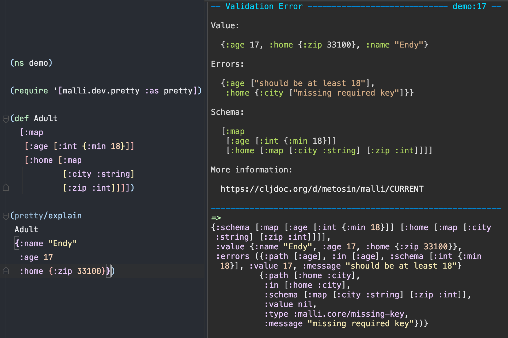

# Malli CHANGELOG

We use [Break Versioning][breakver]. The version numbers follow a `<major>.<minor>.<patch>` scheme with the following intent:

| Bump    | Intent                                                     |
| ------- | ---------------------------------------------------------- |
| `major` | Major breaking changes -- check the changelog for details. |
| `minor` | Minor breaking changes -- check the changelog for details. |
| `patch` | No breaking changes, ever!!                                |

`-SNAPSHOT` versions are preview versions for upcoming releases.

[breakver]: https://github.com/ptaoussanis/encore/blob/master/BREAK-VERSIONING.md

Malli is in well matured [alpha](README.md#alpha).

## UNRELEASED

* **BREAKING** FIX: `json-transformer` is now better at inferring en/decoders for `:enum` and `:=`. [#1205](https://github.com/metosin/malli/pull/1205)
  * For example `[:enum 1 2 3]` gets encoded as a JSON number, not a string.
  * If you need the old behaviour, you can override the en/decoders using properties. [See docs.](README.md#advanced-transformations)
* Value generation: `:+` and `:*` now support generator directives `:gen/min`, `:gen/max` as well as `:min` and `:max` schema directives [#1208](https://github.com/metosin/malli/pull/1208)
* FIX: `:default/fn` now works in map entry properties in addition to schema properties [#1209](https://github.com/metosin/malli/pull/1209)

## 0.18.0 (2025-05-12)

* **BREAKING** Output of `parse` now uses new `malli.core.Tag` and `malli.core.Tags` records for `:orn`, `:multi`, `:altn`, `:catn` etc. [#1123](https://github.com/metosin/malli/issues/1123) [#1153](https://github.com/metosin/malli/issues/1153)
  * See [Parsing](#parsing-values) and [Unparsing](#unparsing-values) for docs.
* **BREAKING** Swagger and JSON-Schema outputs now use `.` instead of `/` (encoded as `~1`) as the separator. [#1183](https://github.com/metosin/malli/pull/1183)
  * This will only affect you if you rely on the exact name of the schema
* Docs: elaborate optional-keys and required-keys [#1117](https://github.com/metosin/malli/pull/1117)
* JSON Schema for `:tuple` now uses `"prefixItems"` [#1151](https://github.com/metosin/malli/pull/1151)
* FIX: `:path` when explaining `:ref` errors [#1106](https://github.com/metosin/malli/issues/1106)
* FIX: don't instrument functions with primitive type hints (like `^double`), instead, emit a warning [#1176](https://github.com/metosin/malli/pull/1176)
* FIX: `:map-of` and `:map` decode now retain the input map type (eg. `sorted-map`) [#1189](https://github.com/metosin/malli/pull/1189)
* FIX: schemas and into-schemas are printed to the console and the REPL in CLJS the same way as they are in CLJ. [#1186](https://github.com/metosin/malli/issues/1186)
* FIX: `:merge` and `:union` now work with 1 child. With no children, throw a clearer error. [#1147](https://github.com/metosin/malli/pull/1147)
* FIX: `default-value-transformer` for `:ref`s inside `:map`s [#1145](https://github.com/metosin/malli/issues/1145)
* FIX: generator for `empty?` schema [#1196](https://github.com/metosin/malli/pull/1196)

## 0.17.0 (2024-12-08)

* Don't output `:definitions nil` in swagger. [#1134](https://github.com/metosin/malli/issues/1134)
* **BREAKING**: `:gen/fmap` property requires its schema to create a generator.
  * previous behavior defaulted to a `nil`-returning generator, even if the schema doesn't accept `nil`
  * use `:gen/return nil` property to restore this behavior
* Support decoding map keys into keywords for `[:map` schemas in `json-transformer` [#1135](https://github.com/metosin/malli/issues/1135)
* `:not` humanizer [#1138](https://github.com/metosin/malli/pull/1138)
* FIX: `:seqable` generates `nil` when `:min` is greater than 0 [#1121](https://github.com/metosin/malli/issues/1121)
* FIX: `malli.registry/{mode,type}` not respected in Babashka [#1124](https://github.com/metosin/malli/issues/1124)
* FIX: `:float` accepts doubles but never generates them [#1132](https://github.com/metosin/malli/issues/1132)
* FIX: `:float` missing humanizer [#1122](https://github.com/metosin/malli/issues/1122)
* Updated dependencies:

```
fipp/fipp '0.6.26' to '0.6.27'
```

## 0.16.4 (2024-08-30)

* Distribute `:merge` over `:multi` [#1086](https://github.com/metosin/malli/pull/1086), see [documentation](README.md#distributive-schemas)
* `:multi` with keyword `:dispatch` accumulates data to generated values [#1095](https://github.com/metosin/malli/pull/1095)
* Allow `m/-proxy-schema` child to be a `delay` [#1090](https://github.com/metosin/malli/pull/1090)
* `json-transformer` decodes 123.0 into 123 for schemas like `:int`, `pos-int?` etc. [#986](https://github.com/metosin/malli/issues/986)
* Fix `malli.dev.pretty` throws when explaining errors in nested maps [#1094](https://github.com/metosin/malli/issues/1096)
* Fix ClojureScript [arithmetic warning](https://github.com/metosin/malli/issues/1093)
* Fix `(-some-pred [])` should return `false` [#1101](https://github.com/metosin/malli/pull/1101)
* Doc `mu/assoc` and `mu/dissoc` only handle one key at a time [#1099](https://github.com/metosin/malli/pull/1099)
* Try to make `map-of-min-max-test` less flaky by fixing seed [#1098](https://github.com/metosin/malli/pull/1098)
* Updated dependencies:

```
borkdude/edamame '1.4.25' to '1.4.27'
```

## 0.16.3 (2024-08-05)

* `:->` added to default registry, see [documentation](/docs/function-schemas.md#flat-arrow-function-schemas).
* New `:seqable` and `:every` schemas [#1041](https://github.com/metosin/malli/pull/1041), see [docs](https://github.com/metosin/malli#seqable-schemas)
* Fix OOM error with infinitely expanding schema [#1069](https://github.com/metosin/malli/pull/1069)
* Correctly form prop-less schemas that have map/nil as first child [#1071](https://github.com/metosin/malli/pull/1071)
* Support min/max on uncountables like eductions [#1075](https://github.com/metosin/malli/pull/1075)
* Fix clj-kondo can't parse config.edn written by `(malli.dev/start!)` [#1083](https://github.com/metosin/malli/issues/1083)
* unstrument before instrumenting [#1081](https://github.com/metosin/malli/pull/1081)
* Replace `.entryAt` with `.valAt` during validation [#1079](https://github.com/metosin/malli/pull/1079)
* Corrected DEPRECATED warning for `m/-simple-schema` [#1077](https://github.com/metosin/malli/pull/1077)

## 0.16.2 (2024-06-30)

* Experimental `:->` for simpler function defintions (not available on default schema registry) [#1027](https://github.com/metosin/malli/pull/1027)

```clojure
[:-> :any] ; [:=> :cat :any]
[:-> :int :any] ; [:=> [:cat :int] :any]
[:-> [:cat :int] :any]  ; [:=> [:cat [:cat :int]] :any]
[:-> a b c d :any] ; [:=> [:cat a b c d] :any]

;; guard property
[:-> {:guard (fn [[[arg] ret]] ...)} :string :boolean]
; [:=> [:cat :string] :boolean [:fn (fn [[[arg] ret]] ...)]]
```

* Fix `mu/get-in` for false-y keys [#1065](https://github.com/metosin/malli/pull/1065)
* Add `:float` [#1055](https://github.com/metosin/malli/pull/1055)
* Make clj-kondo dir configurable [#1062](https://github.com/metosin/malli/pull/1062)
* Improve doc for transformers [#1058](https://github.com/metosin/malli/pull/1058)
* `:double` generates Long if `:`min is Long [#1034](https://github.com/metosin/malli/issues/1034)
* Fix Swagger definitions collecting [#1002](https://github.com/metosin/malli/issues/1002)

## 0.16.1 (2024-04-30)

* Enabled Java8 tests back, no need to limit the version.

## 0.16.0 (2024-04-20)

* **BREAKING**: minimum Java-version is now Java11
* allow changing prefix of json-schema $refs via option `:malli.json-schema/definitions-path` [#1045](https://github.com/metosin/malli/pull/1045)
* Inline refs in non-`:body` swagger parameters [#1044](https://github.com/metosin/malli/pull/1044)
* Fix flaky test [#1040](https://github.com/metosin/malli/pull/1040)
* Utility to update entry properties: `mu/update-entry-properties` [#1037](https://github.com/metosin/malli/pull/1037)
* Fix actions cache [#1036](https://github.com/metosin/malli/pull/1036)
* Only humanize one of `:min` / `:max` when different [#1032](https://github.com/metosin/malli/pull/1032)
* Distinguish between symbols and strings in humanize [#1031](https://github.com/metosin/malli/pull/1031)
* Fix `:map-of` `:min` and unreachable generator, explain such-that failures [#1029](https://github.com/metosin/malli/pull/1029)

## 0.15.0 (2024-03-23)

* `:=>` takes optional 3rd child, the guard schema validating vector of arguments and return value `[args ret]`. See [Function Guards](docs/function-schemas.md#function-guards) for more details. Fixes [#764](https://github.com/metosin/malli/issues/764) and [#764](https://github.com/metosin/malli/issues/764).

```clojure
;; function of arg:int -> ret:int, where arg < ret
[:=>
 [:cat :int]
 :int
 [:fn (fn [[[arg] ret]] (< arg ret))]]
```

* **BREAKING**: `malli.generator/function-checker` returns explanations under new keys:
  * `::mg/explain-input` -> `::m/explain-input`
  * `::mg/explain-output` -> `::m/explain-output`
  * new `::m/explain-guard` to return guard explanation, if any
* `m/explain` for `:=>` returns also errors for args, return and guard if they exist
* FIX `m/deref-recursive` doesn't play nice with `:merge` schema [#997](https://github.com/metosin/malli/issues/997) via [#999](https://github.com/metosin/malli/pull/999)
* FIX nested `:repeat` sequence schema's doesn't seem to work [#761](https://github.com/metosin/malli/issues/761) via [#1024](https://github.com/metosin/malli/pull/1024)
* FIX Invalid Swagger JSON with `[:or :nil]` alternatives [#1006](https://github.com/metosin/malli/issues/1006) via [#1023](https://github.com/metosin/malli/pull/1023)
* FIX `(explain :tuple [])` [#1022](https://github.com/metosin/malli/pull/1022)
* Enforce entry specs in open map destructurings [#1021](https://github.com/metosin/malli/pull/1021)
* FIX `goog/mixin` was deprecated and is now removed [#1016](https://github.com/metosin/malli/pull/1016)

* Updated dependencies:

```clojure
borkdude/edamame 1.3.23 -> 1.4.25
```

## 0.14.0 (2024-01-16)

* Better development-time tooling
  * `malli.dev/start!` captures all malli-thrown exceptions, see [README](README.md#development-mode) for details
  * does not log individual re-instrumentation of function vars
  * **BREAKING**: changes in `malli.dev.virhe` and `malli.pretty` extension apis, wee [#980](https://github.com/metosin/malli/pull/980) for details
* New `m/deref-recursive` to recursive deref all schemas (not `:ref`s)
* FIX: Malli generates incorrect clj-kondo spec for :fn schemas [#836](https://github.com/metosin/malli/issues/836) via [#987](https://github.com/metosin/malli/pull/987)
* Support for Var references [#985](https://github.com/metosin/malli/pull/985), see [guide](README.md#var-registry) for details.
* **BREAKING**: `m/coerce` and `m/coercer` throw `::m/coercion` instead of `::m/invalid-input`
* New Guide for [Reusable Schemas](docs/reusable-schemas.md)
* Less printing of Var instumentation
* **BREAKING**: qualified symbols are valid reference types [#984](https://github.com/metosin/malli/pull/984)
* Fixing `mt/strip-extra-keys-transformer` for recursive map encoding [#963](https://github.com/metosin/malli/pull/963)
* Support passing custom `:type` in into-schema opt for `:map` and `:map-of` [#968](https://github.com/metosin/malli/pull/968)
* `mu/path->in` works with `:orn`, `:catn` and `:altn`.

## 0.13.0 (2023-09-24)

* **BREAKING** Fallback to use result of first branch when decoding `:or` and `:orn`, [#946](https://github.com/metosin/malli/pull/946)
* **BREAKING**: `decode` for `:double` and `double?` in cljs doesn't allow trailing garbage any more [#942](https://github.com/metosin/malli/pull/942)
* Faster generators for `:map`, [#948](https://github.com/metosin/malli/pull/948) & [#949](https://github.com/metosin/malli/pull/949)
* FIX: `:altn` can't handle just one child entry when nested in sequence schema [#945](https://github.com/metosin/malli/pull/945)
* Officially drop Clojure 1.10 support. Tests haven't passed for some time with Clojure 1.10, but this was not noticed due to a faulty CI setup.
* Use type inferrer when encoding enums [#951](https://github.com/metosin/malli/pull/951)
* Use `bound-fn` in `malli.dev/start!` to preserve `*out*` [#954](https://github.com/metosin/malli/pull/954)
* FIX: Malli generates invalid clj-kondo type spec for [:map [:keys [:+ :keyword]]] [#952](https://github.com/metosin/malli/pull/952)
* FIX: `malli.experimental.describe` descriptions of `:min` and `:max` are backwards [#959](https://github.com/metosin/malli/pull/959)
* FIX: Malli tuple should generate clj-kondo seqable [#962](https://github.com/metosin/malli/pull/962)

## 0.12.0 (2023-08-31)

* FIX: retain order with `:catn` unparse, fixes [#925](https://github.com/metosin/malli/issues/925)
* **BREAKING**: Do not require timezone data directly for cljs [#898](https://github.com/metosin/malli/pull/898) with `malli.experimental.time`
* Remove non-root swagger definitions [#900](https://github.com/metosin/malli/pull/900)
* FIX: `malli.core/-comp` keeps interceptor order with long chains [#905](https://github.com/metosin/malli/pull/905)
* FIX: `malli.dev/start!` exception does not contain source [#896](https://github.com/metosin/malli/issues/896)
* FIX: don't add extra :schema nil to swagger :parameters [#939](https://github.com/metosin/malli/pull/939)
* Add `:gen/return` support in malli.generator [#933](https://github.com/metosin/malli/pull/933)
* Make uuid transformer to be case insensitive [#929](https://github.com/metosin/malli/pull/929)
* Add `:default/fn` prop for default-value-transformer [#927](https://github.com/metosin/malli/pull/927)
* Updated dependencies:

```clojure
borkdude/edamame 1.3.20 -> 1.3.23
```

## 0.11.0 (2023-04-12)

* BREAKING: remove map syntax: `mu/from-map-syntax`, `mu/to-map-syntax`. Note that AST syntax and lite syntax remain unchanged.
* BREAKING: walking a `:schema` with an `id` no longer passes `[id]` instead of `children` to the walker function [#884](https://github.com/metosin/malli/issues/884)
* Support converting recursive malli schemas to json-schema [#464](https://github.com/metosin/malli/issues/464) [#868](https://github.com/metosin/malli/issues/868)
* Add cherry as alternative CLJS evaluator [#888](https://github.com/metosin/malli/pull/888)
* Replace `goog/mixin` with `Object.assign` [#890](https://github.com/metosin/malli/pull/890)
* Simplify uuid regex for accept non-standard and zero uuids [#889](https://github.com/metosin/malli/pull/889)
* Fix clj-doc API import [#887](https://github.com/metosin/malli/pull/887)

## 0.10.4 (2023-03-19)

* FIX `malli.swagger` ns, broken test on reitit.

## 0.10.3 (2023-03-18)

* Add support for default branch `::m/default` for `:map` schema
  [#871](https://github.com/metosin/malli/pull/871), see [docs](README.md#map-with-default-schemas).

```clojure
(m/validate
 [:map
  [:x :int]
  [:y :int]
  [::m/default [:map-of :string :string]]]
 {:x 1, :y 2, "kikka" "kukka"})
; => true
```

* `mt/strip-extra-keys-transformer` works with `:map-of`.

```clojure
(m/decode
 [:map-of :int :int]
 {1 1, 2 "2", "3" 3, "4" "4"}
 (mt/strip-extra-keys-transformer))
; => {1 1}
```

* **BREAKING** (post-note 16.8.2023, this should have been a MINOR version bump). `mt/strip-extra-keys-transformer` strips non-defined keys of implicitely open `:map`:

```clojure
(m/decode
 [:map [:x :int]]
 {:x 1, :y 2, :z 3}
 (mt/strip-extra-keys-transformer))
; => {:x 1}
```

* `m/default-schema` to pull the `::m/default` schema from entry schemas
* `m/explicit-keys` to get a vector of explicit keys from entry schemas (no `::m/default`)
* Simplify content-dependent schema creation with `m/-simple-schema` and `m/-collection-schema` via new 3-arity `:compile` function of type `children properties options -> props`. Old 2-arity top-level callback function is `m/deprecated!` and support for it will be removed in future versions. [#866](https://github.com/metosin/malli/pull/866)
* FIX Repeated calls to `malli.util/assoc-in` referencing non-existing maps fail [#874](https://github.com/metosin/malli/issues/874)
* Updated dependencies:

```clojure
borkdude/edamame 1.1.17 -> 1.3.20
```

## 0.10.2 (2023-03-05)

* Implement `malli.experimental.time` schemas for clojurescript using js-joda [#853](https://github.com/metosin/malli/pull/853)
* Allow instrumenting external functions [#841](https://github.com/metosin/malli/pull/841)
* Add clj-kondo support for cljs function schemas [#833](https://github.com/metosin/malli/pull/833)
* Turn on instrumentation for `mx/defn` with `:malli/always` meta [#825](https://github.com/metosin/malli/pull/825)
* Support type-properties in `m/-map-schema`, `m/-map-of-schema` and `m/-tuple-schema` [#856](https://github.com/metosin/malli/pull/856)
* FIX: properly compose interceptors in :map-of json-transformer [#849](https://github.com/metosin/malli/pull/849)
* FIX: error paths for `:multi` schemas when value is not a map [#845](https://github.com/metosin/malli/pull/845)
* FIX: Malli generates `:nilable/any` which is not a valid type in clj-kondo [#821](https://github.com/metosin/malli/issues/821)
* FIX: `mi/collect!` without args doesn't work properly [#834](https://github.com/metosin/malli/issues/834)

* Updated dependencies:

```clojure
mvxcvi/mvxcvi 2.0.0 -> 2.1.0
borkdude/edamame 1.0.0 -> 1.1.17
```

## 0.10.1 (2023-01-21)

* Strip-extra-keys should not break on non-map values [#818](https://github.com/metosin/malli/pull/818)

## 0.10.0 (2023-01-12)

* New optional time-schemas for the JVM on top of `java.time`:
  * `:time/duration`, `:time/instant`, `:time/local-date`, `:time/local-date-time`, `:time/local-time`, `:time/offset-date-time`, `:time/offset-time`, `:time/zone-id`, `:time/zone-offset`, `:time/zoned-date-time`, see [README](README.md#malliexperimentaltime)
* automatic type inferring with `:enum` and `:=` with `malli.transform` and `malli.json-schema` - detects homogenous `:string`, `:keyword`, `:symbol`, `:int` and `:double`), [#782](https://github.com/metosin/malli/pull/782) & [#784](https://github.com/metosin/malli/pull/784)
* New `malli.core/coercer` and `malli.core/coerce` to both decode and validate a value, see [Docs](README.md#coercion)
* New `malli.core/-no-op-transformer`
* **BREAKING**: new implemenation for `:map-of` inferring via `malli.provider/provide`:
  * Option `:malli.provider/map-of-threshold` default dropped (was 3)
  * New and configurable (`malli.provider/map-of-accept`) function of `stats -> boolean` for identifying `:map-of`
* **BREAKING**: Prefer to real Schemas instead of predicates in inferring (e.g. `:int` over `'int?`)
* Adds `:pred` option to `m/-map-schema` [#767](https://github.com/metosin/malli/pull/767)
* New `:some` schema (like `some?`)
* New `malli.experimental.describe` to describe Schemas in english:

```clojure
* (require '[malli.experimental.describe :as med])

(med/describe [:map {:closed true} [:x int?]])
; => "map where {:x -> <integer>} with no other keys"
```

## 0.9.2 (2022-10-18)

* Fix report-fn fn-name symbol constructor in instrument [#768](https://github.com/metosin/malli/pull/768)

## 0.9.1 (2022-10-17)

* Fix instrument! in dev.cljs/start! - pass cljs function schemas [#766](https://github.com/metosin/malli/pull/766)

## 0.9.0 (2022-10-16)

* Improve regex driver cache performance [#756](https://github.com/metosin/malli/pull/756)
* Refactor cljs fn instrumentation to happen at runtime [#755](https://github.com/metosin/malli/pull/755)
* Add jdk 19 to ci [#760](https://github.com/metosin/malli/pull/760)
* Fix pos? json schema mapping [#757](https://github.com/metosin/malli/pull/757)
* Generate alphanumeric strings with `:min/:max` [#759](https://github.com/metosin/malli/pull/759)
* Add cljs instrumentation support for multi-arity and varargs functions [#753](https://github.com/metosin/malli/pull/753)
* Attach fn-name metadata to instrumented CLJS functions [#746](https://github.com/metosin/malli/pull/746)
* Improve generator distribution for sized schemas [#748](https://github.com/metosin/malli/pull/748)
* Group instrumentation logging so it doesn't spam the browser console [#747](https://github.com/metosin/malli/pull/747)
* Fix recursive gen [#677](https://github.com/metosin/malli/pull/677), fixed [On fixing Malli's recursive generation](https://github.com/metosin/malli/issues/452)
* Mask valid values by default with `malli.dev.pretty/explain` [#738](https://github.com/metosin/malli/pull/738)
* Add seq to tuple transformation [#735](https://github.com/metosin/malli/pull/735), fixes [#734](https://github.com/metosin/malli/issues/734)
* Switch Value and Errors in the pretty output order, [#720](https://github.com/metosin/malli/pull/720)
* Ensure all examples work without sci unless mentioned otherwise [#733](https://github.com/metosin/malli/pull/733)
* Set additionalProperties if map is closed [#719](https://github.com/metosin/malli/pull/719), fixes [#716](https://github.com/metosin/malli/issues/716)
* Fix registry lookup in schema vector syntax, [#729](https://github.com/metosin/malli/pull/729), fixes [#451](https://github.com/metosin/malli/issues/451)
* Source-compatible with nbb, [#726](https://github.com/metosin/malli/pull/726)
* Initial [Development Guide](README.md#development)
* Better humanized results with sets
* `::m/extra-key` error retains the error value
* New `malli.error/error-value` utility for [compact error value presentation](README.md#values-in-error).
* **BREAKING**: `me/-push` takes extra argument
* **BREAKING**: `me/-assoc-in` is now called `me/-push-in`
* Updated dependencies:

```clojure
borkdude/dynaload 0.3.4 -> 0.3.5
```

## 0.8.9 (2022-07-01)

* Works with [Babashka](README#babashka), [#718](https://github.com/metosin/malli/pull/718)
* updated dependencies:

```clojure
borkdude/dynaload 0.2.2 -> 0.3.4
```

## 0.8.8 (2022-06-23)

* new guide for [Static type checking via Typed Clojure](README.md#static-type-checking-via-typed-clojure)
* new guide for [To and from JSON](README.md#to-and-from-json)
* much improved support for instrumentation & type checking with ClojureScript via [#660](https://github.com/metosin/malli/pull/660), [#661](https://github.com/metosin/malli/pull/661), [#662](https://github.com/metosin/malli/pull/662), [#667](https://github.com/metosin/malli/pull/667), [#681](https://github.com/metosin/malli/pull/681), [#685](https://github.com/metosin/malli/pull/685), [#696](https://github.com/metosin/malli/pull/696), [#697](https://github.com/metosin/malli/pull/697), [#700](https://github.com/metosin/malli/pull/700), [#703](https://github.com/metosin/malli/pull/703)
* new `malli.dev.pretty/prettier` helper, [#672]
* faster stripping away extra keys from maps, [#674](https://github.com/metosin/malli/pull/674)
* fix regex unparsing, [#690]
* fix [Warning under advanced compilation](#87) via #692
* [Map :re schema to clj-kondo :string](https://github.com/metosin/malli/pull/701)
* added `mall.util/explain-data`, `malli.util/data-explainer` and `malli.util/keys` [#707](https://github.com/metosin/malli/pull/707)
* fix [mu/open-schema does not open a closed schema](https://github.com/metosin/malli/issues/673) via [#709](https://github.com/metosin/malli/pull/709)
* [Show function input arguments on invalid return value](https://github.com/metosin/malli/pull/711)
* fix [Don't lose properties when updating a key](https://github.com/metosin/malli/pull/712)
* `malli.transform/default-value-transformer` accepts `mt/add-optional-keys` option:

```clojure
(m/decode
 [:map
  [:name [:string {:default "kikka"}]]
  [:description {:optional true} [:string {:default "kikka"}]]]
 {}
 (mt/default-value-transformer {::mt/add-optional-keys true}))
; => {:name "kikka", :description "kikka"}
```
* updated dependencies:

```clojure
fipp/fipp 0.2.5 -> 0.2.6
borkdude/edamame 0.0.18 -> 1.0.0
```

## 0.8.7 (2022-06-23)
* technical redeploy

## 0.8.6 (2022-06-23)
* technical redeploy

## 0.8.5 (2022-06-23)
* technical redeploy

## 0.8.4 (2022-03-02)

* support for 2-arity `default-fn` option in `mt/default-value-transformer` [#582](https://github.com/metosin/malli/pull/582) & [#644](https://github.com/metosin/malli/pull/644)
* fix malli.dev.cljs implementation [#655](https://github.com/metosin/malli/pull/655)

## 0.8.3 (2022-02-15)

* FIX: qualified-keyword with namespace doesn't generate the ns [#642](https://github.com/metosin/malli/issues/642)

## 0.8.2 (2022-02-14)

* new ns, `malli.experimental.lite`, see the [docs](README.md#lite).

```clojure
(require '[malli.experimental.lite :as l])

{:id string?
 :tags [:set keyword?]
 :address {:street string?
           :city string?
           :zip (l/optional int?)
           :lonlat [:tuple double? double?]}}
```

* updated deps:

```clojure
borkdude/edamame 0.0.18 -> 0.0.19
```

## 0.8.1 (2022-02-05)

* FIX: bug in inferring with value encoders [#631](https://github.com/metosin/malli/issues/631)
* FIX: The malli pretty printer (virhe) is failing when it tries to print a datomic dbwhen it tries to pr [#629](https://github.com/metosin/malli/issues/629)

## 0.8.0 (2022-01-23)

* new `malli.instrument.cljs` and `malli.dev.cljs` namespaces for instrumentationa and dev-tooling for ClojureScript
* `malli.dev/start!` uses `malli.dev.pretty/reporter` by default
* allow `:malli/schema` to be defined via arglist meta-data, [#615](https://github.com/metosin/malli/pull/615)
* **BREAKING**: local registries with schemas in vector syntax are stored as identity, not as form
* **BREAKING**: `:malli.provider/tuple-threshold` has no default value
* FIX: `me/-resolve-root-error` does not respect `:error/path`, [#554](https://github.com/metosin/malli/issues/554)
* FIX: `m/from-ast` does not work with symbols or unamespaced keywords, [#626](https://github.com/metosin/malli/issues/626)
* FIX: `:+` parsing returns vector, not sequence

* new `malli.destructure` ns for parsing Clojure & Plumatic destructuring binding syntaxes, see [Destructuring](README.md#destructuring).

```clojure
(require '[malli.destructure :as md])

(-> '[a b & cs] (md/parse) :schema)
; => [:cat :any :any [:* :any]]

(-> '[a :- :string, b & cs :- [:* :int]] (md/parse) :schema)
; => [:cat :string :any [:* :int]]
```

* new `malli.experimental` namespace with schematized `defn`, automatically registers the functions schemas with `m/=>`.

```clojure
(require '[malli.experimental :as mx])

(mx/defn kakka :- :int
  "inline schemas (plumatic-style)"
  [x :- :int] (inc x))
```

* transformer names can be qualified, schema properties support `:decode` and `:encode` keys:

```clojure
(m/decode
  [:string {:decode {:string (partial str "olipa "}}]
  "kerran" mt/string-transformer)
; => "olipa kerran"
```

* `malli.dev.pretty/explain` for pretty-printing explanations



* updated dependencies:

```clojure
fipp/fipp 0.6.24 -> 0.6.25
```

## 0.7.5 (2021-12-19)

* [clj-kondo 2021.12.16+](https://github.com/clj-kondo/clj-kondo/blob/master/CHANGELOG.md#20211216) can load malli type configs automatically from new location (`.clj-kondo/metosin/malli-types/config.edn`)
* use [fipp](https://github.com/brandonbloom/fipp) for fast pretty-printing the clj-kondo configs
* updated dependencies:

```clojure
mvxcvi/arrangement 1.2.0 -> 2.0.0
borkdude/edamame 0.0.11 -> 0.0.18
org.clojure/test.check 1.1.0 -> 1.1.1
```

## 0.7.4 (2021-12-18)

* schema inferring supports value decoding via options

```clojure
(mp/provide
 [{:id "caa71a26-5fe1-11ec-bf63-0242ac130002"}
  {:id "8aadbf5e-5fe3-11ec-bf63-0242ac130002"}]
 {::mp/value-decoders {'string? {:uuid mt/-string->uuid}}})
; => [:map [:id :uuid]]
```

## 0.7.3 (2021-12-15)

* `:map-of` inferring can be forced with `:malli.provider/hint :map-of` meta-data:

```clojure
(require '[malli.provider :as mp])

(mp/provide
  [^{::mp/hint :map-of}
   {:a {:b 1, :c 2}
    :b {:b 2, :c 1}
    :c {:b 3}
    :d nil}])
;[:map-of
; keyword?
; [:maybe [:map
;          [:b int?]
;          [:c {:optional true} int?]]]]
```

* `:tuple` inferring (supports type-hints and threshold options)

```clojure
(mp/provide
  [[1 "kikka" true]
   [2 "kukka" true]
   [3 "kakka" true]]
  {::mp/tuple-threshold 3})
; [:tuple int? string? boolean?]
```

## 0.7.2 (2021-12-12)

* FIX Function with Sequential return value cannot define as function schema [#585](https://github.com/metosin/malli/issues/585)

## 0.7.1 (2021-12-11)

* FIX `decimal?` predicate schema was removed in 0.7.0, [#590](https://github.com/metosin/malli/issues/590)

## 0.7.0 (2021-12-07)

### Performance

* big improvements to schema creation, transformation and inferring perfromance, see [#531](https://github.com/metosin/malli/issues/513) and [#550](https://github.com/metosin/malli/pull/550).

#### Schema Creation

```clojure
(def ?schema
  [:map
   [:x boolean?]
   [:y {:optional true} int?]
   [:z [:map
        [:x boolean?]
        [:y {:optional true} int?]]]])

(def schema (m/schema ?schema))

;; 44µs -> 2.5µs (18x)
(bench (m/schema ?schema))

;; 44µs -> 240ns (180x, not realized)
(p/bench (m/schema ?schema {::m/lazy-entries true}))
```

#### Schema Transformation

```clojure
;; 26µs -> 1.2µs (21x)
(bench (m/walk schema (m/schema-walker identity)))

;; 4.2µs -> 0.54µs (7x)
(bench (mu/assoc schema :w :string))

;; 51µs -> 3.4µs (15x)
(bench (mu/closed-schema schema))

;; 5µs -> 28ns (180x)
(p/bench (m/deref-all ref-schema))

;; 134µs -> 9µs (15x)
(p/bench (mu/merge schema schema))
```

#### Schema Workers

```clojure
(def schema (m/schema ?schema))

;; 1.6µs -> 64ns (25x)
(p/bench (m/validate schema {:x true, :z {:x true}}))

;; 1.6µs -> 450ns (3x)
(p/bench (m/explain schema {:x true, :z {:x true}}))
```

#### Schema Inferring

```clojure
(def samples
  [{:id "Lillan"
    :tags #{:artesan :coffee :hotel}
    :address {:street "Ahlmanintie 29"
              :city "Tampere"
              :zip 33100
              :lonlat [61.4858322, 23.7854658]}}
   {:id "Huber",
    :description "Beefy place"
    :tags #{:beef :wine :beer}
    :address {:street "Aleksis Kiven katu 13"
              :city "Tampere"
              :zip 33200
              :lonlat [61.4963599 23.7604916]}}])

;; 126ms -> 2.5ms (50x)
(p/bench (mp/provide samples))

;; 380µs (330x)
(let [provide (mp/provider)]
  (p/bench (provide samples)))
```

### Schema AST

New optimized map-syntax to super-fast schema creation, see [README](README.md#map-syntax).

```clojure
(def ast (m/ast ?schema))
;{:type :map,
; :keys {:x {:order 0, :value {:type boolean?}},
;        :y {:order 1, :value {:type int?}
;            :properties {:optional true}},
;        :z {:order 2,
;            :value {:type :map,
;                    :keys {:x {:order 0
;                               :value {:type boolean?}},
;                           :y {:order 1
;                               :value {:type int?}
;                               :properties {:optional true}}}}}}}

;; 150ns (16x)
(p/bench (m/from-ast ast))

(-> ?schema
    (m/schema)
    (m/ast)
    (m/from-ast)
    (m/form)
    (= ?schema))
; => true
```

Currently in alpha, will fully replace the old map-syntax at some point.

### Swappable default registry

No need to play with Compiler options or JVM properties to swap the default registry (only if you want to get DCE on CLJS with small set of schemas). Can be disabled with new `malli.registry/mode=strict` option.

```clojure
(require '[malli.core :as m]
         '[malli.util :as mu]
         '[malli.registry :as mr]
         '[malli.generator :as mg])

;; look ma, just works
(mr/set-default-registry!
 (mr/composite-registry
  (m/default-schemas)
  (mu/schemas)))

(mg/generate
 [:merge
  [:map [:x :int]]
  [:map [:y :int]]])
; => {:x 0, :y 92}
```

### Public API

* **BREAKING**: `m/explain` `:errors` are plain maps, not `Error` records.
* **BREAKING**: `malli.provider/schema` is moved into extender API: `malli.provider/-schema`
* **BREAKING**: strings generate alphanumeric chars by default
* `malli.provider` supports inferring of `:maybe` and `:map-of`
* configure default registry in less invasive manner, [#488](https://github.com/metosin/malli/issues/488)
* `nil` is a valid default with `mt/default-value-transformer` [#576](https://github.com/metosin/malli/issues/576)
* fixed `:schema` explain path, [#573](https://github.com/metosin/malli/issues/573)
* fixed `:enum` explain path, [#553](https://github.com/metosin/malli/issues/553)
* fixed pretty printing of function values, [#509](https://github.com/metosin/malli/pull/509)
* fixed `:function` lenses
* fixed arity error in `m/function-schema`
* add localized error messages for all type-schemas
* support for Lazy EntrySchema parsing
* `empty?` Schema does not throw exceptions

### Extender API

* **BREAKING**: `m/EntrySchema` replaces `m/MapSchema` with new `-entry-parser` method
* **BREAKING**: (eager) `m/-parse-entries` is removed, use `m/-entry-parser` instead
* **BREAKING**: `m/-create-form` supports 2 & 4 arities (was: 3)
* `m/EntryParser` protocol
* `m/-entry-forms` helper
* `m/walk-leaf`, `m/-walk-entries` & `m/-walk-indexed` helpers
* `m/Cached` protocol and `m/-create-cache` for memoization of `-validator`, `-explainer`, `-parser` and `-unparser` when using `m/validator`, `m/explain`, `m/parser` and `m/unparser`.

## 0.6.1 (2021-08-08)

* add missing optional dependency to `mvxcvi/arrangement` to make pretty printing work

## 0.6.0 (2021-08-08)

* Much faster validators on CLJ (loop unrolling & programming against interfaces) with `:or`, `:and`, `:orn` and `:map`, thanks to [Ben Sless](https://github.com/bsless):

```clojure
;; 164ns -> 28ns
(let [valid? (m/validator [:and [:> 0] [:> 1] [:> 2] [:> 3] [:> 4]])]
  (cc/quick-bench (valid? 5)))

;; 150ns -> 30ns
(let [valid? (m/validator [:map [:a :any] [:b :any] [:c :any] [:d :any] [:e :any]])
      value {:a 1, :b 2, :c 3, :d 4, :e 5}]
  (cc/quick-bench (valid? value)))
```

* Much faster collection transformers on CLJ (loop unrolling & programming against interfaces):

```clojure
(let [decode (m/decoder
               [:map
                [:id :string]
                [:type :keyword]
                [:address
                 [:map
                  [:street :string]
                  [:lonlat [:tuple :double :double]]]]]
               (mt/json-transformer))
      json {:id "pulla"
            :type "food"
            :address {:street "hämeenkatu 14"
                      :lonlat [61 23.7644223]}}]

  ;; 920ns => 160ns
  (cc/quick-bench
    (decode json)))
```

### Public API

* **BREAKING**: `malli.json-schema/unlift-keys` is removed in favor of `malli.core/-unlift-keys`
* **BREAKING**: `malli.json-schema/unlift` is removed in favor of `get`
* **BREAKING**: `malli.provider/stats` is removed (was already deprecated)
* **BREAKING**: `malli.util/update` doesn't the properties of the key it updates, fixes [#412](https://github.com/metosin/malli/issues/412)
* **BREAKING**: New rules for humanized errors, see [#502](https://github.com/metosin/malli/pull/502), fixes [#80](https://github.com/metosin/malli/issues/80), [#428](https://github.com/metosin/malli/issues/428) and [#499](https://github.com/metosin/malli/issues/499).

* new `malli.instrument` and `malli.dev` for instrumenting function Vars (e.g. `defn`s), see [the guide](docs/function-schemas.md).
* new `malli.plantuml` namespace for [PlantUML generation](README.md#plantuml)
* new `malli.generator/check` for generative testing of functions and `defn`s.
* new `malli.core/parent`
* `:map-of` supports `:min` and `:max` properties
* Collection Schemas emit correct JSON Schema min & max declarations
* humanized errors for `:boolean` & `:malli.core/tuple-limit`
* predicate schema for `fn?`
* `malli.util/transform-entries` passes in options [#340]/(https://github.com/metosin/malli/pull/340)
* BETA: humanized errors can be read from parent schemas (also from map entries), fixes [#86](https://github.com/metosin/malli/issues/86):

```clojure
(-> [:map
     [:foo {:error/message "entry-failure"} :int]]
    (m/explain {:foo "1"})
    (me/humanize {:resolve me/-resolve-root-error}))
; => {:foo ["entry-failure"]}
```

* New experimental pretty printer for schema errors, using [fipp](https://github.com/brandonbloom/fipp).

    


### Extender API

* `malli.util.impl/-fail!` is now `malli.core/-fail!`
* `malli.core/-unlift-keys`
* `malli.core/-instrument`
* **BREAKING**: `malli.core/-register-function-schema!` is now 4-arity, new argument is data map
* **BREAKING**: `malli.core/-fail!` has only arity 1 & 2 versions

## 0.5.1 (2021-05-02)

### Public API

* Fix [#435](https://github.com/metosin/malli/issues/435): :re ignores :gen/xxx properties in absence of :gen/gen
* More customization on -collection-schema [#433](https://github.com/metosin/malli/pull/433)

## 0.5.0 (2021-04-28)

### Public API

* Add `ifn?` predicate, [#416](https://github.com/metosin/malli/pull/416)
* Accumulate errors correctly with `m/-explain` with `:function` and `:=>` Schemas
* New `m/properties-schema` and `m/children-schema` to resolve Malli Schemas for `IntoSchema`s. Empty implementations.
* New `:gen/schema` property for declarative generation, e.g. `[:string {:gen/schema :int, :gen/fmap str}]`
* Support double generator options via schema properties
* Fix [#419](https://github.com/metosin/malli/issues/419): Parsing bug in :map schema
* Fix [#418](https://github.com/metosin/malli/issues/418): Better error messages / docs for registry references
* Fix [#415](https://github.com/metosin/malli/issues/415): Default branch in multi schema are not transformed
* Fix [#427](https://github.com/metosin/malli/issues/427): Generated sets of :ref are always empty

### Extender API

* **BREAKING**: `-type` is moved from `Schema` to `IntoSchema`.
* **BREAKING**: `-type-properties` is moved from `Schema` to `IntoSchema`.
* new Protocol methods in `IntoSchema` Protocol
  * `(-properties-schema [this options] "maybe returns :map schema describing schema properties")`
  * `(-children-schema [this options] "maybe returns sequence schema describing schema children")`

## 0.4.0 (2021-03-31)

### Public API

* `:nil` schema, [#401](https://github.com/metosin/malli/pull/401)
* **BREAKING/FIX**: parsing `:multi` returns branch information, [#403](https://github.com/metosin/malli/pull/403)
* `:and` merges using first child, [#405](https://github.com/metosin/malli/pull/405)

## 0.3.1 (2021-03-21)

### Public API

* Add `:orn` json-schema & generator, [#400](https://github.com/metosin/malli/pull/400)
* Ignore optional properties in `mt/default-value-transformer`, [#397](https://github.com/metosin/malli/pull/397)
* Support `nil` keys in maps, [#392](https://github.com/metosin/malli/pull/392)
* `:m/default` for `:multi`, [#391](https://github.com/metosin/malli/pull/391)
* Fix inconsistent park-ing in alt(n)-parser, [#390](https://github.com/metosin/malli/pull/390)
* Fix json schema generation when all attributes of a map are optional, [#385](https://github.com/metosin/malli/pull/385)
* Note about transformers best-effort behavior, [#384](https://github.com/metosin/malli/pull/384)
* Humanized regex/sequence errors, [#383](https://github.com/metosin/malli/pull/383)
* Humanized error for `:double`, [#382](https://github.com/metosin/malli/pull/382)

## 0.3.0 (2021-03-02)

### Public API

* support for sequence schemas: `:cat`, `catn`, `alt`, `altn`, `:?`, `:*`, `:+` and `repeat`, see [Sequence Schemas](./README.md#sequence-schemas).
* support for parsing and unparsing schemas: `m/parse`, `m/parser`, `m/unparse`, `m/unparser`, see [Parsing values](./README.md#parsing-values).
* support for function schmas: `:=>` and `:function`, see [Function Schemas](./README.md#function-schemas).
* support for [clj-kondo](https://github.com/clj-kondo/clj-kondo), see [Clj-kondo](./README.md#clj-kondo).
* new schemas: `:any` (e.g. `any?`), `:not` (complement) and `:orn` (or with named branches)
* `:qualified-keyword` support `:namespace` property

* FIX: Schema vizualization is not working for `[:< ...]` like schemas, [#370](https://github.com/metosin/malli/issues/370)
* Ensure we use size 30 for generator (for more variety), [#364](https://github.com/metosin/malli/pull/364)
* Set JSON Schema types and formats for numbers properly [#354](https://github.com/metosin/malli/pull/354)
* -memoize actually memoized. easily 100x faster now [#350](https://github.com/metosin/malli/pull/350)
* Fix interceptor composition, [#347](https://github.com/metosin/malli/pull/350)
* `malli.util`: add a rename-keys utility, similar to clojure.set [#338](https://github.com/metosin/malli/pull/338)
* Let `mu/update` accept plain data schemas, [#329](https://github.com/metosin/malli/pull/329)
* `mu/find`, [#322](https://github.com/metosin/malli/pull/322)

### Extender API

* **BREAKING**: `m/Schema` has new methods: `-parent`, `-parser` and `-unparser`
* **BREAKING**: `m/-coder` and `m/-chain` are replaced wih `m/-intercepting`
* **BREAKING**: `m/-fail!` is now `miu/-fail!`
* **BREAKING**: `m/-error` is now `miu/-error`

## 0.2.1 (2020-10-22)

* fix `:sequential` decoding with empty sequence under `mt/json-transformer`, fixes [#288](https://github.com/metosin/malli/issues/288)
  * removed broken `mt/-sequential->seq`

## 0.2.0 (2020-10-18)

* **BREAKING (MINOR)**: `m/deref` returns original schema, does not throw, fixes [#284](https://github.com/metosin/malli/issues/284).
* **BREAKING (MINOR)**: the following utilities in `malli.util` deref top-level refs recursively: `merge`, `union`, `transform-entries`, `optional-keys`, `required-keys`, `select-keys` and `dissoc`.
* `m/deref-all` derefs all top-level references recursively, e.g.

```clojure
(m/deref-all [:schema [:schema int?]])
; => int?
```

* `:ref`, `:schema`, `::m/schema` have now generators, JSON Schema and Swagger support
* `mu/subschemas` walks over top-level `:ref` and all `:schema`s.
* `m/walk` can walk over `:ref` and `:schema` reference schemas. Walking can be enabled using options `:malli.core/walk-refs` and `:malli.core/walk-schema-refs`.
* Welcome declarative schema transformations!

There are also declarative versions of schema transforming utilities in `malli.util/schemas`. These include `:merge`, `:union` and `:select-keys`:

```clojure
(def registry (merge (m/default-schemas) (mu/schemas)))

(def Merged
  (m/schema
    [:merge
     [:map [:x :string]]
     [:map [:y :int]]]
    {:registry registry}))

Merged
;[:merge
; [:map [:x :string]]
; [:map [:y :int]]]

(m/deref Merged)
;[:map
; [:x :string]
; [:y :int]]

(m/validate Merged {:x "kikka", :y 6})
; => true
```

* New options for SCI:
  * `:malli.core/disable-sci` for explicitly disabling `sci`, fixes [#276](https://github.com/metosin/malli/issues/276)
  * `:malli.core/sci-options` for configuring `sci`

* `malli.transform/default-value-transformer` accepts options `:key` and `:defaults`:

```clojure
(m/decode
  [:map
   [:user [:map
           [:name :string]
           [:description {:ui/default "-"} :string]]]]
  nil
  (mt/default-value-transformer
    {:key :ui/default
     :defaults {:map (constantly {})
                :string (constantly "")}}))
; => {:user {:name "", :description "-"}}
```
* Support microsecond precision when parsing datetime strings. [#280](https://github.com/metosin/malli/pull/280)

## 0.1.0 (2020-10-08)

First stable release.

## Breaking Changes in pre-alpha:

* 8.10.2020
  * removed `:list` schema
  * removed `malli.error/SchemaError` protocol in favor of using `m/type-properties` for custom errors
* 20.9.2020
  * removed `m/-predicate-schema`, `m/-partial-predicate-schema` and `m/-leaf-schema`
* 19.9.2020
  * new mandatory Protocol method in `m/Schema`: `-type-properties`
* 1.9.2020
  * `m/children` returns 3-tuple (key, properties, schema) for `MapSchema`s
  * `m/map-entries` is removed, `m/entries` returns a `MapEntry` of key & `m/-val-schema`
* 4.8.2020
  * `:path` in explain is re-implemented: map keys by value, others by child index
  * `m/-walk` and `m/Walker` uses `:path`, not `:in`
  * `m/-outer` has new parameter order: `walker schema path children options`
  * `malli.util/path-schemas` replaced with `malli.util/subschemas` & `malli.util/distict-by`
  * `LensSchema` has a new `-key` method
  * renamed some non-user apis in `malli.core` & `malli.util`
  * moved map-syntax helpers from `malli.core` to `malli.util`
  * dynaload `com.gfredericks/test.chuck`
* 23.7.2020
  * `sci` is not a default dependency. Enabling sci-support:
    * **Clojure**: add a dependency to `borkdude/sci`
    * **ClojureScript**: also require `sci.core` (directly or via `:preloads`)
* 18.7.2020
  * big cleanup of `malli.transform` internals.
* 12.7.2020
  * `malli.mermaid` is removed (in favor of `malli.dot`)
* 10.7.2020
  * `[metosin/malli "0.0.1-20200710.075225-19"]`
  * Visitor is implemented using a Walker.
    * `m/accept` -> `m/walk`
    * `m/schema-visitor` -> `m/schema-walker`
    * `m/map-syntax-visitor` -> `m/map-syntax-walker`
* 31.6.2020
  * new `-children` method in `Schema`, to return child schemas as instances (instead of just AST)
* 17.6.2020
  * change all `malli.core/*-registry` defs into `malli.core/*-schemas` defns to enable DCE for clojurescript
* 9.6.2020
  * `malli.core/name` & `malli.core/-name` renamed to `malli.core/type` & `malli.core/-type`
  * `malli.generator/-generator` is renamed to `malli.generator/-schema-generator`
