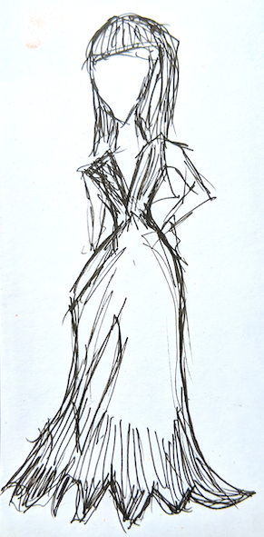
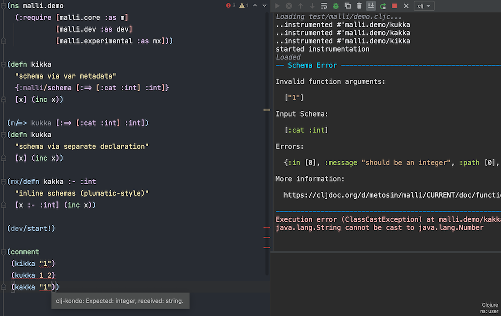
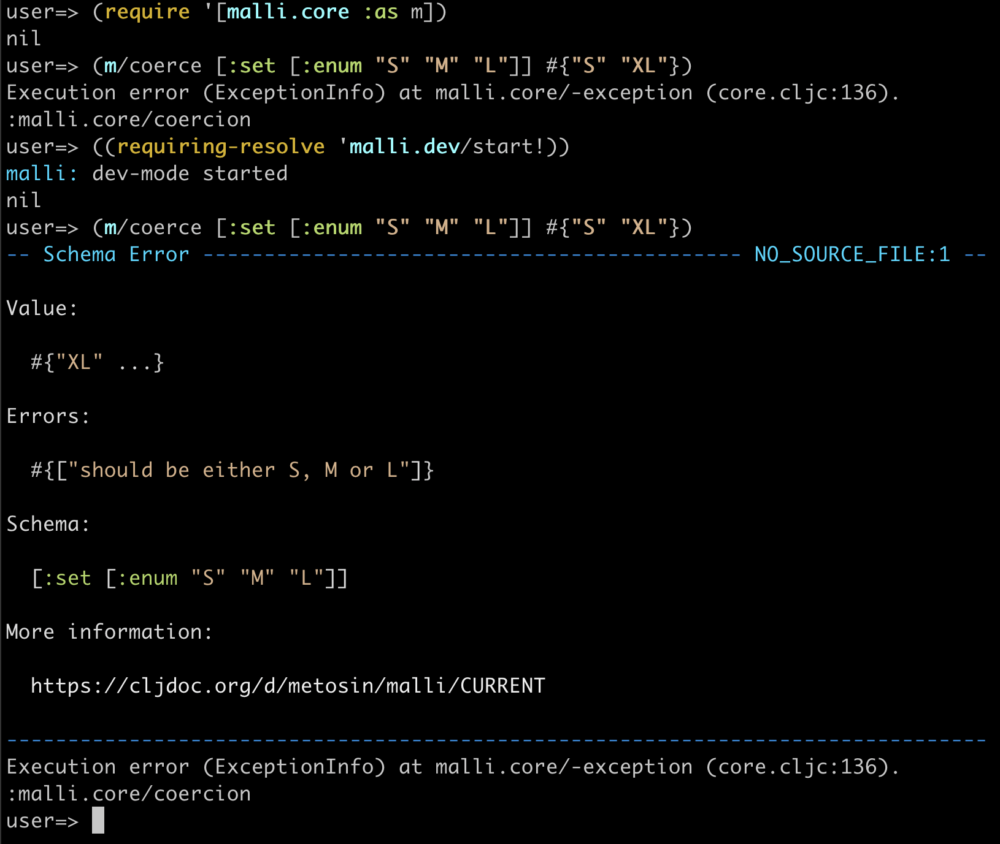
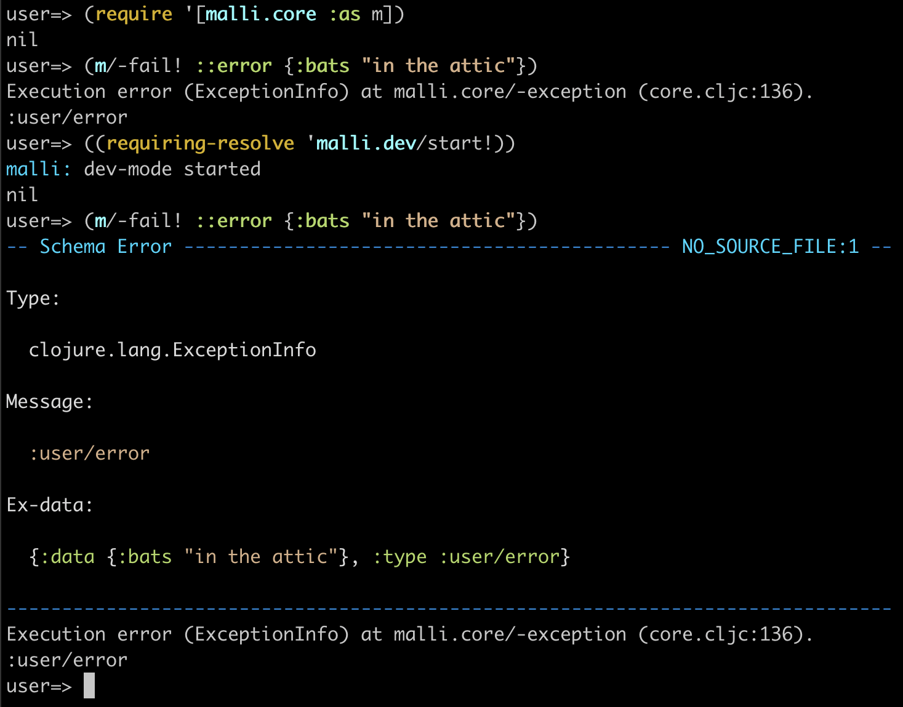
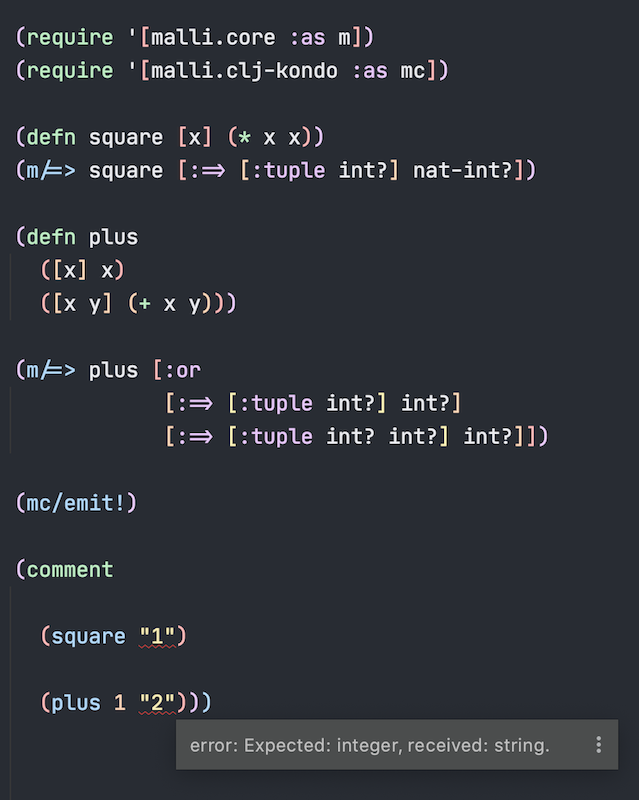

# malli

[](https://github.com/metosin/malli/actions)
[](https://cljdoc.org/d/metosin/malli/)
[](https://clojars.org/metosin/malli)
[](https://clojurians.slack.com/messages/malli/)
[](https://book.babashka.org#badges)

Data-driven Schemas for Clojure/Script and [babashka](#babashka).

[Metosin Open Source Status: Active](https://github.com/metosin/open-source/blob/main/project-status.md#active). Stability: well matured [*alpha*](#alpha).



- Schema definitions as data
- [Vector](#vector-syntax), [Map](#map-syntax) and [Lite](#lite) syntaxes
- [Validation](#validation) and [Value Transformation](#value-transformation)
- First class [Error Messages](#error-messages) with [Spell Checking](#spell-checking)
- [Generating values](#value-generation) from Schemas
- [Inferring Schemas](#inferring-schemas) from sample values and [Destructuring](#destructuring).
- Tools for [Programming with Schemas](#programming-with-schemas)
- [Parsing](#parsing-values) and [Unparsing](#unparsing-values) values
- [Enumeration](#enumeration-schemas), [Sequence](#sequence-schemas), [Vector](#vector-schemas), and [Set](#set-schemas) Schemas
- [Persisting schemas](#persisting-schemas), even [function schemas](#serializable-functions)
- Immutable, Mutable, Dynamic, Lazy and Local [Schema Registries](#schema-registry)
- [Schema Transformations](#schema-Transformation) to [JSON Schema](#json-schema), [Swagger2](#swagger2), and [descriptions in english](#description)
- [Multi-schemas](#multi-schemas), [Recursive Schemas](#recursive-schemas) and [Default values](#default-values)
- [Function Schemas](docs/function-schemas.md) with dynamic and static schema checking
   - Integrates with both [clj-kondo](#clj-kondo) and [Typed Clojure](#static-type-checking-via-typed-clojure)
- Visualizing Schemas with [DOT](#dot) and [PlantUML](#plantuml)
- Pretty [development time errors](#pretty-errors)
- [Fast](#performance)

Presentations:

- [Transforming Data With Malli and Meander](https://www.metosin.fi/blog/transforming-data-with-malli-and-meander/)
- [High-Performance Schemas in Clojure/Script with Malli 1/2](https://www.metosin.fi/blog/high-performance-schemas-in-clojurescript-with-malli-1-2/)
- [ClojureStream Podcast: Malli wtih Tommi Reiman](https://soundcloud.com/clojurestream/s4-e30-malli-wtih-tommi-reiman)
- [Structure and Interpretation of Malli Regex Schemas](https://www.metosin.fi/blog/malli-regex-schemas/)
- LNDCLJ 9.12.2020: [Designing with Malli](https://youtu.be/bQDkuF6-py4), slides [here](https://www.slideshare.net/mobile/metosin/designing-with-malli)
- [Malli, Data-Driven Schemas for Clojure/Script](https://www.metosin.fi/blog/malli/)
- CEST 2.6.2020: [Data-driven Rapid Application Development with Malli](https://www.youtube.com/watch?v=ww9yR_rbgQs)
- ClojureD 2020: [Malli: Inside Data-driven Schemas](https://www.youtube.com/watch?v=MR83MhWQ61E), slides [here](https://www.slideshare.net/metosin/malli-inside-datadriven-schemas)

Try the [online demo](https://malli.io), see also some [3rd Party Libraries](#3rd-party-libraries).

Want to contribute? See the [Development](#development) guide.



> Hi! We are [Metosin](https://metosin.fi), a consulting company. These libraries have evolved out of the work we do for our clients.
> We maintain & develop this project, for you, for free. Issues and pull requests welcome!
> However, if you want more help using the libraries, or want us to build something as cool for you, consider our [commercial support](https://www.metosin.fi/en/open-source-support).

## Motivation

We are building dynamic multi-tenant systems where data models should be first-class: they should drive the runtime value transformations, forms and processes. We should be able to edit the models at runtime, persist them and load them back from a database and over the wire, for both Clojure and ClojureScript. Think of [JSON Schema](https://json-schema.org/), but for Clojure/Script.

Hasn't the problem been solved (many times) already?

There is [Schema](https://github.com/plumatic/schema), which is an awesome, proven and collaborative open-source project, and we absolutely love it. We still use it in many of our projects. The sad part: serializing & de-serializing schemas is non-trivial and there is no proper support on branching.

[Spec](https://clojure.org/guides/spec) is the de facto data specification library for Clojure. It has many great ideas, but it is opinionated with macros, global registry, and it doesn't have any support for runtime transformations. [Spec-tools](https://github.com/metosin/spec-tools) was created to "fix" some of the things, but after [five years](https://github.com/metosin/spec-tools/commit/18aeb78db7886c985b2881fd87fde6039128b3fb) of developing it, it's still a kind of hack and not fun to maintain.

So, we decided to spin out our own library, which would do all the things we feel is important for dynamic system development. It's based on the best parts of the existing libraries and several project-specific tools we have done over the years.

> If you have expectations (of others) that aren't being met, those expectations are your own responsibility. You are responsible for your own needs. If you want things, make them.

- Rich Hickey, [Open Source is Not About You](https://gist.github.com/richhickey/1563cddea1002958f96e7ba9519972d9)

## The library

[](http://clojars.org/metosin/malli)

Malli requires Clojure 1.11 or ClojureScript 1.11.51.

Malli is tested with the LTS releases Java 8, 11, 17 and 21.

## Quickstart

```clojure
(require '[malli.core :as m])

(def UserId :string)

(def Address
  [:map
   [:street :string]
   [:country [:enum "FI" "UA"]]])

(def User
  [:map
   [:id #'UserId]
   [:address #'Address]
   [:friends [:set {:gen/max 2} [:ref #'User]]]])

(require '[malli.generator :as mg])

(mg/generate User)
;{:id "AC",
; :address {:street "mf", :country "UA"},
; :friends #{{:id "1dm",
;             :address {:street "8", :country "UA"},
;             :friends #{}}}}

(m/validate User *1)
; => true
```

## Syntax

Malli supports [Vector](#vector-syntax), [Map](#map-syntax) and [Lite](#lite) syntaxes.

### Vector syntax

The default syntax uses vectors, inspired by [hiccup](https://github.com/weavejester/hiccup):

<!-- :test-doc-blocks/skip -->
```clojure
type
[type & children]
[type properties & children]
```
Examples:

```clojure
;; just a type (String)
:string

;; type with properties
[:string {:min 1, :max 10}]

;; type with properties and children
[:tuple {:title "location"} :double :double]

;; a function schema of :int -> :int
[:=> [:cat :int] :int]
[:-> :int :int]
```

Usage:

```clojure
(require '[malli.core :as m])

(def non-empty-string
  (m/schema [:string {:min 1}]))

(m/schema? non-empty-string)
;; => true

(m/validate non-empty-string "")
;; => false

(m/validate non-empty-string "kikka")
;; => true

(m/form non-empty-string)
;; => [:string {:min 1}]
```

### Map syntax

Alternative map-syntax, similar to [cljfx](https://github.com/cljfx/cljfx):

**NOTE**: For now, Map syntax in considered as internal, so don't use it as a database persistency model.

```clojure
;; just a type (String)
{:type :string}

;; type with properties
{:type :string
 :properties {:min 1, :max 10}}

;; type with properties and children
{:type :tuple
 :properties {:title "location"}
 :children [{:type :double}
            {:type :double}]}

;; a function schema of :int -> :int
{:type :=>
 :input {:type :cat, :children [{:type :int}]}
 :output :int}
{:type :->
 :children [{:type :int} {:type :int}]}
```

Usage:

```clojure
(def non-empty-string
  (m/from-ast {:type :string
               :properties {:min 1}}))

(m/schema? non-empty-string)
;; => true

(m/validate non-empty-string "")
;; => false

(m/validate non-empty-string "kikka")
;; => true

(m/ast non-empty-string)
;; => {:type :string
;;     :properties {:min 1}}
```

Map-syntax is also called the [Schema AST](#schema-ast).

### Why multiple syntaxes?

Malli started with just the [Vector syntax](#vector-syntax). It's really powerful and relatively easy to read, but not optimal for all use cases.

We introduced [Map Syntax](#map-syntax) as we found out that the overhead of parsing large amount of vector-syntaxes can be a deal-breaker when running on slow single-threaded environments like Javascript on mobile phones. Map-syntax allows lazy and parseless Schema Creation.

We added [Lite Syntax](#lite) for simplified schema creation for special cases, like to be used with [reitit coercion](https://cljdoc.org/d/metosin/reitit/CURRENT/doc/coercion/malli) and for easy migration from [data-specs](https://cljdoc.org/d/metosin/spec-tools/CURRENT/doc/data-specs).

## Example Address schema

Following example schema is assumed in many of the following examples.

```clojure
(def Address
  [:map
   [:id :string]
   [:tags [:set :keyword]]
   [:address
    [:map
     [:street :string]
     [:city :string]
     [:zip :int]
     [:lonlat [:tuple :double :double]]]]])
```

## Validation

Validating values against a schema:

```clojure
;; with schema instances
(m/validate (m/schema :int) 1)
;; => true

;; with vector syntax
(m/validate :int 1)
;; => true

(m/validate :int "1")
;; => false

(m/validate [:= 1] 1)
;; => true

(m/validate [:enum 1 2] 1)
;; => true

(m/validate [:and :int [:> 6]] 7)
;; => true

(m/validate [:qualified-keyword {:namespace :aaa}] :aaa/bbb)
;; => true

;; optimized (pure) validation function for best performance
(def valid?
  (m/validator
    [:map
     [:x :boolean]
     [:y {:optional true} :int]
     [:z :string]]))

(valid? {:x true, :z "kikka"})
;; => true
```

Schemas can have properties:

```clojure
(def Age
  [:and
   {:title "Age"
    :description "It's an age"
    :json-schema/example 20}
   :int [:> 18]])

(m/properties Age)
;; => {:title "Age"
;;     :description "It's an age"
;;     :json-schema/example 20}
```

Maps are open by default:

```clojure
(m/validate
  [:map [:x :int]]
  {:x 1, :extra "key"})
;; => true
```

Maps can be closed with `:closed` property:

```clojure
(m/validate
  [:map {:closed true} [:x :int]]
  {:x 1, :extra "key"})
;; => false
```

Maps keys are not limited to keywords:

```clojure
(m/validate
  [:map
   ["status" [:enum "ok"]]
   [1 :any]
   [nil :any]
   [::a :string]]
  {"status" "ok"
   1 'number
   nil :yay
   ::a "properly awesome"})
;; => true
```

Most core-predicates are mapped to Schemas:

```clojure
(m/validate string? "kikka")
;; => true
```

*NOTE*: Predicate Schemas do not cover any schema properties, e.g. `string?` can't be modified with properties like `:min` and `:max`. If you want to use the schema properties, use real schema types instead, e.g. `:string` over `string?`.

See [the full list of default schemas](#schema-registry).

## Enumeration schemas

`:enum` schemas `[:enum V1 V2 ...]` represent an enumerated set of values `V1 V2 ...`.

This mostly works as you'd expect, with values passing the schema if it is contained in the set and generators returning one of the values,
shrinking to the left-most value.

There are some special cases to keep in mind around syntax. Since schema properties can be specified with a map or nil, enumerations starting with
a map or nil must use slightly different syntax.

If your `:enum` does not have properties, you must provide `nil` as the properties.

```clojure
[:enum nil {}]  ;; singleton schema of {}
[:enum nil nil] ;; singleton schema of nil
```

If your `:enum` has properties, the leading map with be interpreted as properties, not an enumerated value.

```clojure
[:enum {:foo :bar} {}]  ;; singleton schema of {}, with properties {:foo :bar}
[:enum {:foo :bar} nil] ;; singleton schema of nil, with properties {:foo :bar}
```

In fact, these syntax rules apply to all schemas, but `:enum` is the most common schema where this is relevant so it deserves a special mention.

## Qualified keys in a map

You can also use [decomplected maps keys and values](https://clojure.org/about/spec#_decomplect_mapskeysvalues) using registry references. References must be either qualified keywords or strings.

```clojure
(m/validate
  [:map {:registry {::id :int
                    ::country :string}}
   ::id
   [:name :string]
   [::country {:optional true}]]
  {::id 1
   :name "kikka"})
;; => true
```

## Homogeneous maps

Other times, we use a map as a homogeneous index. In this case, all our key-value
pairs have the same type. For this use case, we can use the `:map-of` schema.

```clojure
(m/validate
  [:map-of :string [:map [:lat number?] [:long number?]]]
  {"oslo" {:lat 60 :long 11}
   "helsinki" {:lat 60 :long 24}})
;; => true
```
## Map with default schemas

Map schemas can define a special `:malli.core/default` key to handle extra keys:

```clojure
(m/validate
 [:map
  [:x :int]
  [:y :int]
  [::m/default [:map-of :int :int]]]
 {:x 1, :y 2, 1 1, 2 2})
;; => true
```
default branching can be arbitrarily nested:

```clojure
(m/validate
 [:map
  [:x :int]
  [::m/default [:map
                [:y :int]
                [::m/default [:map-of :int :int]]]]]
 {:x 1, :y 2, 1 1, 2 2})
;; => true
```

## Seqable schemas

The `:seqable` and `:every` schemas describe `seqable?` collections. They
differ in their handling of collections that are neither `counted?` nor `indexed?`, and their
[parsers](#parsing-values):
1. `:seqable` parses its elements but `:every` does not and returns the identical input, and
2. valid unparsed `:seqable` values lose the original collection type while `:every`
   returns the identical input.

`:seqable` validates the entire collection, while `:every` checks only the
largest of `:min`, `(inc :max)`, and `(::m/coll-check-limit options 101)`, or
the entire collection if the input is `counted?` or `indexed?`.

```clojure
;; :seqable and :every validate identically with small, counted, or indexed collections.
(m/validate [:seqable :int] #{1 2 3})
;; => true
(m/validate [:seqable :int] [1 2 3])
;; => true
(m/validate [:seqable :int] (sorted-set 1 2 3))
;; => true
(m/validate [:seqable :int] (range 1000))
;; => true
(m/validate [:seqable :int] (conj (vec (range 1000)) nil))
;; => false

(m/validate [:every :int] #{1 2 3})
;; => true
(m/validate [:every :int] [1 2 3])
;; => true
(m/validate [:every :int] (sorted-set 1 2 3))
;; => true
(m/validate [:every :int] (vec (range 1000)))
;; => true
(m/validate [:every :int] (conj (vec (range 1000)) nil))
;; => false

;; for large uncounted and unindexed collections, :every only checks a certain length
(m/validate [:seqable :int] (concat (range 1000) [nil]))
;; => false
(m/validate [:every :int] (concat (range 1000) [nil]))
;; => true
```


## Sequence schemas

You can use `:sequential` to describe homogeneous sequential Clojure collections.

```clojure
(m/validate [:sequential :any] (list "this" 'is :number 42))
;; => true

(m/validate [:sequential :int] [42 105])
;; => true

(m/validate [:sequential :int] #{42 105})
;; => false
```

Malli also supports sequence regexes (also called sequence expressions) like [Seqexp](https://github.com/cgrand/seqexp) and Spec.
The supported operators are `:cat` & `:catn` for concatenation / sequencing

```clojure
(m/validate [:cat :string :int] ["foo" 0])
;; => true

(m/validate [:catn [:s :string] [:n :int]] ["foo" 0])
;; => true
```

`:alt` & `:altn` for alternatives

```clojure
(m/validate [:alt :keyword :string] ["foo"])
;; => true

(m/validate [:altn [:kw :keyword] [:s :string]] ["foo"])
;; => true
```

and `:?`, `:*`, `:+` & `:repeat` for repetition:

```clojure
(m/validate [:? :int] [])
;; => true
(m/validate [:? :int] [1])
;; => true
(m/validate [:? :int] [1 2])
;; => false

(m/validate [:* :int] [])
;; => true
(m/validate [:* :int] [1 2 3])
;; => true

(m/validate [:+ :int] [])
;; => false
(m/validate [:+ :int] [1])
;; => true
(m/validate [:+ :int] [1 2 3])
;; => true

(m/validate [:repeat {:min 2, :max 4} :int] [1])
;; => false
(m/validate [:repeat {:min 2, :max 4} :int] [1 2])
;; => true
(m/validate [:repeat {:min 2, :max 4} :int] [1 2 3 4])
;; => true ; (:max is inclusive, as elsewhere in Malli)
(m/validate [:repeat {:min 2, :max 4} :int] [1 2 3 4 5])
;; => false
```

`:catn` and `:altn` allow naming the subsequences / alternatives

<!-- :test-doc-blocks/skip -->
```clojure
(m/explain
  [:* [:catn [:prop :string] [:val [:altn [:s :string] [:b :boolean]]]]]
  ["-server" "foo" "-verbose" 11 "-user" "joe"])
;; => {:schema [:* [:catn [:prop :string] [:val [:altn [:s :string] [:b :boolean]]]]],
;;     :value ["-server" "foo" "-verbose" 11 "-user" "joe"],
;;     :errors ({:path [0 :val :s], :in [3], :schema :string, :value 11}
;;              {:path [0 :val :b], :in [3], :schema :boolean, :value 11})}
```

while `:cat` and `:alt` just use numeric indices for paths:

<!-- :test-doc-blocks/skip -->
```clojure
(m/explain
  [:* [:cat :string [:alt :string :boolean]]]
  ["-server" "foo" "-verbose" 11 "-user" "joe"])
;; => {:schema [:* [:cat :string [:alt :string :boolean]]],
;;     :value ["-server" "foo" "-verbose" 11 "-user" "joe"],
;;     :errors ({:path [0 1 0], :in [3], :schema :string, :value 11}
;;              {:path [0 1 1], :in [3], :schema :boolean, :value 11})}
```

As all these examples show, the sequence expression (seqex) operators take any non-seqex child schema to
mean a sequence of one element that matches that schema. To force that behaviour for
a seqex child `:schema` can be used:

```clojure
(m/validate
  [:cat [:= :names] [:schema [:* :string]] [:= :nums] [:schema [:* number?]]]
  [:names ["a" "b"] :nums [1 2 3]])
;; => true

;; whereas
(m/validate
  [:cat [:= :names] [:* :string] [:= :nums] [:* number?]]
  [:names "a" "b" :nums 1 2 3])
;; => true
```

Although a lot of effort has gone into making the seqex implementation fast

<!-- :test-doc-blocks/skip -->
```clojure
(require '[clojure.spec.alpha :as s])
(require '[criterium.core :as cc])

(let [valid? (partial s/valid? (s/* int?))]
  (cc/quick-bench (valid? (range 10)))) ; Execution time mean : 27µs

(let [valid? (m/validator [:* int?])]
  (cc/quick-bench (valid? (range 10)))) ; Execution time mean : 2.7µs
```

it is always better to use less general tools whenever possible:

<!-- :test-doc-blocks/skip -->
```clojure
(let [valid? (partial s/valid? (s/coll-of int?))]
  (cc/quick-bench (valid? (range 10)))) ; Execution time mean : 1.8µs

(let [valid? (m/validator [:sequential int?])]
  (cc/quick-bench (valid? (range 10)))) ; Execution time mean : 0.12µs
```

## Vector schemas

You can use `:vector` to describe homogeneous Clojure vectors.

```clojure
(m/validate [:vector :int] [1 2 3])
;; => true

(m/validate [:vector :int] (list 1 2 3))
;; => false
```

A `:tuple` schema describes a fixed length Clojure vector of heterogeneous elements:

```clojure
(m/validate [:tuple :keyword :string number?] [:bing "bang" 42])
;; => true
```

To create a vector schema based on a seqex, use `:and`.

```clojure
;; non-empty vector starting with a keyword
(m/validate [:and [:cat :keyword [:* :any]]
                  vector?]
            [:a 1])
;; => true

(m/validate [:and [:cat :keyword [:* :any]]
                  vector?]
            (:a 1))
;; => false
```

Note: To generate values from a vector seqex, see [:and generation](#and-generation).

## Set schemas

You can use `:set` to describe homogeneous Clojure sets.

```clojure
(m/validate [:set :int] #{42 105})
;; => true

(m/validate [:set :int] #{:a :b})
;; => false
```

## String schemas

Using a predicate:

```clojure
(m/validate string? "kikka")
```

Using `:string` Schema:

```clojure
(m/validate :string "kikka")
;; => true

(m/validate [:string {:min 1, :max 4}] "")
;; => false
```

Using regular expressions:

```clojure
(m/validate #"a+b+c+" "abbccc")
;; => true

;; :re with string
(m/validate [:re ".{3,5}"] "abc")
;; => true

;; :re with regex
(m/validate [:re #".{3,5}"] "abc")
;; => true

;; NB: re-find semantics
(m/validate [:re #"\d{4}"] "1234567")
;; => true

;; anchor with ^...$ if you want to strictly match the whole string
(m/validate [:re #"^\d{4}$"] "1234567")
;; => false
```

## Maybe schemas

Use `:maybe` to express that an element should match some schema OR be `nil`:

```clojure
(m/validate [:maybe :string] "bingo")
;; => true

(m/validate [:maybe :string] nil)
;; => true

(m/validate [:maybe :string] :bingo)
;; => false
```

## Fn schemas

`:fn` allows any predicate function to be used:

```clojure
(def my-schema
  [:and
   [:map
    [:x :int]
    [:y :int]]
   [:fn (fn [{:keys [x y]}] (> x y))]])

(m/validate my-schema {:x 1, :y 0})
;; => true

(m/validate my-schema {:x 1, :y 2})
;; => false
```

## Error messages

Detailed errors with `m/explain`:

<!-- :test-doc-blocks/skip -->
```clojure
(m/explain
  Address
  {:id "Lillan"
   :tags #{:artesan :coffee :hotel}
   :address {:street "Ahlmanintie 29"
             :city "Tampere"
             :zip 33100
             :lonlat [61.4858322, 23.7854658]}})
;; => nil

(m/explain
  Address
  {:id "Lillan"
   :tags #{:artesan "coffee" :garden}
   :address {:street "Ahlmanintie 29"
             :zip 33100
             :lonlat [61.4858322, nil]}})
;; => {:schema [:map
;;              [:id :string]
;;              [:tags [:set :keyword]]
;;              [:address [:map
;;                         [:street :string]
;;                         [:city :string]
;;                         [:zip :int]
;;                         [:lonlat [:tuple :double :double]]]]],
;;     :value {:id "Lillan",
;;             :tags #{:artesan :garden "coffee"},
;;             :address {:street "Ahlmanintie 29"
;;                       :zip 33100
;;                       :lonlat [61.4858322 nil]}},
;;     :errors ({:path [:tags 0]
;;               :in [:tags 0]
;;               :schema :keyword
;;               :value "coffee"}
;;              {:path [:address :city],
;;               :in [:address :city],
;;               :schema [:map
;;                        [:street :string]
;;                        [:city :string]
;;                        [:zip :int]
;;                        [:lonlat [:tuple :double :double]]],
;;               :type :malli.core/missing-key}
;;              {:path [:address :lonlat 1]
;;               :in [:address :lonlat 1]
;;               :schema :double
;;               :value nil})}
```

Under `:errors`, you get a list of errors with the following keys:

* `:path`, error location in Schema
* `:in`, error location in value
* `:schema`, schema in error
* `:value`, value in error

<!-- :test-doc-blocks/skip -->
```clojure
(def Schema [:map [:x [:maybe [:tuple :string]]]])

(def value {:x [1]})

(def error (-> Schema
               (m/explain value)
               :errors
               first))

error
;{:path [:x 0 0]
; :in [:x 0]
; :schema :string
; :value 1}

(get-in value (:in error))
;; => 1

(mu/get-in Schema (:path error))
;; => :string
```

Note! If you need error messages that serialize neatly to EDN/JSON, use `malli.util/explain-data` instead.

## Humanized error messages

Explain results can be humanized with `malli.error/humanize`:

```clojure
(require '[malli.error :as me])

(-> Address
    (m/explain
      {:id "Lillan"
       :tags #{:artesan "coffee" :garden}
       :address {:street "Ahlmanintie 29"
                 :zip 33100
                 :lonlat [61.4858322, nil]}})
    (me/humanize))
;; => {:tags #{["should be a keyword"]}
;;     :address {:city ["missing required key"]
;;               :lonlat [nil ["should be a double"]]}}
```

Or if you already have a malli validation exception (e.g. in a catch form):

```clojure
(require '[malli.error :as me])

(try
  (m/assert Address {:not "an address"})
  (catch Exception e
    (-> e ex-data :data :explain me/humanize)))
```

## Custom error messages

Error messages can be customized with `:error/message` and `:error/fn` properties.

If `:error/message` is of a predictable structure, it will automatically support custom `[:not schema]` failures for the following locales:
- `:en` if message starts with `should` or `should not` then they will be swapped automatically. Otherwise, message is ignored.

```clojure
;; e.g.,
(me/humanize
  (m/explain
    [:not
     [:fn {:error/message {:en "should be a multiple of 3"}}
      #(= 0 (mod % 3))]]
    3))
;; => ["should not be a multiple of 3"]
```

The first argument to `:error/fn` is a map with keys:
- `:schema`, the schema to explain
- `:value` (optional), the value to explain
- `:negated` (optional), a function returning the explanation of `(m/explain [:not schema] value)`.
  If provided, then we are explaining the failure of negating this schema via `(m/explain [:not schema] value)`.
  Note in this scenario, `(m/validate schema value)` is true.
  If returning a string,
  the resulting error message will be negated by the `:error/fn` caller in the same way as `:error/message`.
  Returning `(negated string)` disables this behavior and `string` is used as the negated error message.

```clojure
;; automatic negation
(me/humanize
  (m/explain
    [:not [:fn {:error/fn {:en (fn [_ _] "should not be a multiple of 3")}}
           #(not= 0 (mod % 3))]]
    1))
;; => ["should be a multiple of 3"]

;; manual negation
(me/humanize
  (m/explain [:not [:fn {:error/fn {:en (fn [{:keys [negated]} _]
                                          (if negated
                                            (negated "should not avoid being a multiple of 3")
                                            "should not be a multiple of 3"))}}
                    #(not= 0 (mod % 3))]] 1))
;; => ["should not avoid being a multiple of 3"]
```

Here are some basic examples of `:error/message` and `:error/fn`:

```clojure
(-> [:map
     [:id :int]
     [:size [:enum {:error/message "should be: S|M|L"}
             "S" "M" "L"]]
     [:age [:fn {:error/fn (fn [{:keys [value]} _] (str value ", should be > 18"))}
            (fn [x] (and (int? x) (> x 18)))]]]
    (m/explain {:size "XL", :age 10})
    (me/humanize
      {:errors (-> me/default-errors
                   (assoc ::m/missing-key {:error/fn (fn [{:keys [in]} _] (str "missing key " (last in)))}))}))
;; => {:id ["missing key :id"]
;;     :size ["should be: S|M|L"]
;;     :age ["10, should be > 18"]}
```

Messages can be localized:

```clojure
(-> [:map
     [:id :int]
     [:size [:enum {:error/message {:en "should be: S|M|L"
                                    :fi "pitäisi olla: S|M|L"}}
             "S" "M" "L"]]
     [:age [:fn {:error/fn {:en (fn [{:keys [value]} _] (str value ", should be > 18"))
                            :fi (fn [{:keys [value]} _] (str value ", pitäisi olla > 18"))}}
            (fn [x] (and (int? x) (> x 18)))]]]
    (m/explain {:size "XL", :age 10})
    (me/humanize
      {:locale :fi
       :errors (-> me/default-errors
                   (assoc-in ['int? :error-message :fi] "pitäisi olla numero")
                   (assoc ::m/missing-key {:error/fn {:en (fn [{:keys [in]} _] (str "missing key " (last in)))
                                                      :fi (fn [{:keys [in]} _] (str "puuttuu avain " (last in)))}}))}))
;; => {:id ["puuttuu avain :id"]
;;     :size ["pitäisi olla: S|M|L"]
;;     :age ["10, pitäisi olla > 18"]}
```

Top-level humanized map-errors are under `:malli/error`:

```clojure
(-> [:and [:map
           [:password :string]
           [:password2 :string]]
     [:fn {:error/message "passwords don't match"}
       (fn [{:keys [password password2]}]
         (= password password2))]]
    (m/explain {:password "secret"
                :password2 "faarao"})
    (me/humanize))
;; => ["passwords don't match"]
```

Errors can be targeted using `:error/path` property:

```clojure
(-> [:and [:map
           [:password :string]
           [:password2 :string]]
     [:fn {:error/message "passwords don't match"
           :error/path [:password2]}
       (fn [{:keys [password password2]}]
         (= password password2))]]
    (m/explain {:password "secret"
                :password2 "faarao"})
    (me/humanize))
;; => {:password2 ["passwords don't match"]}
```

By default, only direct erroneous schema properties are used:

```clojure
(-> [:map
     [:foo {:error/message "entry-failure"} :int]] ;; here, :int fails, no error props
    (m/explain {:foo "1"})
    (me/humanize))
;; => {:foo ["should be an integer"]}
```

Looking up humanized errors from parent schemas with custom `:resolve` (BETA, subject to change):

```clojure
(-> [:map
     [:foo {:error/message "entry-failure"} :int]]
    (m/explain {:foo "1"})
    (me/humanize {:resolve me/-resolve-root-error}))
;; => {:foo ["entry-failure"]}
```

## Spell checking

For closed schemas, key spelling can be checked with:

```clojure
(require '[malli.util :as mu])
(-> [:map [:address [:map [:street :string]]]]
    (mu/closed-schema)
    (m/explain
      {:name "Lie-mi"
       :address {:streetz "Hämeenkatu 14"}})
    (me/with-spell-checking)
    (me/humanize))
;; => {:address {:streetz ["should be spelled :street"]}
;;     :name ["disallowed key"]}
```

## Values in error

Just to get parts of the value that are in error:

```clojure
(-> Address
    (m/explain
     {:id "Lillan"
      :tags #{:artesan "coffee" :garden "ground"}
      :address {:street "Ahlmanintie 29"
                :zip 33100
                :lonlat [61.4858322, "23.7832851,17"]}})
    (me/error-value))
;; => {:tags #{"coffee" "ground"}
;;     :address {:lonlat [nil "23.7832851,17"]}}
```

Masking irrelevant parts:

```clojure
(-> Address
    (m/explain
     {:id "Lillan"
      :tags #{:artesan "coffee" :garden "ground"}
      :address {:street "Ahlmanintie 29"
                :zip 33100
                :lonlat [61.4858322, "23.7832851,17"]}})
    (me/error-value {::me/mask-valid-values '...}))
;; => {:id ...
;;     :tags #{"coffee" "ground" ...}
;;     :address {:street ...
;;               :zip ...
;;               :lonlat [... "23.7832851,17"]}}
```

## Pretty errors

There are two ways to get pretty errors:

### Development mode

Start development mode:

<!-- :test-doc-blocks/skip -->
```clojure
((requiring-resolve 'malli.dev/start!))
```

Now, any exception thrown via `malli.core/-fail!` is being captured and pretty printed before being thrown. Pretty printing is extendable using [virhe](https://github.com/metosin/virhe).

Pretty Coercion:



Custom exception (with default layout):



Pretty printing in being backed by `malli.dev.virhe/-format` multimethod using `(-> exception (ex-data) :data)` as the default dispatch key. As fallback, exception class - or exception subclass can be used, e.g. the following will handle all `java.sql.SQLException` and it's parent exceptions:

<!-- :test-doc-blocks/skip -->
```clojure
(require '[malli.dev.virhe :as v])

(defmethod v/-format java.sql.SQLException [e _ printer]
  {:title "Exception thrown"
   :body [:group
          (v/-block "SQL Exception" (v/-color :string (ex-message e) printer) printer) :break :break
          (v/-block "More information:" (v/-link "https://cljdoc.org/d/metosin/malli/CURRENT" printer) printer)]})
```

### pretty/explain

For pretty development-time error printing, try `malli.dev.pretty/explain`


## Value transformation

```clojure
(require '[malli.transform :as mt])
```

Two-way schema-driven value transformations with `m/decode` and `m/encode` using a `Transformer` instance.

Default Transformers include:

| name                              | description                                         |
|:----------------------------------|-----------------------------------------------------|
| `mt/string-transformer`           | transform between strings and EDN                   |
| `mt/json-transformer`             | transform between JSON and EDN                      |
| `mt/strip-extra-keys-transformer` | drop extra keys from maps                           |
| `mt/default-value-transformer`    | applies default values from schema properties       |
| `mt/key-transformer`              | transforms map keys                                |
| `mt/collection-transformer`       | conversion between collections (e.g. set -> vector) |

**NOTE**: the included transformers are best-effort, i.e. they won't throw on bad input, they will just pass the input value through unchanged. You should make sure your schema validation catches these non-transformed values. Custom transformers should follow the same idiom.

Simple usage:

```clojure
(m/decode :int "42" mt/string-transformer)
;; =>  42

(m/encode :int 42 mt/string-transformer)
;; => "42"
```

For performance, precompute the transformations with `m/decoder` and `m/encoder`:

```clojure
(def decode (m/decoder :int mt/string-transformer))

(decode "42")
;; => 42

(def encode (m/encoder :int mt/string-transformer))

(encode 42)
;; => "42"
```

### Coercion

For both decoding + validating the results (throwing exception on error), there is `m/coerce` and `m/coercer`:

<!-- :test-doc-blocks/skip -->
```clojure
(m/coerce :int "42" mt/string-transformer)
;; => 42

((m/coercer :int mt/string-transformer) "42")
;; => 42

(m/coerce :int "invalid" mt/string-transformer)
; =throws=> :malli.core/invalid-input {:value "invalid", :schema :int, :explain {:schema :int, :value "invalid", :errors ({:path [], :in [], :schema :int, :value "invalid"})}}
```

Coercion can be applied without transformer, doing just validation:

<!-- :test-doc-blocks/skip -->
```clojure
(m/coerce :int 42)
; 42

(m/coerce :int "42")
; =throws=> :malli.core/invalid-input {:value "42", :schema :int, :explain {:schema :int, :value "42", :errors ({:path [], :in [], :schema :int, :value "42"})}}
```

Exception-free coercion with continuation-passing style:

<!-- :test-doc-blocks/skip -->
```clojure
(m/coerce :int "fail" nil (partial prn "success:") (partial prn "error:"))
;; =stdout=> "error:" {:value "fail", :schema :int, :explain ...}
```

### Advanced Transformations

Transformations are recursive:

```clojure
(m/decode
  Address
  {:id "Lillan",
   :tags ["coffee" "artesan" "garden"],
   :address {:street "Ahlmanintie 29"
             :city "Tampere"
             :zip 33100
             :lonlat [61.4858322 23.7854658]}}
  mt/json-transformer)
;; => {:id "Lillan",
;;     :tags #{:coffee :artesan :garden},
;;     :address {:street "Ahlmanintie 29"
;;               :city "Tampere"
;;               :zip 33100
;;               :lonlat [61.4858322 23.7854658]}}
```

Transform map keys:

```clojure
(m/encode
  Address
  {:id "Lillan",
   :tags ["coffee" "artesan" "garden"],
   :address {:street "Ahlmanintie 29"
             :city "Tampere"
             :zip 33100
             :lonlat [61.4858322 23.7854658]}}
  (mt/key-transformer {:encode name}))
;; => {"id" "Lillan",
;;     "tags" ["coffee" "artesan" "garden"],
;;     "address" {"street" "Ahlmanintie 29"
;;                "city" "Tampere"
;;                "zip" 33100
;;                "lonlat" [61.4858322 23.7854658]}}
```

Transforming homogenous `:enum` or `:=`s (supports automatic type detection of `:keyword`, `:symbol`, `:int` and `:double`):

```clojure
(m/decode [:enum :kikka :kukka] "kukka" mt/string-transformer)
;; => :kukka
```

Transformers can be composed with `mt/transformer`:

```clojure
(def strict-json-transformer
  (mt/transformer
    mt/strip-extra-keys-transformer
    mt/json-transformer))

(m/decode
  Address
  {:id "Lillan",
   :EVIL "LYN"
   :tags ["coffee" "artesan" "garden"],
   :address {:street "Ahlmanintie 29"
             :DARK "ORKO"
             :city "Tampere"
             :zip 33100
             :lonlat [61.4858322 23.7854658]}}
  strict-json-transformer)
;; => {:id "Lillan",
;;     :tags #{:coffee :artesan :garden},
;;     :address {:street "Ahlmanintie 29"
;;               :city "Tampere"
;;               :zip 33100
;;               :lonlat [61.4858322 23.7854658]}}
```

Schema properties can be used to override default transformations:

```clojure
(m/decode
  [:string {:decode/string clojure.string/upper-case}]
  "kerran" mt/string-transformer)
;; => "KERRAN"
```

This works too:

```clojure
(m/decode
  [:string {:decode {:string clojure.string/upper-case}}]
  "kerran" mt/string-transformer)
;; => "KERRAN"
```

Decoders and encoders as interceptors (with `:enter` and `:leave` stages):

```clojure
(m/decode
  [:string {:decode/string {:enter clojure.string/upper-case}}]
  "kerran" mt/string-transformer)
;; => "KERRAN"
```

```clojure
(m/decode
  [:string {:decode/string {:enter #(str "olipa_" %)
                            :leave #(str % "_avaruus")}}]
  "kerran" mt/string-transformer)
;; => "olipa_kerran_avaruus"
```

To access Schema (and options) use `:compile`:

```clojure
(m/decode
  [:int {:math/multiplier 10
         :decode/math {:compile (fn [schema _]
                                  (let [multiplier (:math/multiplier (m/properties schema))]
                                    (fn [x] (* x multiplier))))}}]
  12
  (mt/transformer {:name :math}))
;; => 120
```

Going crazy:

```clojure
(m/decode
  [:map
   {:decode/math {:enter #(update % :x inc)
                  :leave #(update % :x (partial * 2))}}
   [:x [:int {:decode/math {:enter (partial + 2)
                            :leave (partial * 3)}}]]]
  {:x 1}
  (mt/transformer {:name :math}))
;; => {:x 24}
```

`:and` accumulates the transformed value left-to-right.

```clojure
(m/decode
  [:and
   [:string {:decode/string '{:enter #(str "1_" %), :leave #(str % "_2")}}]
   [:string {:decode/string '{:enter #(str "3_" %), :leave #(str % "_4")}}]]
  "kerran" mt/string-transformer)
;; => "3_1_kerran_2_4"
```

`:or` transforms using the first successful schema, left-to-right.

```clojure
(m/decode
  [:or
   [:string {:decode/string '{:enter #(str "1_" %), :leave #(str % "_2")}}]
   [:string {:decode/string '{:enter #(str "3_" %), :leave #(str % "_4")}}]]
  "kerran" mt/string-transformer)
;; => "1_kerran_2"

(m/decode
  [:or
   :map
   [:string {:decode/string '{:enter #(str "3_" %), :leave #(str % "_4")}}]]
  "kerran" mt/string-transformer)
;; => "3_kerran_4"
```

Proxy schemas like `:merge` and `:union` transform as if `m/deref`ed.

```clojure
(m/decode
  [:merge
   [:map [:name [:string {:default "kikka"}]] ]
   [:map [:description {:optional true} [:string {:default "kikka"}]]]]
  {}
  {:registry (merge (mu/schemas) (m/default-schemas))}
  (mt/default-value-transformer {::mt/add-optional-keys true}))
;; => {:name "kikka"
;      :description "kikka"}
```

## To and from JSON

The `m/encode` and `m/decode` functions work on clojure data. To go
from clojure data to JSON, you need a JSON library like
[jsonista](https://github.com/metosin/jsonista). Additionally, since
`m/decode` doesn't check the schema, you need to run `m/validate` (or
`m/explain`) if you want to make sure your data conforms to your
schema.

To JSON:

```clojure
(require 'jsonista.core)

(def Tags
  (m/schema [:map
             {:closed true}
             [:tags [:set :keyword]]]))
(jsonista.core/write-value-as-string
 (m/encode Tags
           {:tags #{:bar :quux}}
           mt/json-transformer))
;; => "{\"tags\":[\"bar\",\"quux\"]}"
```

From JSON without validation:

```clojure
(m/decode Tags
          (jsonista.core/read-value "{\"tags\":[\"bar\",[\"quux\"]]}"
                                    jsonista.core/keyword-keys-object-mapper)
          mt/json-transformer)
;; => {:tags #{:bar ["quux"]}}
```

From JSON with validation:

<!-- :test-doc-blocks/skip -->
```clojure
(m/explain Tags
           (m/decode Tags
                     (jsonista.core/read-value "{\"tags\":[\"bar\",[\"quux\"]]}"
                                               jsonista.core/keyword-keys-object-mapper)
                     mt/json-transformer))
;; => {:schema [:map {:closed true} [:tags [:set :keyword]]],
;;     :value {:tags #{:bar ["quux"]}},
;;     :errors ({:path [:tags 0], :in [:tags ["quux"]], :schema :keyword, :value ["quux"]})}
```

```clojure
(m/validate Tags
            (m/decode Tags
                      (jsonista.core/read-value "{\"tags\":[\"bar\",\"quux\"]}" ; <- note! no error
                                                jsonista.core/keyword-keys-object-mapper)
                      mt/json-transformer))
; => true
```

For performance, it's best to prebuild the validator, decoder and explainer:

```clojure
(def validate-Tags (m/validator Tags))
(def decode-Tags (m/decoder Tags mt/json-transformer))
(-> (jsonista.core/read-value "{\"tags\":[\"bar\",\"quux\"]}"
                              jsonista.core/keyword-keys-object-mapper)
    decode-Tags
    validate-Tags)
;; => true
```

## Default values

Applying default values:

```clojure
(m/decode [:and {:default 42} :int] nil mt/default-value-transformer)
;; => 42
```

With custom key and type defaults:

```clojure
(m/decode
  [:map
   [:user [:map
           [:name :string]
           [:description {:ui/default "-"} :string]]]]
  nil
  (mt/default-value-transformer
    {:key :ui/default
     :defaults {:map (constantly {})
                :string (constantly "")}}))
;; => {:user {:name "", :description "-"}}
```

With custom function:

<!-- :test-doc-blocks/skip -->
```clojure
(m/decode
 [:map
  [:os [:string {:property "os.name"}]]
  [:timezone [:string {:property "user.timezone"}]]]
 {}
 (mt/default-value-transformer
  {:key :property
   :default-fn (fn [_ x] (System/getProperty x))}))
; => {:os "Mac OS X", :timezone "Europe/Helsinki"}
```

With ad-hoc custom function:

```clojure
(def the-default-atom (atom 42))
(m/decode
 [:map
  [:a [:int {:default/fn #(deref the-default-atom)}]]  ; property of schema
  [:b {:default/fn #(deref the-default-atom)} :int]]   ; property of map entry
 {}
 (mt/default-value-transformer))
;; => {:a 42 :b 42}
```

Optional Keys are not added by default:

```clojure
(m/decode
 [:map
  [:name [:string {:default "kikka"}]]
  [:description {:optional true} [:string {:default "kikka"}]]]
 {}
 (mt/default-value-transformer))
;; => {:name "kikka"}
```

Adding optional keys too via `::mt/add-optional-keys` option:

```clojure
(m/decode
 [:map
  [:name [:string {:default "kikka"}]]
  [:description {:optional true} [:string {:default "kikka"}]]]
 {}
 (mt/default-value-transformer {::mt/add-optional-keys true}))
;; => {:name "kikka", :description "kikka"}
```

Single sweep of defaults & string encoding:

```clojure
(m/encode
  [:map {:default {}}
   [:a [:int {:default 1}]]
   [:b [:vector {:default [1 2 3]} :int]]
   [:c [:map {:default {}}
        [:x [:int {:default 42}]]
        [:y :int]]]
   [:d [:map
        [:x [:int {:default 42}]]
        [:y :int]]]
   [:e :int]]
  nil
  (mt/transformer
    mt/default-value-transformer
    mt/string-transformer))
;; => {:a "1"
;;     :b ["1" "2" "3"]
;;     :c {:x "42"}}
```

## Programming with schemas

```clojure
(require '[malli.util :as mu])
```

Updating Schema properties:

<!-- :test-doc-blocks/skip -->
```clojure
(mu/update-properties [:vector :int] assoc :min 1)
;; => [:vector {:min 1} :int]
```

Lifted `clojure.core` function to work with schemas: `select-keys`, `dissoc`, `get`, `assoc`, `update`, `get-in`, `assoc-in`, `update-in`

```clojure
(mu/get-in Address [:address :lonlat])
; => [:tuple :double :double]

(mu/update-in Address [:address] mu/assoc :country [:enum "fi" "po"])
;[:map
; [:id :string]
; [:tags [:set :keyword]]
; [:address
;  [:map [:street :string]
;   [:city :string]
;   [:zip :int]
;   [:lonlat [:tuple :double :double]]
;   [:country [:enum "fi" "po"]]]]]

(-> Address
    (mu/dissoc :address)
    (mu/update-properties assoc :title "Address"))
;[:map {:title "Address"}
; [:id :string]
; [:tags [:set :keyword]]]
```

Making keys optional or required:

```clojure
(mu/optional-keys [:map [:x :int] [:y :int]])
;[:map
; [:x {:optional true} :int]
; [:y {:optional true} :int]]

(mu/optional-keys [:map [:x :int] [:y :int]]
                  [:x])
;[:map
; [:x {:optional true} :int]
; [:y :int]]

(mu/required-keys [:map [:x {:optional true} :int] [:y {:optional true} :int]])
;[:map
; [:x :int]
; [:y :int]]

(mu/required-keys [:map [:x {:optional true} :int] [:y {:optional true} :int]]
                  [:x])
;[:map
; [:x :int]
; [:y {:optional true} :int]]
```

Closing and opening all `:map` schemas recursively:

```clojure
(def abcd
  [:map {:title "abcd"}
   [:a :int]
   [:b {:optional true} :int]
   [:c [:map
        [:d :int]]]])

(mu/closed-schema abcd)
;[:map {:title "abcd", :closed true}
; [:a :int]
; [:b {:optional true} :int]
; [:c [:map {:closed true}
;      [:d :int]]]]

(-> abcd
    mu/closed-schema
    mu/open-schema)
;[:map {:title "abcd"}
; [:a :int]
; [:b {:optional true} :int]
; [:c [:map
;      [:d :int]]]]
```

Merging Schemas (last value wins):

```clojure
(mu/merge
  [:map
   [:name :string]
   [:description :string]
   [:address
    [:map
     [:street :string]
     [:country [:enum "finland" "poland"]]]]]
  [:map
   [:description {:optional true} :string]
   [:address
    [:map
     [:country :string]]]])
;[:map
; [:name :string]
; [:description {:optional true} :string]
; [:address [:map
;            [:street :string]
;            [:country :string]]]]
```

With `:and`, first child is used in merge:

```clojure
(mu/merge
  [:and {:type "entity"}
   [:map {:title "user"}
    [:name :string]]
   map?]
  [:map {:description "aged"} [:age :int]])
;[:and {:type "entity"}
; [:map {:title "user", :description "aged"}
;  [:name :string]
;  [:age :int]]
; map?]
```

Schema unions (merged values of both schemas are valid for union schema):

```clojure
(mu/union
  [:map
   [:name :string]
   [:description :string]
   [:address
    [:map
     [:street :string]
     [:country [:enum "finland" "poland"]]]]]
  [:map
   [:description {:optional true} :string]
   [:address
    [:map
     [:country :string]]]])
;[:map
; [:name :string]
; [:description {:optional true} :string]
; [:address [:map
;            [:street :string]
;            [:country [:or [:enum "finland" "poland"] :string]]]]]
```

Adding generated example values to Schemas:

```clojure
(m/walk
  [:map
   [:name :string]
   [:description :string]
   [:address
    [:map
     [:street :string]
     [:country [:enum "finland" "poland"]]]]]
  (m/schema-walker
    (fn [schema]
      (mu/update-properties schema assoc :examples (mg/sample schema {:size 2, :seed 20})))))
;[:map
; {:examples ({:name "", :description "", :address {:street "", :country "poland"}}
;             {:name "W", :description "x", :address {:street "8", :country "finland"}})}
; [:name [:string {:examples ("" "")}]]
; [:description [:string {:examples ("" "")}]]
; [:address
;  [:map
;   {:examples ({:street "", :country "finland"} {:street "W", :country "poland"})}
;   [:street [:string {:examples ("" "")}]]
;   [:country [:enum {:examples ("finland" "poland")} "finland" "poland"]]]]]
```

Finding first value (prewalk):

```clojure
(mu/find-first
  [:map
   [:x :int]
   [:y [:vector [:tuple
                 [:or [:and {:salaisuus "turvassa"} :boolean] :int]
                 [:schema {:salaisuus "vaarassa"} false?]]]]
   [:z [:string {:salaisuus "piilossa"}]]]
  (fn [schema _ _]
    (-> schema m/properties :salaisuus)))
;; => "turvassa"
```

Finding all subschemas with paths, retaining order:

```clojure
(def Schema
  (m/schema
    [:maybe
     [:map
      [:id :string]
      [:tags [:set :keyword]]
      [:address
       [:and
        [:map
         [:street {:optional true} :string]
         [:lonlat {:optional true} [:tuple :double :double]]]
        [:fn (fn [{:keys [street lonlat]}] (or street lonlat))]]]]]))

(mu/subschemas Schema)
;[{:path [], :in [], :schema [:maybe
;                             [:map
;                              [:id :string]
;                              [:tags [:set :keyword]]
;                              [:address
;                               [:and
;                                [:map
;                                 [:street {:optional true} :string]
;                                 [:lonlat {:optional true} [:tuple :double :double]]]
;                                [:fn (fn [{:keys [street lonlat]}] (or street lonlat))]]]]]}
; {:path [0], :in [], :schema [:map
;                              [:id :string]
;                              [:tags [:set :keyword]]
;                              [:address
;                               [:and
;                                [:map
;                                 [:street {:optional true} :string]
;                                 [:lonlat {:optional true} [:tuple :double :double]]]
;                                [:fn (fn [{:keys [street lonlat]}] (or street lonlat))]]]]}
; {:path [0 :id], :in [:id], :schema :string}
; {:path [0 :tags], :in [:tags], :schema [:set :keyword]}
; {:path [0 :tags :malli.core/in], :in [:tags :malli.core/in], :schema :keyword}
; {:path [0 :address], :in [:address], :schema [:and
;                                               [:map
;                                                [:street {:optional true} :string]
;                                                [:lonlat {:optional true} [:tuple :double :double]]]
;                                               [:fn (fn [{:keys [street lonlat]}] (or street lonlat))]]}
; {:path [0 :address 0], :in [:address], :schema [:map
;                                                 [:street {:optional true} :string]
;                                                 [:lonlat {:optional true} [:tuple :double :double]]]}
; {:path [0 :address 0 :street], :in [:address :street], :schema :string}
; {:path [0 :address 0 :lonlat], :in [:address :lonlat], :schema [:tuple :double :double]}
; {:path [0 :address 0 :lonlat 0], :in [:address :lonlat 0], :schema :double}
; {:path [0 :address 0 :lonlat 1], :in [:address :lonlat 1], :schema :double}
; {:path [0 :address 1], :in [:address], :schema [:fn (fn [{:keys [street lonlat]}] (or street lonlat))]}]
```

Collecting unique value paths and their schema paths:

```clojure
(->> Schema
     (mu/subschemas)
     (mu/distinct-by :id)
     (mapv (juxt :in :path)))
;[[[] []]
; [[] [0]]
; [[:id] [0 :id]]
; [[:tags] [0 :tags]]
; [[:tags :malli.core/in] [0 :tags :malli.core/in]]
; [[:address] [0 :address]]
; [[:address] [0 :address 0]]
; [[:address :street] [0 :address 0 :street]]
; [[:address :lonlat] [0 :address 0 :lonlat]]
; [[:address :lonlat 0] [0 :address 0 :lonlat 0]]
; [[:address :lonlat 1] [0 :address 0 :lonlat 1]]
; [[:address] [0 :address 1]]]
```

Schema paths can be converted into value paths:

```clojure
(mu/get-in Schema [0 :address 0 :lonlat])
; [:tuple :double :double]

(mu/path->in Schema [0 :address 0 :lonlat])
;; => [:address :lonlat]
```

and back, returning all paths:

```clojure
(mu/in->paths Schema [:address :lonlat])
;; => [[0 :address 0 :lonlat]]
```

## Declarative schema transformation

There are also declarative versions of schema transforming utilities in `malli.util/schemas`. These include `:merge`, `:union` and `:select-keys`:

```clojure
(def registry (merge (m/default-schemas) (mu/schemas)))

(def Merged
  (m/schema
    [:merge
     [:map [:x :string]]
     [:map [:y :int]]]
    {:registry registry}))

Merged
;[:merge
; [:map [:x :string]]
; [:map [:y :int]]]

(m/deref Merged)
;[:map
; [:x :string]
; [:y :int]]

(m/validate Merged {:x "kikka", :y 6})
;; => true
```

`:union` is similar to `:or`, except `:union` combines map schemas in different disjuncts with `:or`.
For example, `UnionMaps` is equivalent to `[:map [:x [:or :int :string]] [:y [:or :int :string]]]`.

```clojure
(def OrMaps
  (m/schema
    [:or
     [:map [:x :int] [:y :string]]
     [:map [:x :string] [:y :int]]]
    {:registry registry}))

(def UnionMaps
  (m/schema
    [:union
     [:map [:x :int] [:y :string]]
     [:map [:x :string] [:y :int]]]
    {:registry registry}))

(m/validate OrMaps {:x "kikka" :y "kikka"})
;; => false

(m/validate UnionMaps {:x "kikka" :y "kikka"})
;; => true
```

`:merge` and `:union` differ on schemas with common keys. `:merge` chooses the right-most
schema of common keys, and `:union` combines them with `:or`.
For example, `MergedCommon` is equivalent to `[:map [:x :int]]`, and `UnionCommon`
is equivalent to `[:map [:x [:or :string :int]]]`.

```clojure
(def MergedCommon
  (m/schema
    [:merge
     [:map [:x :string]]
     [:map [:x :int]]]
    {:registry registry}))

(def UnionCommon
  (m/schema
    [:union
     [:map [:x :string]]
     [:map [:x :int]]]
    {:registry registry}))

(m/validate MergedCommon {:x "kikka"})
;; => false
(m/validate MergedCommon {:x 1})
;; => true
(m/validate UnionCommon {:x "kikka"})
;; => true
(m/validate UnionCommon {:x 1})
;; => true
```

### Distributive schemas

`:merge` also distributes over `:multi` in a [similar way](https://en.wikipedia.org/wiki/Distributive_property) to how multiplication
distributes over addition in arithmetic. There are two transformation rules, applied in the following order:

<!-- :test-doc-blocks/skip -->
```clojure
;; right-distributive
[:merge [:multi M1 M2 ...] M3]
=>
[:multi [:merge M1 M3] [:merge M2 M3] ...]

;; left-distributive
[:merge M1 [:multi M2 M3 ...]]
=>
[:multi [:merge M1 M2] [:merge M1 M3] ...]
```

For `:merge` with more than two arguments, the rules are applied iteratively left-to-right
as if the following transformation was applied:

<!-- :test-doc-blocks/skip -->
```clojure
[:merge M1 M2 M3 M4 ...]
=>
[:merge
 [:merge
  [:merge M1 M2]
  M3]
 M4]
...
```

The distributive property of `:multi` is useful combined with `:merge`
if you want all clauses of a `:multi` to share extra entries.

Here are concrete examples of applying the rules:

```clojure
;; left-distributive
(m/deref
 [:merge
  [:map [:x :int]]
  [:multi {:dispatch :y}
   [1 [:map [:y [:= 1]]]]
   [2 [:map [:y [:= 2]]]]]]
 {:registry registry})
;    [:multi {:dispatch :y}
;     [1 [:map [:x :int] [:y [:= 1]]]]
;     [2 [:map [:x :int] [:y [:= 2]]]]]

;; right-distributive
(m/deref
 [:merge
  [:multi {:dispatch :y}
   [1 [:map [:y [:= 1]]]]
   [2 [:map [:y [:= 2]]]]]
  [:map [:x :int]]]
 {:registry registry})
;    [:multi {:dispatch :y}
;     [1 [:map [:y [:= 1]] [:x :int]]]
;     [2 [:map [:y [:= 2]] [:x :int]]]]
```

It is not recommended to use local registries in schemas that are transformed.
Also be aware that merging non-maps via the distributive property inherits
the same semantics as `:merge`, which is based on [meta-merge](https://github.com/weavejester/meta-merge).

## Persisting schemas

Writing and Reading schemas as [EDN](https://github.com/edn-format/edn), no `eval` needed.

Following example requires [SCI](https://github.com/babashka/sci) or
[cherry](https://github.com/squint-cljs/cherry) as external dependency because
it includes a (quoted) function definition. See [Serializable
functions](#serializable-functions).

```clojure
(require '[malli.edn :as edn])

(-> [:and
     [:map
      [:x :int]
      [:y :int]]
     [:fn '(fn [{:keys [x y]}] (> x y))]]
    (edn/write-string)
    (doto prn) ; => "[:and [:map [:x :int] [:y :int]] [:fn (fn [{:keys [x y]}] (> x y))]]"
    (edn/read-string)
    (doto (-> (m/validate {:x 0, :y 1}) prn)) ; => false
    (doto (-> (m/validate {:x 2, :y 1}) prn))) ; => true
;[:and
; [:map
;  [:x :int]
;  [:y :int]]
; [:fn (fn [{:keys [x y]}] (> x y))]]
```

## Multi schemas

Closed dispatch with `:multi` schema and `:dispatch` property:

```clojure
(m/validate
  [:multi {:dispatch :type}
   [:sized [:map [:type :keyword] [:size :int]]]
   [:human [:map [:type :keyword] [:name :string] [:address [:map [:country :keyword]]]]]]
  {:type :sized, :size 10})
;; => true
```

Default branch with `::m/default`:

```clojure
(def valid?
  (m/validator
    [:multi {:dispatch :type}
     ["object" [:map-of :keyword :string]]
     [::m/default :string]]))

(valid? {:type "object", :key "1", :value "100"})
;; => true

(valid? "SUCCESS!")
;; => true

(valid? :failure)
;; => false
```

Any function can be used for `:dispatch`:

```clojure
(m/validate
  [:multi {:dispatch first}
   [:sized [:tuple :keyword [:map [:size :int]]]]
   [:human [:tuple :keyword [:map [:name :string] [:address [:map [:country :keyword]]]]]]]
  [:human {:name "seppo", :address {:country :sweden}}])
;; => true
```

`:dispatch` values should be decoded before actual values:

```clojure
(m/decode
  [:multi {:dispatch :type
           :decode/string #(update % :type keyword)}
   [:sized [:map [:type [:= :sized]] [:size :int]]]
   [:human [:map [:type [:= :human]] [:name :string] [:address [:map [:country :keyword]]]]]]
  {:type "human"
   :name "Tiina"
   :age "98"
   :address {:country "finland"
             :street "this is an extra key"}}
  (mt/transformer mt/strip-extra-keys-transformer mt/string-transformer))
;; => {:type :human
;;     :name "Tiina"
;;     :address {:country :finland}}
```

## Recursive schemas

To create a recursive schema, introduce a [local registry](#local-registry) and wrap all recursive positions in the registry with `:ref`. Now you may reference the recursive schemas in the body of the schema.

For example, here is a recursive schema using `:schema` for singly-linked lists of positive integers:

```clojure
(m/validate
  [:schema {:registry {::cons [:maybe [:tuple pos-int? [:ref ::cons]]]}}
   [:ref ::cons]]
  [16 [64 [26 [1 [13 nil]]]]])
;; => true
```

Without the `:ref` keyword, malli eagerly expands the schema until a stack overflow error is thrown:

<!-- :test-doc-blocks/skip -->
```clojure
(m/validate
  [:schema {:registry {::cons [:maybe [:tuple pos-int? ::cons]]}}
   ::cons]
  [16 [64 [26 [1 [13 nil]]]]])
; StackOverflowError
```

Technically, you only need the `:ref` in recursive positions. However, it is best practice to `:ref` all references
to recursive variables for better-behaving generators:

<!-- :test-doc-blocks/skip -->
```clojure
;; Note:
[:schema {:registry {::cons [:maybe [:tuple pos-int? [:ref ::cons]]]}}
 ::cons]
;; produces the same generator as the "unfolded"
[:maybe [:tuple pos-int? [:schema {:registry {::cons [:maybe [:tuple pos-int? [:ref ::cons]]]}} ::cons]]]
;; while
[:schema {:registry {::cons [:maybe [:tuple pos-int? [:ref ::cons]]]}}
 [:ref ::cons]]
;; has a direct correspondance to the following generator:
(gen/recursive-gen
  (fn [rec] (gen/one-of [(gen/return nil) (gen/tuple rec)]))
  (gen/return nil))
```


Mutual recursion works too. Thanks to the `:schema` construct, many schemas could be defined in the local registry, the top-level one being promoted by the `:schema` second parameter:

```clojure
(m/validate
  [:schema {:registry {::ping [:maybe [:tuple [:= "ping"] [:ref ::pong]]]
                       ::pong [:maybe [:tuple [:= "pong"] [:ref ::ping]]]}}
   ::ping]
  ["ping" ["pong" ["ping" ["pong" ["ping" nil]]]]])
;; => true
```

Nested registries, the last definition wins:

```clojure
(m/validate
  [:schema {:registry {::ping [:maybe [:tuple [:= "ping"] [:ref ::pong]]]
                       ::pong any?}} ;; effectively unreachable
   [:schema {:registry {::pong [:maybe [:tuple [:= "pong"] [:ref ::ping]]]}}
    ::ping]]
  ["ping" ["pong" ["ping" ["pong" ["ping" nil]]]]])
;; => true
```

## Value generation

Schemas can be used to generate values:

<!-- :test-doc-blocks/skip -->
```clojure
(require '[malli.generator :as mg])

;; random
(mg/generate :keyword)
; => :?

;; using seed
(mg/generate [:enum "a" "b" "c"] {:seed 42})
;; => "a"

;; using seed and size
(mg/generate pos-int? {:seed 10, :size 100})
;; => 55740

;; regexs work too (only clj and if [com.gfredericks/test.chuck "0.2.10"+] available)
(mg/generate
  [:re #"^[a-zA-Z0-9._%+-]+@[a-zA-Z0-9.-]+\.[a-zA-Z]{2,63}$"]
  {:seed 42, :size 10})
; => "CaR@MavCk70OHiX.yZ"

;; :gen/return (note, not validated)
(mg/generate
 [:and {:gen/return 42} :int])
; => 42

;; :gen/elements (note, are not validated)
(mg/generate
  [:and {:gen/elements ["kikka" "kukka" "kakka"]} :string]
  {:seed 10})
; => "kikka"

;; :gen/fmap
(mg/generate
  [:and {:gen/fmap (partial str "kikka_")} :string]
  {:seed 10, :size 10})
;; => "kikka_WT3K0yax2"

;; portable :gen/fmap (requires `org.babashka/sci` dependency to work)
(mg/generate
  [:and {:gen/fmap '(partial str "kikka_")} :string]
  {:seed 10, :size 10})
;; => "kikka_nWT3K0ya7"

;; :gen/schema
(mg/generate
  [:any {:gen/schema [:int {:min 10, :max 20}]}]
  {:seed 10})
; => 19

;; :gen/min & :gen/max for numbers and collections
(mg/generate
  [:vector {:gen/min 4, :gen/max 4} :int]
  {:seed 1})
; => [-8522515 -1433 -1 1]

;; :gen/min & gen/max works for :+ and :* as well
(mg/generate
 [:+ {:gen/min 2 :gen/max 10} :int]
 {:seed 10})
; => [-109024846 -2 25432]

;; When composing sequence schemas, the directives effect the definition they are
;; associated with, such that:
(mg/generate
 [:* {:gen/min 2 :gen/max 3} ; 2 - 3 repetitions of
  [:cat
   [:+ {:gen/min 2 :gen/max 3} :int] ; 2 - 3 repetitions of int
   [:* {:gen/min 1 :gen/max 2} :string]]] ; followed by 1-2 repetitions of string
 {:seed 10})

; => (-812 1283 "Q9beps1Yn3c3VP9" "4XHdn1mgudSlNpVyxOrQIiR5pd5ocs" 114 -14284153 "8SSR9033czAO05")

;; :gen/infinite? & :gen/NaN? for :double
(mg/generate
  [:double {:gen/infinite? true, :gen/NaN? true}]
  {:seed 1})
; => ##Inf

(require '[clojure.test.check.generators :as gen])

;; gen/gen (note, not serializable)
(mg/generate
  [:sequential {:gen/gen (gen/list gen/neg-int)} :int]
  {:size 42, :seed 42})
; => (-37 -13 -13 -24 -20 -11 -34 -40 -22 0 -10)
```

Generated values are valid:

```clojure
(mg/generate Address {:seed 123, :size 4})
;{:id "H7",
; :tags #{:v?.w.t6!.QJYk-/-?s*4
;         :_7U
;         :QdG/Xi8J
;         :*Q-.p*8*/n-J9u}
; :address {:street "V9s"
;           :city ""
;           :zip 3
;           :lonlat [-2.75 -0.625]}}

(m/validate Address (mg/generate Address))
;; => true
```

Sampling values:

<!-- :test-doc-blocks/skip -->
```clojure
;; sampling
(mg/sample [:and :int [:> 10] [:< 100]] {:seed 123})
; => (25 39 51 13 53 43 57 15 26 27)
```

Integration with test.check:

<!-- :test-doc-blocks/skip -->
```clojure
(require '[clojure.test.check.generators :as gen])
(gen/sample (mg/generator pos-int?))
; => (2 1 2 2 2 2 8 1 55 83)
```

### :and generation

Generators for `:and` schemas work by generating values from the first child, and then filtering
out any values that do not pass the overall `:and` schema.

For the most reliable results, place the schema that is most likely to generate valid
values for the entire schema as the first child of an `:and` schema.

<!-- :test-doc-blocks/skip -->
```clojure
;; BAD: :string is unlikely to generate values satisfying the schema
(mg/generate [:and :string [:enum "a" "b" "c"]] {:seed 42})
; Execution error
; Couldn't satisfy such-that predicate after 100 tries.

;; GOOD: every value generated by the `:enum` is a string
(mg/generate [:and [:enum "a" "b" "c"] :string] {:seed 42})
; => "a"
```

You might need to customize the generator for the first `:and` child to improve
the chances of it generating valid values.

For example, a schema for non-empty heterogeneous vectors can validate values
by combining `:cat` and `vector?`, but since `:cat` generates sequences
we need to use `:gen/fmap` to make it generate vectors:

<!-- :test-doc-blocks/skip -->
```clojure
;; generate a non-empty vector starting with a keyword
(mg/generate [:and [:cat {:gen/fmap vec}
                    :keyword [:* :any]]
                   vector?]
             {:size 1
              :seed 2})
;=> [:.+ [1]]
```

## Inferring schemas

Inspired by [F# Type providers](https://docs.microsoft.com/en-us/dotnet/fsharp/tutorials/type-providers/):

```clojure
(require '[malli.provider :as mp])

(def samples
  [{:id "Lillan"
    :tags #{:artesan :coffee :hotel}
    :address {:street "Ahlmanintie 29"
              :city "Tampere"
              :zip 33100
              :lonlat [61.4858322, 23.7854658]}}
   {:id "Huber",
    :description "Beefy place"
    :tags #{:beef :wine :beer}
    :address {:street "Aleksis Kiven katu 13"
              :city "Tampere"
              :zip 33200
              :lonlat [61.4963599 23.7604916]}}])

(mp/provide samples)
;[:map
; [:id :string]
; [:tags [:set :keyword]]
; [:address
;  [:map
;   [:street :string]
;   [:city :string]
;   [:zip :int]
;   [:lonlat [:vector :double]]]]
; [:description {:optional true} :string]]
```

All samples are valid against the inferred schema:

```clojure
(every? (partial m/validate (mp/provide samples)) samples)
;; => true
```

For better performance, use `mp/provider`:

<!-- :test-doc-blocks/skip -->
```clojure
(require '[criterium.core :as p])

;; 5ms
(p/bench (mp/provide samples))

;; 500µs (10x)
(let [provider (mp/provider)]
  (p/bench (provider samples)))
```

### :map-of inferring

By default, `:map-of` is not inferred:

```clojure
(mp/provide
 [{"1" [1]}
  {"2" [1 2]}
  {"3" [1 2 3]}])
;; => [:map
;;     ["1" {:optional true} [:vector :int]]
;;     ["2" {:optional true} [:vector :int]]
;;     ["3" {:optional true} [:vector :int]]]
```

With `::mp/map-of-threshold` option:

```clojure
(mp/provide
 [{"1" [1]}
  {"2" [1 2]}
  {"3" [1 2 3]}]
 {::mp/map-of-threshold 3})
;; => [:map-of :string [:vector :int]]
```

Sample-data can be type-hinted with `::mp/hint`:

```clojure
(mp/provide
  [^{::mp/hint :map-of}
   {:a {:b 1, :c 2}
    :b {:b 2, :c 1}
    :c {:b 3}
    :d nil}])
;; => [:map-of
;;     :keyword
;;     [:maybe [:map
;;              [:b :int]
;;              [:c {:optional true} :int]]]]
```

### :tuple inferring

By default, tuples are not inferred:

```clojure
(mp/provide
  [[1 "kikka" true]
   [2 "kukka" true]
   [3 "kakka" true]])
;; => [:vector :some]
```

With `::mp/tuple-threshold` option:

```clojure
(mp/provide
  [[1 "kikka" true]
   [2 "kukka" true]
   [3 "kakka" false]]
  {::mp/tuple-threshold 3})
;; => [:tuple :int :string :boolean]
```

Sample-data can be type-hinted with `::mp/hint`:

```clojure
(mp/provide
  [^{::mp/hint :tuple}
   [1 "kikka" true]
   ["2" "kukka" true]])
;; => [:tuple :some :string :boolean]
```

### value decoding in inferring

By default, no decoding is applied for (leaf) values:

```clojure
(mp/provide
 [{:id "caa71a26-5fe1-11ec-bf63-0242ac130002"}
  {:id "8aadbf5e-5fe3-11ec-bf63-0242ac130002"}])
;; => [:map [:id :string]]
```

Adding custom decoding via `::mp/value-decoders` option:

```clojure
(mp/provide
 [{:id "caa71a26-5fe1-11ec-bf63-0242ac130002"
   :time "2021-01-01T00:00:00Z"}
  {:id "8aadbf5e-5fe3-11ec-bf63-0242ac130002"
   :time "2022-01-01T00:00:00Z"}]
 {::mp/value-decoders {:string {:uuid mt/-string->uuid
                                'inst? mt/-string->date}}})
;; => [:map [:id :uuid] [:time inst?]]
```

## Destructuring

Schemas can also be inferred from [Clojure Destructuring Syntax](https://clojure.org/guides/destructuring).

```clojure
(require '[malli.destructure :as md])

(def infer (comp :schema md/parse))

(infer '[a b & cs])
;; => [:cat :any :any [:* :any]]
```
Malli also supports adding type hints as an extension to the normal Clojure syntax (enabled by default), inspired by [Plumatic Schema](https://github.com/plumatic/schema#beyond-type-hints).

```clojure
(infer '[a :- :int, b :- :string & cs :- [:* :boolean]])
;; => [:cat :int :string [:* :boolean]]
```

Pulling out function argument schemas from Vars:

```clojure
(defn kikka
  ([a] [a])
  ([a b & cs] [a b cs]))

(md/infer #'kikka)
;; => [:function
;;     [:=> [:cat :any] :any]
;;     [:=> [:cat :any :any [:* :any]] :any]]
```

`md/parse` uses the following options:

| key                    | description |
| -----------------------|-------------|
| `::md/inline-schemas`  | support plumatic-style inline schemas (true)
| `::md/sequential-maps` | support sequential maps in non-rest position (true)
| `::md/references`      | qualified schema references used (true)
| `::md/required-keys`   | destructured keys are required (false)
| `::md/closed-maps`     | destructured maps are closed (false)

A more complete example:

```clojure
(infer '[a [b c & rest :as bc]
         & {:keys [d e]
            :demo/keys [f]
            g :demo/g
            [h] :h
            :or {d 0}
            :as opts}])
;; => [:cat
;;     :any
;;     [:maybe [:cat
;;              [:? :any]
;;              [:? :any]
;;              [:* :any]]]
;;     [:orn
;;      [:map
;;       [:map
;;        [:d {:optional true} :any]
;;        [:e {:optional true} :any]
;;        [:demo/f {:optional true}]
;;        [:demo/g {:optional true}]
;;        [:h {:optional true} [:maybe [:cat
;;                                      [:? :any]
;;                                      [:* :any]]]]]]
;;      [:args
;;       [:*
;;        [:alt
;;         [:cat [:= :d] :any]
;;         [:cat [:= :e] :any]
;;         [:cat [:= :demo/f] :demo/f]
;;         [:cat [:= :demo/g] :demo/g]
;;         [:cat [:= :h] [:maybe [:cat
;;                                [:? :any]
;;                                [:* :any]]]]
;;         [:cat [:not [:enum :d :e :demo/f :demo/g :h]] :any]]]]]]
```

## Parsing values

Schemas can be used to parse values using `m/parse` and `m/parser`:

`m/parse` for one-time things:

```clojure
(m/parse
  [:* [:catn
       [:prop :string]
       [:val [:altn
              [:s :string]
              [:b :boolean]]]]]
  ["-server" "foo" "-verbose" true "-user" "joe"])
;; => [#malli.core.Tags{:values {:prop "-server", :val #malli.core.Tag{:key :s, :value "foo"}}}
;;     #malli.core.Tags{:values {:prop "-verbose", :val #malli.core.Tag{:key :b, :value true}}}
;;     #malli.core.Tags{:values {:prop "-user", :val #malli.core.Tag{:key :s, :value "joe"}}}]

```

`m/parser` to create an optimized parser:

```clojure
(def Hiccup
  [:schema {:registry {"hiccup" [:orn
                                 [:node [:catn
                                         [:name keyword?]
                                         [:props [:? [:map-of keyword? any?]]]
                                         [:children [:* [:schema [:ref "hiccup"]]]]]]
                                 [:primitive [:orn
                                              [:nil nil?]
                                              [:boolean boolean?]
                                              [:number number?]
                                              [:text string?]]]]}}
   "hiccup"])

(def parse-hiccup (m/parser Hiccup))

(parse-hiccup
  [:div {:class [:foo :bar]}
   [:p "Hello, world of data"]])

;; => #malli.core.Tag
;;    {:key :node,
;;     :value
;;     #malli.core.Tags
;;     {:values {:name :div,
;;               :props {:class [:foo :bar]},
;;               :children [#malli.core.Tag
;;                          {:key :node,
;;                           :value
;;                           #malli.core.Tags
;;                           {:values {:name :p,
;;                                     :props nil,
;;                                     :children [#malli.core.Tag
;;                                                {:key :primitive,
;;                                                 :value
;;                                                 #malli.core.Tag
;;                                                 {:key :text,
;;                                                  :value "Hello, world of data"}}]}}}]}}}
```

Parsing returns tagged values for `:orn`, `:catn`, `:altn` and `:multi`.

```clojure
(def Multi
  [:multi {:dispatch :type}
   [:user [:map [:size :int]]]
   [::m/default :any]])

(m/parse Multi {:type :user, :size 1})
;; => #malli.core.Tag{:key :user, :value {:type :user, :size 1}}

(m/parse Multi {:type "sized", :size 1})
;; => #malli.core.Tag{:key :malli.core/default, :value {:type "sized", :size 1}}
```

## Unparsing values

The inverse of parsing, using `m/unparse` and `m/unparser`:

```clojure
(->> [:div {:class [:foo :bar]}
      [:p "Hello, world of data"]]
     (m/parse Hiccup)
     (m/unparse Hiccup))
;; => [:div {:class [:foo :bar]}
;;     [:p "Hello, world of data"]]
```

```clojure
(m/unparse [:orn [:name :string] [:id :int]]
           (m/tag :name "x"))
;; => "x"

(m/unparse [:* [:catn [:name :string] [:id :int]]]
           [(m/tags {:name "x" :id 1})
            (m/tags {:name "y" :id 2})])
;; => ["x" 1 "y" 2]
```

## Serializable functions

Enabling serializable function schemas requires [SCI](https://github.com/borkdude/sci) or [cherry](https://github.com/squint-cljs/cherry) (for client side) as external dependency. If
it is not present, the malli function evaluator throws `:sci-not-available` exception.

For ClojureScript, you need to require `sci.core` or `malli.cherry` manually.

For GraalVM, you need to require `sci.core` manually, before requiring any malli namespaces.

<!-- :test-doc-blocks/skip -->
```clojure
(def my-schema
  [:and
   [:map
    [:x :int]
    [:y :int]]
   [:fn '(fn [{:keys [x y]}] (> x y))]])

(m/validate my-schema {:x 1, :y 0})
; => true

(m/validate my-schema {:x 1, :y 2})
; => false
```

**NOTE**: [sci is not termination safe](https://github.com/borkdude/sci/issues/348) so be wary of `sci` functions from untrusted sources. You can explicitly disable sci with option `::m/disable-sci` and set the default options with `::m/sci-options`.

<!-- :test-doc-blocks/skip -->
```clojure
(m/validate [:fn 'int?] 1 {::m/disable-sci true})
; Execution error
; :malli.core/sci-not-available {:code int?}
```

## Schema AST

Implemented with protocol `malli.core/AST`. Allows lossless round-robin with faster schema creation.

**NOTE**: For now, the AST syntax in considered as internal, e.g. don't use it as a database persistency model.

```clojure
(def ?schema
  [:map
   [:x :boolean]
   [:y {:optional true} :int]
   [:z [:map
        [:x :boolean]
        [:y {:optional true} :int]]]])

(m/form ?schema)
;; => [:map
;;     [:x :boolean]
;;     [:y {:optional true} :int]
;;     [:z [:map
;;          [:x :boolean]
;;          [:y {:optional true} :int]]]]

(m/ast ?schema)
;; => {:type :map,
;;     :keys {:x {:order 0
;;                :value {:type :boolean}},
;;            :y {:order 1, :value {:type :int}
;;                :properties {:optional true}},
;;            :z {:order 2,
;;                :value {:type :map,
;;                        :keys {:x {:order 0
;;                                   :value {:type :boolean}},
;;                               :y {:order 1
;;                                   :value {:type :int}
;;                                   :properties {:optional true}}}}}}}

(-> ?schema
    (m/schema) ;; 3.4µs
    (m/ast)
    (m/from-ast) ;; 180ns (18x, lazy)
    (m/form)
    (= (m/form ?schema)))
;; => true
```

## Schema transformation

Schemas can be transformed using post-walking, e.g. the [Visitor Pattern](https://en.wikipedia.org/wiki/visitor_pattern).

The identity walker:

```clojure
(m/walk
  Address
  (m/schema-walker identity))
;[:map
; [:id :string]
; [:tags [:set :keyword]]
; [:address
;  [:map
;   [:street :string]
;   [:city :string]
;   [:zip :int]
;   [:lonlat [:tuple :double :double]]]]]
```

Adding `:title` property to schemas:

```clojure
(m/walk
  Address
  (m/schema-walker #(mu/update-properties % assoc :title (name (m/type %)))))
;[:map {:title "map"}
; [:id [:string {:title "string"}]]
; [:tags [:set {:title "set"} [:keyword {:title "keyword"}]]]
; [:address
;  [:map {:title "map"}
;   [:street [:string {:title "string"}]]
;   [:city [:string {:title "string"}]]
;   [:zip [:int {:title "int"}]]
;   [:lonlat [:tuple {:title "tuple"} [:double {:title "double"}] [:double {:title "double"}]]]]]]
```

Transforming schemas into maps:

```clojure
(m/walk
  Address
  (fn [schema _ children _]
    (-> (m/properties schema)
        (assoc :malli/type (m/type schema))
        (cond-> (seq children) (assoc :malli/children children)))))
;; => {:malli/type :map,
;;     :malli/children [[:id nil {:malli/type :string}]
;;                      [:tags nil {:malli/type :set
;;                                  :malli/children [{:malli/type :keyword}]}]
;;                      [:address nil {:malli/type :map,
;;                                     :malli/children [[:street nil {:malli/type :string}]
;;                                                      [:city nil {:malli/type :string}]
;;                                                      [:zip nil {:malli/type :int}]
;;                                                      [:lonlat nil {:malli/type :tuple
;;                                                                    :malli/children [{:malli/type :double}
;;                                                                                     {:malli/type :double}]}]]}]]}
```

### JSON Schema

Transforming Schemas into [JSON Schema](https://json-schema.org/):

```clojure
(require '[malli.json-schema :as json-schema])

(json-schema/transform Address)
;; => {:type "object",
;;     :properties {:id {:type "string"},
;;                  :tags {:type "array"
;;                         :items {:type "string"}
;;                         :uniqueItems true},
;;                  :address {:type "object",
;;                            :properties {:street {:type "string"},
;;                                         :city {:type "string"},
;;                                         :zip {:type "integer"},
;;                                         :lonlat {:type "array",
;;                                                  :prefixItems [{:type "number"} {:type "number"}],
;;                                                  :items false}},
;;                            :required [:street :city :zip :lonlat]}},
;;     :required [:id :tags :address]}
```

Custom transformation via `:json-schema` namespaced properties:

```clojure
(json-schema/transform
  [:enum
   {:title "Fish"
    :description "It's a fish"
    :json-schema/type "string"
    :json-schema/default "perch"}
   "perch" "pike"])
;; => {:title "Fish"
;;     :description "It's a fish"
;;     :type "string"
;;     :default "perch"
;;     :enum ["perch" "pike"]}
```

Full override with `:json-schema` property:

```clojure
(json-schema/transform
  [:map {:json-schema {:type "file"}}
   [:file any?]])
;; =>  {:type "file"}
```

### Swagger2

Transforming Schemas into [Swagger2 Schema](https://github.com/OAI/OpenAPI-Specification/blob/master/versions/2.0.md):

```clojure
(require '[malli.swagger :as swagger])

(swagger/transform Address)
;; => {:type "object",
;;     :properties {:id {:type "string"},
;;                  :tags {:type "array"
;;                         :items {:type "string"}
;;                         :uniqueItems true},
;;                  :address {:type "object",
;;                            :properties {:street {:type "string"},
;;                                         :city {:type "string"},
;;                                         :zip {:type "integer", :format "int64"},
;;                                         :lonlat {:type "array",
;;                                                  :items {},
;;                                                  :x-items [{:type "number", :format "double"}
;;                                                            {:type "number", :format "double"}]}},
;;                            :required [:street :city :zip :lonlat]}},
;;     :required [:id :tags :address]}
```

Custom transformation via `:swagger` and `:json-schema` namespaced properties:

```clojure
(swagger/transform
  [:enum
   {:title "Fish"
    :description "It's a fish"
    :swagger/type "string"
    :json-schema/default "perch"}
   "perch" "pike"])
;; => {:title "Fish"
;;     :description "It's a fish"
;;     :type "string"
;;     :default "perch"
;;     :enum ["perch" "pike"]}
```

Full override with `:swagger` property:

```clojure
(swagger/transform
  [:map {:swagger {:type "file"}}
   [:file any?]])
;; => {:type "file"}
```

## Custom schema types

Schema Types are described using `m/IntoSchema` protocol, which has a factory method
`(-into-schema [this properties children options])` to create the actual Schema instances.
See `malli.core` for example implementations.

### Simple schema

For simple cases, there is `m/-simple-schema`:

```clojure
(require '[clojure.test.check.generators :as gen])

(def Over6
  (m/-simple-schema
    {:type :user/over6
     :pred #(and (int? %) (> % 6))
     :type-properties {:error/message "should be over 6"
                       :decode/string mt/-string->long
                       :json-schema/type "integer"
                       :json-schema/format "int64"
                       :json-schema/minimum 6
                       :gen/gen (gen/large-integer* {:min 7})}}))

(m/into-schema? Over6)
;; => true
```

`m/IntoSchema` can be both used as Schema (creating a Schema instance with `nil` properties
and children) and as Schema type to create new Schema instances without needing to
register the types:

```clojure
(m/schema? (m/schema Over6))
;; => true

(m/schema? (m/schema [Over6 {:title "over 6"}]))
;; => true
```

`:pred` is used for validation:

```clojure
(m/validate Over6 2)
;; => false

(m/validate Over6 7)
;; => true
```

`:type-properties` are shared for all schema instances and are used just like Schema
(instance) properties by many Schema applications, including [error messages](#custom-error-messages),
[value generation](#value-generation) and [json-schema](#json-schema) transformations.

```clojure
(json-schema/transform Over6)
;; => {:type "integer", :format "int64", :minimum 6}

(json-schema/transform [Over6 {:json-schema/example 42}])
;; => {:type "integer", :format "int64", :minimum 6, :example 42}
```

### Content dependent simple schema

You can also build content-dependent schemas by using a callback function `:compile` of type `properties children options -> opts`:

```clojure
(def Between
  (m/-simple-schema
   {:type `Between
    :compile (fn [_properties [min max] _options]
               (when-not (and (int? min) (int? max))
                 (m/-fail! ::invalid-children {:min min, :max max}))
               {:pred #(and (int? %) (<= min % max))
                :min 2 ;; at least 1 child
                :max 2 ;; at most 1 child
                :type-properties {:error/fn (fn [error _] (str "should be between " min " and " max ", was " (:value error)))
                                  :decode/string mt/-string->long
                                  :json-schema {:type "integer"
                                                :format "int64"
                                                :minimum min
                                                :maximum max}
                                  :gen/gen (gen/large-integer* {:min (inc min), :max max})}})}))

(m/form [Between 10 20])
; [user/Between 10 20]

(-> [Between 10 20]
    (m/explain 8)
    (me/humanize))
;; => ["should be between 10 and 20, was 8"]

(mg/sample [Between -10 10])
; (-1 0 -2 -4 -4 0 -2 7 1 0)
```

## Schema registry

Schemas are looked up using a `malli.registry/Registry` protocol, which is effectively a map from schema `type` to a schema recipe (`Schema`, `IntoSchema` or vector-syntax schema). `Map`s can also be used as a registry.

Custom `Registry` can be passed into all/most malli public APIs via the optional options map using `:registry` key. If omitted, `malli.core/default-registry` is used.

```clojure
;; the default registry
(m/validate [:maybe :string] "kikka")
;; => true

;; registry as explicit options
(m/validate [:maybe :string] "kikka" {:registry m/default-registry})
;; => true
```

The default immutable registry is merged from multiple parts, enabling easy re-composition of custom schema sets. See [built-in schemas](#built-in-schemas) for list of all Schemas.

### Custom registry

Here's an example to create a custom registry without the default core predicates and with `:neg-int` and `:pos-int` Schemas:

```clojure
(def registry
  (merge
    (m/class-schemas)
    (m/comparator-schemas)
    (m/base-schemas)
    {:neg-int (m/-simple-schema {:type :neg-int, :pred neg-int?})
     :pos-int (m/-simple-schema {:type :pos-int, :pred pos-int?})}))

(m/validate [:or :pos-int :neg-int] 'kikka {:registry registry})
;; => false

(m/validate [:or :pos-int :neg-int] 123 {:registry registry})
;; => true
```

We did not register normal predicate schemas:

<!-- :test-doc-blocks/skip -->
```clojure
(m/validate pos-int? 123 {:registry registry})
; Syntax error (ExceptionInfo) compiling
; :malli.core/invalid-schema {:schema pos-int?}
```

### Local registry

Any schema can define a local registry using `:registry` schema property:

```clojure
(def Adult
  [:map {:registry {::age [:and :int [:> 18]]}}
   [:age ::age]])

(mg/generate Adult {:size 10, :seed 1})
; {:age 92}
```

Local registries can be persisted:

```clojure
(-> Adult
    (malli.edn/write-string)
    (malli.edn/read-string)
    (m/validate {:age 46}))
;; => true
```

See also [Recursive Schemas](#recursive-schemas).

### Changing the default registry

Passing in custom options to all public methods is a lot of boilerplate. For the lazy, there is an easier way - we can swap the (global) default registry:

```clojure
(require '[malli.registry :as mr])

;; the default registry
(-> m/default-registry (mr/schemas) (count))
; 147

;; global side-effects! free since 0.7.0!
(mr/set-default-registry!
  {:string (m/-string-schema)
   :maybe (m/-maybe-schema)
   :map (m/-map-schema)})

(-> m/default-registry (mr/schemas) (count))
;; => 3

(m/validate
  [:map [:maybe [:maybe :string]]]
  {:maybe "sheep"})
;; => true
```
Invalid values throw:

<!-- :test-doc-blocks/skip -->
```clojure
(m/validate :int 42)
; =throws=> :malli.core/invalid-schema {:schema :int}
```

**NOTE**: `mr/set-default-registry!` is an imperative api with global side-effects. Easy, but not simple. If you want to disable the api, you can define the following compiler/jvm bootstrap:
* cljs: `:closure-defines {malli.registry/mode "strict"}`
* clj: `:jvm-opts ["-Dmalli.registry/mode=strict"]`

### DCE and schemas

The default schema registry is defined as a Var, so all Schema implementation (100+) are dragged in. For ClojureScript, this means the schemas implementations are not removed via Dead Code Elimination (DCE), resulting a large (37KB, zipped) js-bundle.

Malli allows the default registry to initialized with empty schemas, using the following compiler/jvm bootstrap:
   * cljs: `:closure-defines {malli.registry/type "custom"}`
   * clj: `:jvm-opts ["-Dmalli.registry/type=custom"]`

<!-- :test-doc-blocks/skip -->
```clojure
;; with the flag set on
(-> m/default-registry (mr/schemas) (count))
; => 0
```

With this, you can register just what you need and rest are DCE'd. The previous example results in just a 3KB gzip bundle.

## Registry implementations

Malli supports multiple type of registries.

### Immutable registry

Just a `Map`.

```clojure
(require '[malli.registry :as mr])

(mr/set-default-registry!
  {:string (m/-string-schema)
   :maybe (m/-maybe-schema)
   :map (m/-map-schema)})

(m/validate
  [:map [:maybe [:maybe :string]]]
  {:maybe "sheep"})
;; => true
```
### Var registry

Var is a valid reference type in Malli. To support auto-resolving Var references to Vars, `mr/var-registry` is needed. It is enabled by default.

<!-- :test-doc-blocks/skip -->
```clojure
(def UserId :string)

(def User
  [:map
   [:id #'UserId]
   [:friends {:optional true} [:set [:ref #'User]]]])

(mg/sample User {:seed 0})
;({:id ""}
; {:id "6", :friends #{{:id ""}}}
; {:id ""}
; {:id "4", :friends #{}}
; {:id "24b7"}
; {:id "Uo"}
; {:id "8"}
; {:id "z5b"}
; {:id "R9f"}
; {:id "lUm6Wj9gR"})
```

### Mutable registry

[clojure.spec](https://clojure.org/guides/spec) introduces a mutable global registry for specs. The mutable registry in malli forces you to bring in your own state atom and functions how to work with it:

Using a custom registry atom:

```clojure
(def registry*
  (atom {:string (m/-string-schema)
         :maybe (m/-maybe-schema)
         :map (m/-map-schema)}))

(defn register! [type ?schema]
  (swap! registry* assoc type ?schema))

(mr/set-default-registry!
  (mr/mutable-registry registry*))

(register! :non-empty-string [:string {:min 1}])

(m/validate :non-empty-string "malli")
;; => true
```

The mutable registry can also be passed in as an explicit option:

```clojure
(def registry (mr/mutable-registry registry*))

(m/validate :non-empty-string "malli" {:registry registry})
;; => true
```

### Dynamic registry

If you know what you are doing, you can also use [dynamic scope](https://stuartsierra.com/2013/03/29/perils-of-dynamic-scope) to pass in default schema registry:

```clojure
(mr/set-default-registry!
  (mr/dynamic-registry))

(binding [mr/*registry* {:string (m/-string-schema)
                         :maybe (m/-maybe-schema)
                         :map (m/-map-schema)
                         :non-empty-string [:string {:min 1}]}]
  (m/validate :non-empty-string "malli"))
;; => true
```

### Lazy registries

You can provide schemas at runtime using `mr/lazy-registry` - it takes a local registry and a provider function of `type registry -> schema` as arguments:

```clojure
(def registry
  (mr/lazy-registry
    (m/default-schemas)
    (fn [type registry]
      ;; simulates pulling CloudFormation Schemas when needed
      (let [lookup {"AWS::ApiGateway::UsagePlan" [:map {:closed true}
                                                  [:Type [:= "AWS::ApiGateway::UsagePlan"]]
                                                  [:Description {:optional true} string?]
                                                  [:UsagePlanName {:optional true} string?]]
                    "AWS::AppSync::ApiKey" [:map {:closed true}
                                            [:Type [:= "AWS::AppSync::ApiKey"]]
                                            [:ApiId string?]
                                            [:Description {:optional true} string?]]}]
        (println "... loaded" type)
        (some-> type lookup (m/schema {:registry registry}))))))

;; lazy multi, doesn't realize the schemas
(def CloudFormation
  (m/schema
    [:multi {:dispatch :Type, :lazy-refs true}
     "AWS::ApiGateway::UsagePlan"
     "AWS::AppSync::ApiKey"]
    {:registry registry}))

(m/validate
  CloudFormation
  {:Type "AWS::ApiGateway::UsagePlan"
   :Description "laiskanlinna"})
; ... loaded AWS::ApiGateway::UsagePlan
;; => true

(m/validate
  CloudFormation
  {:Type "AWS::ApiGateway::UsagePlan"
   :Description "laiskanlinna"})
;; => true
```

### Composite registry

Registries can be composed, a full example:

```clojure
(require '[malli.core :as m])
(require '[malli.registry :as mr])

(def registry (atom {}))

(defn register! [type schema]
  (swap! registry assoc type schema))

(mr/set-default-registry!
  ;; linear search
  (mr/composite-registry
    ;; immutable registry
    {:map (m/-map-schema)}
    ;; mutable (spec-like) registry
    (mr/mutable-registry registry)
    ;; on the perils of dynamic scope
    (mr/dynamic-registry)))

;; mutate like a boss
(register! :maybe (m/-maybe-schema))

;; ☆.。.:*・°☆.。.:*・°☆.。.:*・°☆.。.:*・°☆
(binding [mr/*registry* {:string (m/-string-schema)}]
  (m/validate
    [:map [:maybe [:maybe :string]]]
    {:maybe "sheep"}))
;; => true
```

Revert the registry back to defaults:
```clojure
(mr/set-default-registry!
  (m/default-schemas))
```


## Function schemas

See [Working with functions](docs/function-schemas.md).

### Instrumentation

See [Instrumentation](docs/function-schemas.md#instrumentation).

## Clj-kondo

[Clj-kondo](https://github.com/borkdude/clj-kondo) is a linter for Clojure code that sparks joy.

Given functions and function Schemas:

```clojure
(defn square [x] (* x x))
(m/=> square [:=> [:cat int?] nat-int?])

(defn plus
  ([x] x)
  ([x y] (+ x y)))

(m/=> plus [:function
            [:=> [:cat int?] int?]
            [:=> [:cat int? int?] int?]])
```

Generating `clj-kondo` configuration from current namespace:

```clojure
(require '[malli.clj-kondo :as mc])

(-> (mc/collect *ns*) (mc/linter-config))
;{:lint-as #:malli.schema{defn schema.core/defn},
; :linters
; {:type-mismatch
;  {:namespaces
;   {user {square {:arities {1 {:args [:int]
;                               :ret :pos-int}}}
;          plus {:arities {1 {:args [:int]
;                             :ret :int},
;                          2 {:args [:int :int]
;                             :ret :int}}}}}}}}
```

Emitting confing into `./.clj-kondo/configs/malli/config.edn`:

<!-- :test-doc-blocks/skip -->
```clojure
(mc/emit!)
```

In action:



## Static type checking via Typed Clojure

[Typed Clojure](https://github.com/typedclojure/typedclojure) is an optional type system for Clojure.

[typed.malli](https://github.com/typedclojure/typedclojure/tree/main/typed/malli) can consume a subset of malli
schema syntax to statically type check and infer Clojure code.

See this in action in the [malli-type-providers](https://github.com/typedclojure/typedclojure/tree/main/example-projects/malli-type-providers)
example project.

<!-- :test-doc-blocks/skip -->
```clojure
(ns typed-example.malli-type-providers
  (:require [typed.clojure :as t]
            [malli.core :as m]))

;; just use malli instrumentation normally
(m/=> foo [:=> [:cat :int] :int])
;; Typed Clojure will statically check `foo` against its schema (after converting it to a type)
(defn foo [t] (inc t))
;; Typed Clojure will automatically infer `foo`s type from its schema
(foo 1)

(comment (t/check-ns-clj)) ;; check this ns
```

## Visualizing schemas

### DOT

Transforming Schemas into [DOT Language](https://en.wikipedia.org/wiki/DOT_(graph_description_language) ):

<!-- :test-doc-blocks/skip -->
```clojure
(require '[malli.dot :as md])

(def Address
  [:schema
   {:registry {"Country" [:map
                          [:name [:enum :FI :PO]]
                          [:neighbors [:vector [:ref "Country"]]]]
               "Burger" [:map
                         [:name string?]
                         [:description {:optional true} string?]
                         [:origin [:maybe "Country"]]
                         [:price pos-int?]]
               "OrderLine" [:map
                            [:burger "Burger"]
                            [:amount int?]]
               "Order" [:map
                        [:lines [:vector "OrderLine"]]
                        [:delivery [:map
                                    [:delivered boolean?]
                                    [:address [:map
                                               [:street string?]
                                               [:zip int?]
                                               [:country "Country"]]]]]]}}
   "Order"])

(md/transform Address)
; "digraph { ... }"
```

Visualized with [Graphviz](https://graphviz.org/):


### PlantUML

Transforming Schemas into [PlantUML](https://plantuml.com/):

<!-- :test-doc-blocks/skip -->
```clojure
(require '[malli.plantuml :as plantuml])

(plantuml/transform Address)
; "@startuml ... @enduml"
```

Visualized with [PlantText](https://www.planttext.com/):


## Lite

Simple syntax sugar, like [data-specs](https://cljdoc.org/d/metosin/spec-tools/CURRENT/doc/data-specs), but for malli.

As the namespace suggests, it's experimental, built for [reitit](https://github.com/metosin/reitit).

```clojure
(require '[malli.experimental.lite :as l])

(l/schema
 {:map1 {:x :int
         :y [:maybe :string]
         :z (l/maybe :keyword)}
  :map2 {:min-max [:int {:min 0 :max 10}]
         :tuples (l/vector (l/tuple :int :string))
         :optional (l/optional (l/maybe :boolean))
         :set-of-maps (l/set {:e :int
                              :f :string})
         :map-of-int (l/map-of :int {:s :string})}})
;[:map
; [:map1
;  [:map
;   [:x :int]
;   [:y [:maybe :string]]
;   [:z [:maybe :keyword]]]]
; [:map2
;  [:map
;   [:min-max [:int {:min 0, :max 10}]]
;   [:tuples [:vector [:tuple :int :string]]]
;   [:optional {:optional true} [:maybe :boolean]]
;   [:set-of-maps [:set [:map [:e :int] [:f :string]]]]
;   [:map-of-int [:map-of :int [:map [:s :string]]]]]]]
```

Options can be used by binding a dynamic `l/*options*` Var:

```clojure
(binding [l/*options* {:registry (merge
                                  (m/default-schemas)
                                  {:user/id :int})}]
  (l/schema {:id (l/maybe :user/id)
             :child {:id :user/id}}))
;[:map
; [:id [:maybe :user/id]]
; [:child [:map [:id :user/id]]]]
```

## Performance

Malli tries to be really, really fast.

### Validation performance

Usually as fast (or faster) as idiomatic Clojure.

<!-- :test-doc-blocks/skip -->
```clojure
(require '[criterium.core :as cc])

(def valid {:x true, :y 1, :z "zorro"})

;; idomatic clojure (54ns)
(let [valid? (fn [{:keys [x y z]}]
               (and (boolean? x)
                    (if y (int? y) true)
                    (string? z)))]
  (assert (valid? valid))
  (cc/quick-bench (valid? valid)))

(require '[malli.core :as m])

;; malli (39ns)
(let [valid? (m/validator
               [:map
                [:x :boolean]
                [:y {:optional true} :int]
                [:z :string]])]
  (assert (valid? valid))
  (cc/quick-bench (valid? valid)))
```

Same with Clojure Spec and Plumatic Schema:

<!-- :test-doc-blocks/skip -->
```clojure
(require '[clojure.spec.alpha :as spec])
(require '[schema.core :as schema])

(spec/def ::x boolean?)
(spec/def ::y int?)
(spec/def ::z string?)

;; clojure.spec (450ns)
(let [spec (spec/keys :req-un [::x ::z] :opt-un [::y])]
  (assert (spec/valid? spec valid))
  (cc/quick-bench (spec/valid? spec valid)))

;; plumatic schema (660ns)
(let [valid? (schema/checker
               {:x schema/Bool
                (schema/optional-key :y) schema/Int
                :z schema/Str})]
  (assert (not (valid? valid)))
  (cc/quick-bench (valid? valid)))
```

### Transformation performance

Usually faster than idiomatic Clojure.

<!-- :test-doc-blocks/skip -->
```clojure
(def data {:x "true", :y "1", :z "kikka"})
(def expected {:x true, :y 1, :z "kikka"})

;; idiomatic clojure (290ns)
(let [transform (fn [{:keys [x y] :as m}]
                  (cond-> m
                    (string? x) (update :x #(Boolean/parseBoolean %))
                    (string? y) (update :y #(Long/parseLong %))))]
  (assert (= expected (transform data)))
  (cc/quick-bench (transform data)))

;; malli (72ns)
(let [schema [:map
              [:x :boolean]
              [:y {:optional true} int?]
              [:z string?]]
      transform (m/decoder schema (mt/string-transformer))]
  (assert (= expected (transform data)))
  (cc/quick-bench (transform data)))
```

Same with Clojure Spec and Plumatic Schema:

<!-- :test-doc-blocks/skip -->
```clojure
(require '[spec-tools.core :as st])
(require '[schema.coerce :as sc])

(spec/def ::x boolean?)
(spec/def ::y int?)
(spec/def ::z string?)

;; clojure.spec (19000ns)
(let [spec (spec/keys :req-un [::x ::z] :opt-un [::y])
      transform #(st/coerce spec % st/string-transformer)]
  (assert (= expected (transform data)))
  (cc/quick-bench (transform data)))

;; plumatic schema (2200ns)
(let [schema {:x schema/Bool
              (schema/optional-key :y) schema/Int
              :z schema/Str}
      transform (sc/coercer schema sc/string-coercion-matcher)]
  (assert (= expected (transform data)))
  (cc/quick-bench (transform data)))
```

The transformation engine is smart enough to just transform parts of the schema that need to be transformed. If there is nothing to transform, `identity` function is returned.

<!-- :test-doc-blocks/skip -->
```clojure
(def json->user
  (m/decoder
    [:map
     [:id :int]
     [:name :string]
     [:address [:map
                [:street :string]
                [:rural :boolean]
                [:country [:enum "finland" "poland"]]]]]
    (mt/json-transformer)))

(= identity json->user)
; => true

;; 5ns
(cc/quick-bench
  (json->user
    {:id 1
     :name "tiina"
     :address {:street "kotikatu"
               :rural true
               :country "poland"}}))
```

### Parsing performance

<!-- :test-doc-blocks/skip -->
```clojure
;; 37µs
(let [spec (s/* (s/cat :prop string?,
                       :val (s/alt :s string?
                                   :b boolean?)))
      parse (partial s/conform spec)]
  (cc/quick-bench
    (parse ["-server" "foo" "-verbose" "-verbose" "-user" "joe"])))

;; 2.4µs
(let [schema [:* [:catn
                  [:prop string?]
                  [:val [:altn
                         [:s string?]
                         [:b boolean?]]]]]
      parse (m/parser schema)]
  (cc/quick-bench
    (parse ["-server" "foo" "-verbose" "-verbose" "-user" "joe"])))
```

## Built-in schemas

### `malli.core/predicate-schemas`

Contains both function values and unqualified symbol representations for all relevant core predicates. Having both representations enables reading forms from both code (function values) and EDN-files (symbols): `any?`, `some?`, `number?`, `integer?`, `int?`, `pos-int?`, `neg-int?`, `nat-int?`, `pos?`, `neg?`, `float?`, `double?`, `boolean?`, `string?`, `ident?`, `simple-ident?`, `qualified-ident?`, `keyword?`, `simple-keyword?`, `qualified-keyword?`, `symbol?`, `simple-symbol?`, `qualified-symbol?`, `uuid?`, `uri?`, `decimal?`, `inst?`, `seqable?`, `indexed?`, `map?`, `vector?`, `list?`, `seq?`, `char?`, `set?`, `nil?`, `false?`, `true?`, `zero?`, `rational?`, `coll?`, `empty?`, `associative?`, `sequential?`, `ratio?`, `bytes?`, `ifn?` and `fn?`.

*NOTE*: Predicate Schemas do not cover any schema properties, e.g. `string?` can't be modified with properties like `:min` and `:max`. If you want to use the schema properties, use real schema types instead, e.g. `:string` over `string?`.

### `malli.core/class-schemas`

Class-based schemas, contains `java.util.regex.Pattern` & `js/RegExp`.

### `malli.core/comparator-schemas`

Comparator functions as keywords: `:>`, `:>=`, `:<`, `:<=`, `:=` and `:not=`.

### `malli.core/type-schemas`

Type-like schemas: `:any`, `:some`, `:nil`, `:string`, `:int`, `:double`, `:boolean`, `:keyword`, `:qualified-keyword`, `:symbol`, `:qualified-symbol`, and `:uuid`.

### `malli.core/sequence-schemas`

Sequence/regex-schemas: `:+`, `:*`, `:?`, `:repeat`, `:cat`, `:alt`, `:catn`, `:altn`.

### `malli.core/base-schemas`

Contains `:and`, `:or`, `:orn`, `:not`, `:map`, `:map-of`, `:vector`, `:sequential`, `:set`, `:enum`, `:maybe`, `:tuple`, `:multi`, `:re`, `:fn`, `:ref`, `:=>`, `:->`, `:function` and `:schema`.

### `malli.util/schemas`

`:merge`, `:union` and `:select-keys`.

### `malli.experimental.time`

The `time` namespace adds support for time formats as defined by [ISO 8601 - Date and time — Representations for information interchange](https://en.wikipedia.org/wiki/ISO_8601).

Currently supported platform and providing implementations:

- JVM: via the java.time package.
- JS:  via the js-joda [package](https://github.com/js-joda/js-joda)

The following schemas and their respective types are provided:

| Schema                   | Example                                              | JVM/js-joda Type (`java.time`) |
|:-------------------------|:-----------------------------------------------------|:-------------------------------|
| `:time/duration`         | PT0.01S                                              | `Duration`                     |
| `:time/period`           | P-1Y100D                                             | `Period`                       |
| `:time/instant`          | 2022-12-18T12:00:25.840823567Z                       | `Instant`                      |
| `:time/local-date`       | 2020-01-01                                           | `LocalDate`                    |
| `:time/local-date-time`  | 2020-01-01T12:00:00                                  | `LocalDateTime`                |
| `:time/local-time`       | 12:00:00                                             | `LocalTime`                    |
| `:time/offset-date-time` | 2022-12-18T06:00:25.840823567-06:00                  | `OffsetDateTime`               |
| `:time/offset-time`      | 12:00:00+00:00                                       | `OffsetTime`                   |
| `:time/zone-id`          | UTC                                                  | `ZoneId`                       |
| `:time/zone-offset`      | +15:00                                               | `ZoneOffset`                   |
| `:time/zoned-date-time`  | 2022-12-18T06:00:25.840823567-06:00[America/Chicago] | `ZonedDateTime`                |

To use these schemas, add the schemas provided by `(malli.experimental.time/schemas)` to your registry.

Using time-schemas to default registry:
```clj
(require '[malli.experimental.time :as met])

(mr/set-default-registry!
  (mr/composite-registry
    (m/default-schemas)
    (met/schemas)))
```

To use these schemas in ClojureScript you will need to install the npm packages `@js-joda/core` and `@js-joda/timezone`.

```bash
npm install @js-joda/core @js-joda/timezone
```

Because historical timezone data can add ~500kb to your ClojureScript build malli does not require the `@js-joda/timezone`
package directly. You must require timezone data before requiring the `malli.experimental.time` namespace if you want
to make use of zone related time objects.

For example, to include only timezone data for +/- 5 years from the time the library was released, use:

<!-- :test-doc-blocks/skip -->
```clojure
(ns com.my-co.my-app
  (:require ["@js-joda/timezone/dist/js-joda-timezone-10-year-range"]))
```

For more info see:

https://github.com/js-joda/js-joda/tree/main/packages/timezone

#### min/max

Time schemas respect min/max predicates for their respective types:

<!-- :test-doc-blocks/skip -->
```clojure
(import (java.time LocalTime))

[:time/local-time {:min (LocalTime/parse "12:00:00") :max (LocalTime/parse "13:00:00")}]
```

Will be valid only for local times between 12:00 and 13:00.

For the comparison of `Period`s, units are compared to corresponding units and never between.

For example a Period of 1 year will always compare greater than a period of 13 months; that is, conceptually `(< P13M P1Y)`

If you want to add further constraints you can transform your `Period`s before being used in `min` and `max` per your use-case
or combine the schema with `:and` and `:fn` for example.

#### Transformation - `malli.experimental.time.transform`

The `malli.experimental.time.transform` namespace provides a `time-transformer` from string to the correct type.

Formats can be configured by providing a `formatter` or a `pattern` property

- pattern: should be a string
- formatter: should be a DateTimeFormatter

```clojure
(require '[malli.experimental.time.transform :as mett])

(as-> "20200101" $
  (m/decode [:time/local-date {:pattern "yyyyMMdd"}] $ (mett/time-transformer))
  (m/encode [:time/local-date {:pattern "yyyy_MM_dd"}] $ (mett/time-transformer))
  (= "2020_01_01" $))
;; => true
```

#### Generators - `malli.experimental.time.generator`

Require `malli.experimental.time.generator` to add support for time schema generators.

Generated data also respects min/max properties.

When generating `Period`s there is no way distinguish between `nil` values and zero for each unit, so zero units will
not constrain the generator, if you need some of the units to be zero in generated `Period`s you can always `gen/fmap` the data:

<!-- :test-doc-blocks/skip -->
```clojure
[:time/period {:gen/fmap #(. % withMonths 0) :min (. Period of -10 0 1)}]
```
This would generate `Period`s with a minimum years unit of -10, minimum days unit of 1 and months unit always equal to zero.
Without the fmap the months unit could be any negative or positive integer.

#### JSON Schema - `malli.experimental.time.json-schema`

Require `malli.experimental.time.json-schema` to add support for json
schema time formats.

Json schema formats map to the following string formats:

- time/local-date: date
- time/offset-time: time
- time/offset-date-time: date-time
- time/duration: duration

## Description

You can call describe on a schema to get its description in english:

```clojure
(require '[malli.experimental.describe :as med])

(med/describe [:map {:closed true}
               [:x {:optional true} int?]
               [:y :boolean]])
;; => "map where {:x (optional) -> <integer>, :y -> <boolean>} with no other keys"
```

## Links (and thanks)

- Schema https://github.com/plumatic/schema
- Clojure.spec https://clojure.org/guides/spec
- Spell-spec https://github.com/bhauman/spell-spec
- JSON Schema https://json-schema.org/understanding-json-schema
- Spec-provider: https://github.com/stathissideris/spec-provider
- F# Type Providers: https://docs.microsoft.com/en-us/dotnet/fsharp/tutorials/type-providers/
- Minimallist https://github.com/green-coder/minimallist
- malli-instrument https://github.com/setzer22/malli-instrument
- Core.typed https://github.com/clojure/core.typed
- TypeScript https://www.typescriptlang.org/
- Struct https://funcool.github.io/struct/latest/
- Seqexp https://github.com/cgrand/seqexp
- yup https://github.com/jquense/yup
- JOI https://github.com/hapijs/joi

## Alpha

The public API of Malli has been quite stable already in [pre-alpha](https://github.com/metosin/malli/issues/207) and in alpha, we try not to break things. Still, the library is evolving and things like [value destructuring](https://github.com/metosin/malli/issues/241) **could** affect public APIs and **most likely** affect the library extenders, e.g. need to implement a new protocol method for custom schemas.

All changes (breaking or not) will be documented in the [CHANGELOG](CHANGELOG.md) and there will be a migration guide and path if needed.

The API layers and stability:

* **public API**: public vars, name doesn't start with `-`, e.g. `malli.core/validate`. The most stable part of the library, should not change (much) in alpha
* **extender API**: public vars, name starts with `-`, e.g. `malli.core/-collection-schema`. Not needed with basic use cases, might evolve during the alpha, follow [CHANGELOG](CHANGELOG.md) for details
* **experimental**: stuff in `malli.experimental` ns, code might change be moved under a separate support library, but you can always copy the old implementation to your project, so ok to use.
* **private API**: private vars and `malli.impl` namespaces, all bets are off.

# Development

Malli is open for contributions. Before contributing with a PR, please open an issue for it.

## Adding new schema types

To add a new schema type, e.g. `:float`, you should adding the following:

* schema definition to `malli.core` + tests
* default encoder/decoder mappings into `malli.transform` + tests
* JSON Schema mappings into `malli.json-schema` + tests
* Generators into `malli.generator` + tests
* **OPTIONALLY** adding inferrers into `malli.provider` + tests
* update `README.md`

## Running tests

We use [Kaocha](https://github.com/lambdaisland/kaocha) and [cljs-test-runner](https://github.com/Olical/cljs-test-runner) as a test runners. Before running the tests, you need to install NPM dependencies.

```bash
npm install
./bin/kaocha
./bin/node
```

## Installing locally

```bash
clj -Mjar
clj -Minstall
```

## Bundle size for cljs

With default registry (37KB+ Gzipped)

```bash
# no sci
npx shadow-cljs run shadow.cljs.build-report app /tmp/report.html

# with sci
npx shadow-cljs run shadow.cljs.build-report app-sci /tmp/report.html

# with cherry
npx shadow-cljs run shadow.cljs.build-report app-cherry /tmp/report.html
```

With minimal registry (2.4KB+ Gzipped)

```bash
# no sci
npx shadow-cljs run shadow.cljs.build-report app2 /tmp/report.html

# with sci
npx shadow-cljs run shadow.cljs.build-report app2-sci /tmp/report.html

# with cherry
npx shadow-cljs run shadow.cljs.build-report app2-cherry /tmp/report.html
```

## Formatting the code

```bash
clojure-lsp format
clojure-lsp clean-ns
```

## Checking the generated code

```bash
npx shadow-cljs release app --pseudo-names
```

## Testing on GraalVM

Without sci (11Mb)

```bash
./bin/native-image demo
./demo '[:set :keyword]' '["kikka" "kukka"]'
```

With sci (18Mb):

```bash
./bin/native-image demosci
./demosci '[:fn (fn [x] (and (int? x) (> x 10)))]]' '12'
```

## Babashka

Since version 0.8.9 malli is compatible with [babashka](https://babashka.org/),
a native, fast starting Clojure interpreter for scripting.

You can add malli to `bb.edn`:

<!-- :test-doc-blocks/skip -->
``` clojure
{:deps {metosin/malli {:mvn/version "0.9.0"}}}
```

or directly in a babashka script:

<!-- :test-doc-blocks/skip -->
``` clojure
(ns bb-malli
  (:require [babashka.deps :as deps]))

(deps/add-deps '{:deps {metosin/malli {:mvn/version "0.9.0"}}})

(require '[malli.core :as malli])

(prn (malli/validate [:map [:a [:int]]] {:a 1}))
(prn (malli/explain [:map [:a [:int]]] {:a "foo"}))
```

## 3rd party libraries

- [Aave](https://github.com/teknql/aave), a code checking tool for Clojure.
- [Gungnir](https://github.com/kwrooijen/gungnir), a high level, data driven database library for Clojure data mapping.
- [Regal](https://github.com/lambdaisland/regal), Royally reified regular expressions
- [Reitit](https://github.com/metosin/reitit), a fast data-driven router for Clojure/Script.
- [wasm.cljc](https://github.com/helins/wasm.cljc) - Spec compliant WebAssembly compiler and decompiler
- [malli-instrument](https://github.com/setzer22/malli-instrument) - Instrumentation for malli mimicking the clojure.spec.alpha API
- [Snoop](https://github.com/CrypticButter/snoop) - Function instrumentation using Malli schemas.
- [malli-key-relations](https://github.com/bsless/malli-keys-relations) - Relational schemas about map keys for malli
- [malli-cli](https://github.com/piotr-yuxuan/malli-cli) - Command-line processing
- [malapropism](https://github.com/dpassen/malapropism) - malli-backed configuration library
- [muotti](https://github.com/esuomi/muotti) - a graph based value transformer library with malli-support
- [malli-select](https://github.com/eval/malli-select) - spec2 selection for Malli (for when you only need part of the herd 🐑)

## License

Copyright © 2019-2022 Metosin Oy and contributors.

Available under the terms of the Eclipse Public License 2.0, see `LICENSE`.
