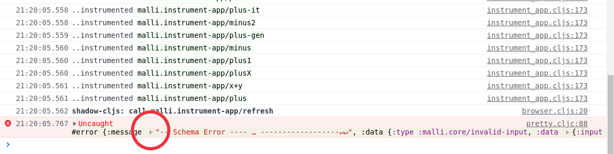
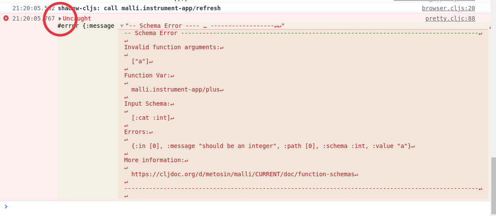
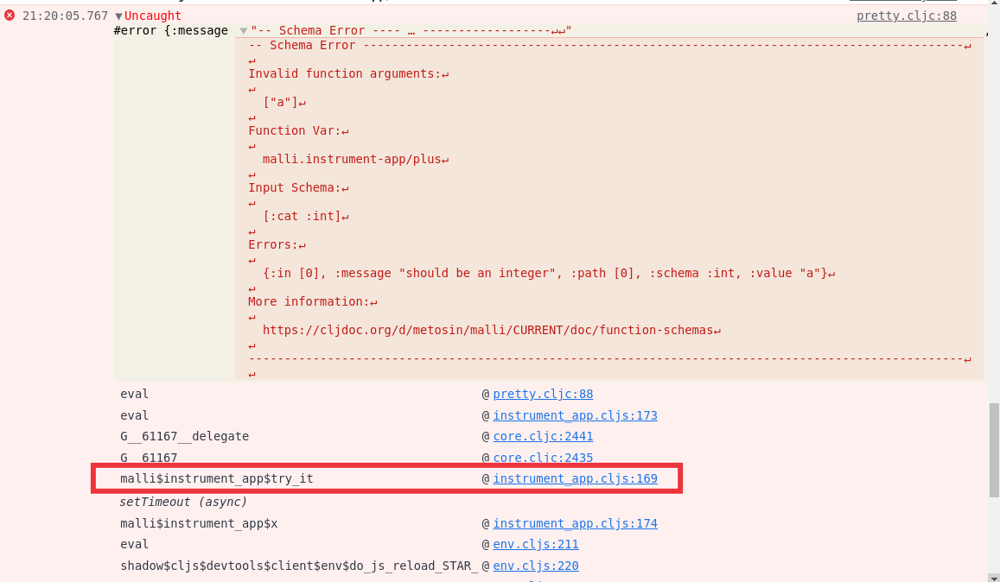

# ClojureScript Function Instrumentation

Function instrumentation is also supported when developing ClojureScript browser applications.

The implementation works by collecting function schemas using a ClojureScript macro which registers the function schemas
available in the application.

Instrumentation happens at runtime in a JavaScript runtime. The functions to instrument are replaced by instrumented versions.

# Dev Setup

For the best developer experience make sure you install the latest version of binaryage/devtools and use a Chromium or Firefox based browser:

https://clojars.org/binaryage/devtools

if you are using shadow-cljs just ensure this library is on the classpath.

For an application that uses React.js such as Reagent you will typically declare an entry namespace and init function in your `shadow-cljs.edn` config like so:

```clojure
{...
:modules {:app {:entries [your-app.entry-ns]
:init-fn your-app.entry-ns/init}}
...}
```

All development-time code should ideally live in a [preload](https://shadow-cljs.github.io/docs/UsersGuide.html#_preloads) namespace.

Add a preload namespace to your codebase to enable the malli instrumentation:

```clojure
(ns com.myapp.dev-preload
  {:dev/always true}
  (:require
    your-app.entry-ns ; <---- make sure you include your entry namespace
    [malli.dev.cljs :as dev]))

(dev/start!)
```
By including your entry namespace in the `:require` form the compiler will ensure that the preload namespace is compiled
after your application. This will ensure your schemas are up-to-date when `(malil.dev.cljs/start!)` is evaluated.

We also add `{:dev/always true}` metadata to the namespace so that the compiler will never cache this file.

Add this preload to your shadow-cljs config:

```clojure
{...
 :modules {:app {:entries [your-app.entry-ns]
                 :preloads [com.myapp.dev-preload]
                 :init-fn your-app.entry-ns/init}}
 ...}
```

If you want to get clj-kondo static checking from your function schemas add the `malli.dev.cljs-kondo-preload` namespace
to the preloads vector:
```clojure
{...
 :modules {:app {:entries [your-app.entry-ns]
                 :preloads [com.myapp.dev-preload
                            malli.dev.cljs-kondo-preload ;; <----
                            ]
                 :init-fn your-app.entry-ns/init}}
 ...}
```

Now while you develop clj-kondo config will be written under the `.clj-kondo` directory to enable static type checking 
on any functions that have schemas.

## Errors in the browser console

When you get a schema validation error and instrumentation is on you will see an exception in the browser devtools.

A validation error looks like this:



If you click the arrow that is highlighted in the above image you will see the error message:



and if you click the arrow highlighted in this above image you will see the stracktrace:



the instrumented function is the one with the red rectangle around it in the image above.

If you click the filename (`instrument_app.cljs` in this example) the browser devtools will open a file viewer at the problematic call-site.

# Release builds

If you follow the strategy outlined above using a `preload` to include all development-time tooling then you don't
have to make any changes to prevent that code from ending up in a release build.

One other technique you may want to use to optimize even further is to have a separate malli registry for development
and one for your release build. The dev build may include schemas that are only used for instrumenting functions or for
attaching generators to schemas which can increase bundle size significantly.

You can use a configuration like so using the `:ns-aliases` feature of shadow-cljs to switch malli registry namespaces
without needing to update your codebase:

```clojure
{:target :browser
 :output-dir "resources/public/js/main"
 :asset-path "js/main"
 :dev {:modules {:main {:init-fn com.my-org.client.dev-entry/init}}}
 :release {:modules {:main {:init-fn com.my-org.client.release-entry/init}}
           :build-options {:ns-aliases
                           {com.my-org.client.malli-registry com.my-org.client.malli-registry-release}}}
 :closure-defines {malli.registry/type "custom"}
,,,
```
This example also demonstrates how if you really need to, you can also have a completely separate entry namespace for a release.

It should be noted also that metadata declared on function vars in ClojureScript is excluded by default by the ClojureScript
compiler. The function var metadata is only included in a build if you explicitly invoke a static call to it such as:
```clojure
(meta (var com.my-org.some.ns/a-fn))
```

Unless you explicitly ask for it, function var metadata will not be included in your compiled JS, so annotating functions
with malli schemas in metadata adds no cost on your builds.
