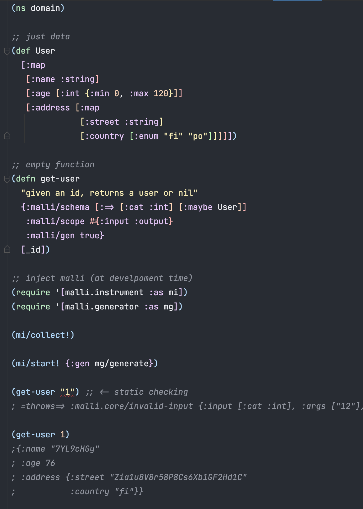

# Working with Functions

In Clojure, functions are first-class. Here's a simple function:

```clj
(defn plus [x y]
  (+ x y))
  
(plus 1 2)
; => 3
```

## Predicate Schemas

Simplest way to describe function values with malli is to use predefined predicate schemas `fn?` and `ifn?`:

```clj
(require '[malli.core :as m])

(m/validate fn? plus)
; => true

(m/validate ifn? plus)
; => true
```

Note that `ifn?` also accepts many data-structures that can be used as functions:

```clj
(m/validate ifn? :kikka)
; => true

(m/validate ifn? {})
; => true
```

But, neither of the predefined function predicate schemas can validate function arity, function arguments or return values. As it stands, [there is no robust way to programmatically check function arity at runtime](https://stackoverflow.com/questions/1696693/clojure-how-to-find-out-the-arity-of-function-at-runtime).

Enter, function schemas.

## Function Schemas

Function values can be described with `:=>` and `:function` schemas. They allows description of both function arguments (as [sequence schemas](README.md#sequence-schemas)) and function return values.

Examples of function definitions:

```clj
;; no args, no return
[:=> :cat :nil]

;; int -> int
[:=> [:cat :int] :int]

;; x:int, xs:int* -> int
[:=> [:catn 
      [:x :int] 
      [:xs [:+ :int]]] :int]
      
;; multi-arity function
[:function
 [:=> [:cat :int] :int]
 [:=> [:cat :int :int [:* :int]] :int]]      
```

Function definition for the `plus` looks like this:

```clj
(def =>plus [:=> [:cat :int :int] :int])
```

Let's try:

```clj
(m/validate =>plus plus)
; => true
```

But, wait, as there was no way to know the function arity & other information at runtime, so how did the validation work? Actually, it didn't. By default. `:=>` validation just checks that it's a `fn?`, so this holds too:

```clj
(m/validate =>plus str)
; => true
```
Bummer.

Enter, generative testing.

## Generative testing

Like [clojure.spec](https://clojure.org/about/spec) demonstrated, we can use [test.check](https://github.com/clojure/test.check) to check the functions at runtime. For this, there is `:malli.core/function-checker` option.

```clj
(require '[malli.generator :as mg])

(m/validate =>plus plus {::m/function-checker mg/function-checker})
; => true

(m/validate =>plus str {::m/function-checker mg/function-checker})
; => false
```

Explanation why it is not valid:

```clj
(m/explain =>plus str {::m/function-checker mg/function-checker})
;{:schema [:=> [:cat :int :int] :int],
; :value #object[clojure.core$str],
; :errors (#Error{:path [],
;                 :in [],
;                 :schema [:=> [:cat :int :int] :int],
;                 :value #object[clojure.core$str],
;                 :check {:total-nodes-visited 0,
;                         :depth 0,
;                         :pass? false,
;                         :result false,
;                         :result-data nil,
;                         :time-shrinking-ms 1,
;                         :smallest [(0 0)],
;                         :malli.generator/explain-output {:schema :int,
;                                                          :value "00",
;                                                          :errors (#Error{:path []
;                                                                          :in []
;                                                                          :schema :int
;                                                                          :value "00"})}}})}
```

Smallest failing invocation is `(str 0 0)`, which returns `"00"`, which is not an `:int`. Looks good.

But, why `mg/function-checker` is not enabled by default? The reason is that it uses generartive testing, which is orders of magnitude slower than normal validation and requires an extra dependency to `test.check`, which would make `malli.core` much heavier. This would be expecially bad for CLJS bundle size.

## Generating functions

We can also generate function implementations based on the function schemas. The generated functions check the function arity and arguments at runtime and return generated values.

```clj
(def plus-gen (mg/generate =>plus))

(plus-gen 1)
; =throws=> :malli.core/invalid-arity {:arity 1, :arities #{{:min 2, :max 2}}, :args [1], :input [:cat :int :int], :schema [:=> [:cat :int :int] :int]}

(plus-gen 1 "2")
; =throws=> :malli.core/invalid-input {:input [:cat :int :int], :args [1 "2"], :schema [:=> [:cat :int :int] :int]}

(plus-gen 1 2)
; => -1
```

## Multi-arity functions

Multi-arity functions can be composed with `:function`:

```clj
;; multi-arity fn with function checking always on
(def =>my-fn
  (m/schema
    [:function {:registry {::small-int [:int {:min -100, :max 100}]}}
     [:=> [:cat ::small-int] :int]
     [:=> [:cat ::small-int ::small-int [:* ::small-int]] :int]]
    {::m/function-checker mg/function-checker}))

(m/validate
  =>my-fn
  (fn
    ([x] x)
    ([x y & z] (apply - (- x y) z))))
; => true

(m/validate
  =>my-fn
  (fn
    ([x] x)
    ([x y & z] (str x y z))))
; => false

(m/explain
  =>my-fn
  (fn
    ([x] x)
    ([x y & z] (str x y z))))
;{:schema [:function
;          {:registry {::small-int [:int {:min -100, :max 100}]}}
;          [:=> [:cat ::small-int] :int]
;          [:=> [:cat ::small-int ::small-int [:* ::small-int]] :int]],
; :value #object[malli.core_test$eval27255$fn__27256],
; :errors (#Error{:path [],
;                 :in [],
;                 :schema [:function
;                          {:registry {::small-int [:int {:min -100, :max 100}]}}
;                          [:=> [:cat ::small-int] :int]
;                          [:=> [:cat ::small-int ::small-int [:* ::small-int]] :int]],
;                 :value #object[malli.core_test$eval27255$fn__27256],
;                 :check ({:total-nodes-visited 2,
;                          :depth 1,
;                          :pass? false,
;                          :result false,
;                          :result-data nil,
;                          :time-shrinking-ms 0,
;                          :smallest [(0 0)],
;                          :malli.generator/explain-output {:schema :int,
;                                                           :value "00",
;                                                           :errors (#Error{:path []
;                                                                           :in []
;                                                                           :schema :int
;                                                                           :value "00"})}})})}
```

Generating multi-arity functions:

```clj
(def my-fn-gen (mg/generate =>my-fn))

(my-fn-gen)
; =throws=> :malli.core/invalid-arity {:arity 0, :arities #{1 :varargs}, :args nil, :input nil, :schema [:function {:registry {::small-int [:int {:min -100, :max 100}]}} [:=> [:cat ::small-int] :int] [:=> [:cat ::small-int ::small-int [:* ::small-int]] :int]]}

(my-fn-gen 1)
; => -3237

(my-fn-gen 1 2)
; => --543

(my-fn-gen 1 2 3 4)
; => -2326
```

## Instrumentation

Besides testing function schemas as values, we can also intrument functions to enable runtime validation of arguments and return values.

Simplest way to do this is to use `m/-instrument` which takes options map and a function and returns a instrumented function. Valid options include:

| key       | description |
| ----------|-------------|
| `:schema` | function schema
| `:scope`  | optional set of scope definitions, defaults to `#{:input :output}`
| `:report` | optional side-effecting function of `key data -> any` to report problems, defaults to `m/-fail!`
| `:gen`    | optional function of `schema -> schema -> value` to be invoked on the args to get the return value

Instrumentig a function with input & return constraints:

```clj
(def pow
  (m/-instrument
    {:schema [:=> [:cat :int] [:int {:max 6}]]}
    (fn [x] (* x x))))

(pow 2)
; => 4

(pow "2")
; =throws=> :malli.core/invalid-input {:input [:cat :int], :args ["2"], :schema [:=> [:cat :int] [:int {:max 6}]]}

(pow 4)
; =throws=> :malli.core/invalid-output {:output [:int {:max 6}], :value 16, :args [4], :schema [:=> [:cat :int] [:int {:max 6}]]}

(pow 4 2)
; =throws=> :malli.core/invalid-arity {:arity 2, :arities #{{:min 1, :max 1}}, :args [4 2], :input [:cat :int], :schema [:=> [:cat :int] [:int {:max 6}]]}
```

Example of a multi-arity function with instrumentation scopes and custom reporting function:

```clj
(def multi-arity-pow
  (m/-instrument
    {:schema [:function
              [:=> [:cat :int] [:int {:max 6}]]
              [:=> [:cat :int :int] [:int {:max 6}]]]
     :scope #{:input :output}
     :report println}
    (fn
      ([x] (* x x))
      ([x y] (* x y)))))

(multi-arity-pow 4)
; =prints=> :malli.core/invalid-output {:output [:int {:max 6}], :value 16, :args [4], :schema [:=> [:cat :int] [:int {:max 6}]]}
; => 16

(multi-arity-pow 5 0.1)
; =prints=> :malli.core/invalid-input {:input [:cat :int :int], :args [5 0.1], :schema [:=> [:cat :int :int] [:int {:max 6}]]}
; =prints=> :malli.core/invalid-output {:output [:int {:max 6}], :value 0.5, :args [5 0.1], :schema [:=> [:cat :int :int] [:int {:max 6}]]}
; => 0.5
```

With `:gen` we can omit the function body. Here's an example to generate random values based on the return schema:

```clj
(def pow-gen
  (m/-instrument
    {:schema [:function
              [:=> [:cat :int] [:int {:max 6}]]
              [:=> [:cat :int :int] [:int {:max 6}]]]
     :gen mg/generate}))

(pow-gen 10)
; => -253

(pow-gen 10 20)
; => -159

(pow-gen 10 20 30)
; =throws=> :malli.core/invalid-arity {:arity 3, :arities #{1 2}, :args (10 20 30), :input nil, :schema [:function [:=> [:cat :int] [:int {:max 6}]] [:=> [:cat :int :int] [:int {:max 6}]]]}
```

## Function Var Schemas

Functions Vars can be annotated with function schemas using `m/=>` macro, which stores the var -> schema mappings in a global registry.

A simple function (Var) and schema for it:

```clj
(defn plus1 [x] (inc x))
(m/=> plus1 [:=> [:cat :int] [:int {:max 6}]])
``` 

The order doesn't matter, so this also works:

```clj
(m/=> plus1 [:=> [:cat :int] [:int {:max 6}]])
(defn plus1 [x] (inc x))
```

Listing the current accumulation of function (Var) schemas:

```clj
(m/function-schemas)
;{user {plus1 {:schema [:=> [:cat :int] [:int {:max 6}]]
;              :meta nil
;              :ns user
;              :name plus1}}}
```

## Function Var Instrumentation

The function (Var) registry is passive and doesn't do anything by itself. To instrument the Vars based on the registry, there is the `malli.instrument` namespace. Var instrumentations focus is for development time, but can also be used for production builds.

```clj
(require '[malli.instrument :as mi])
```

Vars can be instrumented with `mi/instrument!` and the instrumentation can be removed with `mi/unstrument!`.

```clj
(plus 6)
; => 7

;; instrument all registered vars
(mi/instrument!)

(plus 6)
; =throws=> :malli.core/invalid-output {:output [:int {:max 6}], :value 9, :args [8], :schema [:=> [:cat :int] [:int {:max 6}]]}

(mi/unstrument!)
; => 7
```

Instrumentation can be configured with the same options as `m/-instrument` and with a set of `:filters` to select which Vars should be instrumented.

```clj
(mi/instrument!
  {:filters [;; everything from user ns
             (mi/-filter-ns 'user)
             ;; ... and some vars
             (mi/-filter-var #{#'plus})
             ;; all other vars with :always-validate meta
             (mi/-filter-var #(-> % meta :always-validate))]
   ;; scope
   :scope #{:input :output}
   ;; just print
   :report println})

(plus 8)
; =prints=> :malli.core/invalid-output {:output [:int {:max 6}], :value 9, :args [8], :schema [:=> [:cat :int] [:int {:max 6}]]}
; => 9
```

Note: if you register new function (Var) schemas or redefine existing ones, you need to call `mi/instrument!` again. This is not good developer experience.

We can do better.

## Development Instrumentation

For smoother DX, there are `mi/start!` and `mi/stop!` functions. `mi/start!` takes the same options as `mi/instrument!`, runs `mi/instrument!` and starts watching for registry changes. Any change that matches the filters, will cause the Var to be automatically re-instrumented. It also emits [clj-kondo](README.md#clj-kondo) linter config for instrumented Var enabling static type checking/linting for those.

```clj
(mi/start!)
; =prints=> ..instrumented #'user/plus1
; =prints=> started instrumentation

(plus 6)
; =throws=> :malli.core/invalid-output {:output [:int {:max 6}], :value 9, :args [8], :schema [:=> [:cat :int] [:int {:max 6}]]}

(m/=> plus1 [:=> [:cat :int] :int])
; =prints=> ..instrumented #'user/plus1

(plus 6)
; => 7

(mi/stop!)
; =prints=> ..unstrumented #'user/plus1
; =prints=> stopped instrumentation
```

## Function Var Schemas as Var metadata

We can also store Malli schemas and instrumentation options as function Var metadata:

```clj
(defn minus
  "a normal clojure function, no dependencies to malli"
  {:malli/schema [:=> [:cat :int] [:int {:min 6}]]}
  [x] (dec x))
```

To read the Var metadata and register it to the global registry, we need to call `mi/collect!`. It reads all public vars from a given namespace and if the var has `:malli/schema` metadata, it registers the function Var schema for it and returns a set of all registered vars.

```clj
(mi/collect!)
; => #{#'user/minus}

(mi/instrument!)
; =prints=> ..instrumented #'user/minus

(minus 6)
; =throws=> :malli.core/invalid-output {:output [:int {:min 6}], :value 5, :args [6], :schema [:=> [:cat :int] [:int {:min 6}]]}
```

All options keys with `malli` ns are read when collecting. Setting `:malli/gen` to `true` while function body generation is enabled with `mi/instrument!` allows body to be generated, to return valid generated data.

A more complete example of using malli instrumentation in an existing Clojure codebase:

```clj
(ns domain)

;; just data
(def User
  [:map
   [:name :string]
   [:age [:int {:min 0, :max 120}]]
   [:address [:map
              [:street :string]
              [:country [:enum "fi" "po"]]]]])

;; empty function
(defn get-user
  "given an id, returns a user or nil"
  {:malli/schema [:=> [:cat :int] [:maybe User]]
   :malli/scope #{:input :output}
   :malli/gen true}
  [_id])

;; inject malli (at develpoment time)
(require '[malli.instrument :as mi])
(require '[malli.generator :as mg])

(mi/collect!)
; #{#'domain/get-user}

(mi/start! {:gen mg/generate})
; =prints=> ..instrumented #'domain/get-user
; =prints=> started instrumentation

(get-user "1") ;; <- static checking
; =throws=> :malli.core/invalid-input {:input [:cat :int], :args ["1"], :schema [:=> [:cat :int] [:maybe [:map [:name :string] [:age [:int {:min 0, :max 120}]] [:address [:map [:street :string] [:country [:enum "fi" "po"]]]]]]]}

(get-user 1)
;{:name "7YL9cHGy"
; :age 76
; :address {:street "Zia1u8V8r58P8Cs6Xb1GF2Hd1C"
;           :country "fi"}}

(mi/stop!)
; =prints=> ..unstrumented #'domain/get-user
; =prints=> stopped instrumentation
```

Here's the same code seen from [Cursive IDE](https://cursive-ide.com/), note the `static checking` error on invald input:



## Future work

* [pretty printer for schema errors](https://github.com/metosin/malli/issues/19)
* [support Schema defn syntax](https://github.com/metosin/malli/issues/125)
* better integration with [clj-kondo](https://github.com/clj-kondo/clj-kondo) and [clojure-lsp](https://github.com/clojure-lsp/clojure-lsp) for better DX.

