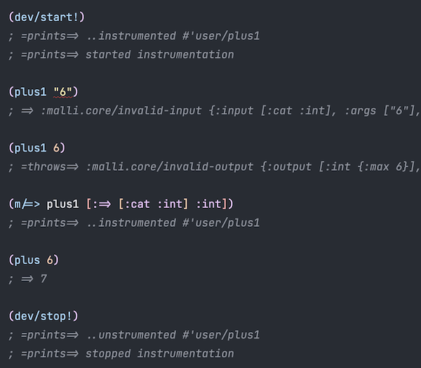
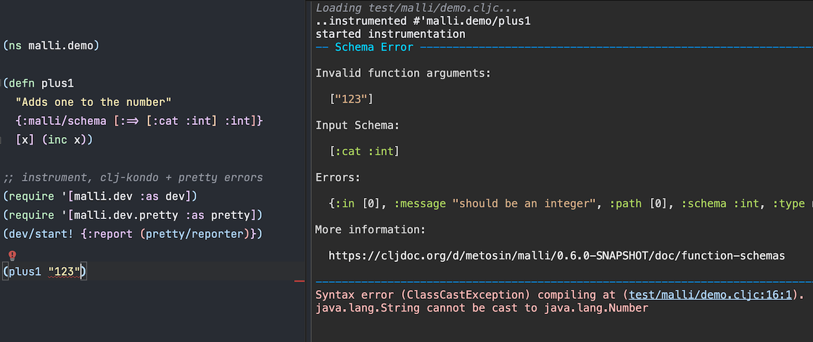

# Function Schemas

* [Functions](#functions)
* [Predicate Schemas](#predicate-schemas)
* [Function Schemas](#function-schemas)
  * [Generative Testing](#generative-testing)
  * [Generating Functions](#generating-functions)
  * [Multi-arity Functions](#multi-arity-functions)
  * [Instrumentation](#instrumentation)
* [Defn Schemas](#defn-schemas)
  * [Defn Instrumentation](#defn-instrumentation)
  * [Defn Checking](#defn-checking)
* [Development Instumentation](#development-instrumentation)
  * [Static Type Checking](#static-type-checking)
  * [Pretty Errors](#pretty-errors)
* [Defn Schemas via metadata](#defn-schemas-via-metadata)
  * [TL;DR](#tldr)

## Functions

In Clojure, functions are first-class. Here's a simple function:

```clj
(defn plus [x y]
  (+ x y))
  
(plus 1 2)
; => 3
```

## Predicate Schemas

Simplest way to describe function values with malli is to use predefined predicate schemas `fn?` and `ifn?`:

```clj
(require '[malli.core :as m])

(m/validate fn? plus)
; => true

(m/validate ifn? plus)
; => true
```

Note that `ifn?` also accepts many data-structures that can be used as functions:

```clj
(m/validate ifn? :kikka)
; => true

(m/validate ifn? {})
; => true
```

But, neither of the predefined function predicate schemas can validate function arity, function arguments or return values. As it stands, [there is no robust way to programmatically check function arity at runtime](https://stackoverflow.com/questions/1696693/clojure-how-to-find-out-the-arity-of-function-at-runtime).

Enter, function schemas.

## Function Schemas

Function values can be described with `:=>` and `:function` schemas. They allows description of both function arguments (as [sequence schemas](https://github.com/metosin/malli#sequence-schemas)) and function return values.

Examples of function definitions:

```clj
;; no args, no return
[:=> :cat :nil]

;; int -> int
[:=> [:cat :int] :int]

;; x:int, xs:int* -> int
[:=> [:catn 
      [:x :int] 
      [:xs [:+ :int]]] :int]
      
;; multi-arity function
[:function
 [:=> [:cat :int] :int]
 [:=> [:cat :int :int [:* :int]] :int]]      
```

Function definition for the `plus` looks like this:

```clj
(def =>plus [:=> [:cat :int :int] :int])
```

Let's try:

```clj
(m/validate =>plus plus)
; => true
```

But, wait, as there was no way to know the function arity & other information at runtime, so how did the validation work? Actually, it didn't. By default. `:=>` validation just checks that it's a `fn?`, so this holds too:

```clj
(m/validate =>plus str)
; => true
```
Bummer.

Enter, generative testing.

### Generative Testing

Like [clojure.spec](https://clojure.org/about/spec) demonstrated, we can use [test.check](https://github.com/clojure/test.check) to check the functions at runtime. For this, there is `:malli.core/function-checker` option.

```clj
(require '[malli.generator :as mg])

(def =>plus 
  (m/schema 
    [:=> [:cat :int :int] :int] 
    {::m/function-checker mg/function-checker}))

(m/validate =>plus plus)
; => true

(m/validate =>plus str)
; => false
```

Explanation why it is not valid:

```clj
(m/explain =>plus str)
;{:schema [:=> [:cat :int :int] :int],
; :value #object[clojure.core$str],
; :errors (#Error{:path [],
;                 :in [],
;                 :schema [:=> [:cat :int :int] :int],
;                 :value #object[clojure.core$str],
;                 :check {:total-nodes-visited 0,
;                         :depth 0,
;                         :pass? false,
;                         :result false,
;                         :result-data nil,
;                         :time-shrinking-ms 1,
;                         :smallest [(0 0)],
;                         :malli.generator/explain-output {:schema :int,
;                                                          :value "00",
;                                                          :errors (#Error{:path []
;                                                                          :in []
;                                                                          :schema :int
;                                                                          :value "00"})}}})}
```

Smallest failing invocation is `(str 0 0)`, which returns `"00"`, which is not an `:int`. Looks good.

But, why `mg/function-checker` is not enabled by default? The reason is that it uses generartive testing, which is orders of magnitude slower than normal validation and requires an extra dependency to `test.check`, which would make `malli.core` much heavier. This would be expecially bad for CLJS bundle size.

### Generating Functions

We can also generate function implementations based on the function schemas. The generated functions check the function arity and arguments at runtime and return generated values.

```clj
(def plus-gen (mg/generate =>plus))

(plus-gen 1)
; =throws=> :malli.core/invalid-arity {:arity 1, :arities #{{:min 2, :max 2}}, :args [1], :input [:cat :int :int], :schema [:=> [:cat :int :int] :int]}

(plus-gen 1 "2")
; =throws=> :malli.core/invalid-input {:input [:cat :int :int], :args [1 "2"], :schema [:=> [:cat :int :int] :int]}

(plus-gen 1 2)
; => -1
```

### Multi-arity Functions

Multi-arity functions can be composed with `:function`:

```clj
;; multi-arity fn with function checking always on
(def =>my-fn
  (m/schema
    [:function {:registry {::small-int [:int {:min -100, :max 100}]}}
     [:=> [:cat ::small-int] :int]
     [:=> [:cat ::small-int ::small-int [:* ::small-int]] :int]]
    {::m/function-checker mg/function-checker}))

(m/validate
  =>my-fn
  (fn
    ([x] x)
    ([x y & z] (apply - (- x y) z))))
; => true

(m/validate
  =>my-fn
  (fn
    ([x] x)
    ([x y & z] (str x y z))))
; => false

(m/explain
  =>my-fn
  (fn
    ([x] x)
    ([x y & z] (str x y z))))
;{:schema [:function
;          {:registry {::small-int [:int {:min -100, :max 100}]}}
;          [:=> [:cat ::small-int] :int]
;          [:=> [:cat ::small-int ::small-int [:* ::small-int]] :int]],
; :value #object[malli.core_test$eval27255$fn__27256],
; :errors (#Error{:path [],
;                 :in [],
;                 :schema [:function
;                          {:registry {::small-int [:int {:min -100, :max 100}]}}
;                          [:=> [:cat ::small-int] :int]
;                          [:=> [:cat ::small-int ::small-int [:* ::small-int]] :int]],
;                 :value #object[malli.core_test$eval27255$fn__27256],
;                 :check ({:total-nodes-visited 2,
;                          :depth 1,
;                          :pass? false,
;                          :result false,
;                          :result-data nil,
;                          :time-shrinking-ms 0,
;                          :smallest [(0 0)],
;                          :malli.generator/explain-output {:schema :int,
;                                                           :value "00",
;                                                           :errors (#Error{:path []
;                                                                           :in []
;                                                                           :schema :int
;                                                                           :value "00"})}})})}
```

Generating multi-arity functions:

```clj
(def my-fn-gen (mg/generate =>my-fn))

(my-fn-gen)
; =throws=> :malli.core/invalid-arity {:arity 0, :arities #{1 :varargs}, :args nil, :input nil, :schema [:function {:registry {::small-int [:int {:min -100, :max 100}]}} [:=> [:cat ::small-int] :int] [:=> [:cat ::small-int ::small-int [:* ::small-int]] :int]]}

(my-fn-gen 1)
; => -3237

(my-fn-gen 1 2)
; => --543

(my-fn-gen 1 2 3 4)
; => -2326
```

### Instrumentation

Besides testing function schemas as values, we can also intrument functions to enable runtime validation of arguments and return values.

Simplest way to do this is to use `m/-instrument` which takes options map and a function and returns a instrumented function. Valid options include:

| key       | description |
| ----------|-------------|
| `:schema` | function schema
| `:scope`  | optional set of scope definitions, defaults to `#{:input :output}`
| `:report` | optional side-effecting function of `key data -> any` to report problems, defaults to `m/-fail!`
| `:gen`    | optional function of `schema -> schema -> value` to be invoked on the args to get the return value

Instrumentig a function with input & return constraints:

```clj
(def pow
  (m/-instrument
    {:schema [:=> [:cat :int] [:int {:max 6}]]}
    (fn [x] (* x x))))

(pow 2)
; => 4

(pow "2")
; =throws=> :malli.core/invalid-input {:input [:cat :int], :args ["2"], :schema [:=> [:cat :int] [:int {:max 6}]]}

(pow 4)
; =throws=> :malli.core/invalid-output {:output [:int {:max 6}], :value 16, :args [4], :schema [:=> [:cat :int] [:int {:max 6}]]}

(pow 4 2)
; =throws=> :malli.core/invalid-arity {:arity 2, :arities #{{:min 1, :max 1}}, :args [4 2], :input [:cat :int], :schema [:=> [:cat :int] [:int {:max 6}]]}
```

Example of a multi-arity function with instrumentation scopes and custom reporting function:

```clj
(def multi-arity-pow
  (m/-instrument
    {:schema [:function
              [:=> [:cat :int] [:int {:max 6}]]
              [:=> [:cat :int :int] [:int {:max 6}]]]
     :scope #{:input :output}
     :report println}
    (fn
      ([x] (* x x))
      ([x y] (* x y)))))

(multi-arity-pow 4)
; =prints=> :malli.core/invalid-output {:output [:int {:max 6}], :value 16, :args [4], :schema [:=> [:cat :int] [:int {:max 6}]]}
; => 16

(multi-arity-pow 5 0.1)
; =prints=> :malli.core/invalid-input {:input [:cat :int :int], :args [5 0.1], :schema [:=> [:cat :int :int] [:int {:max 6}]]}
; =prints=> :malli.core/invalid-output {:output [:int {:max 6}], :value 0.5, :args [5 0.1], :schema [:=> [:cat :int :int] [:int {:max 6}]]}
; => 0.5
```

With `:gen` we can omit the function body. Here's an example to generate random values based on the return schema:

```clj
(def pow-gen
  (m/-instrument
    {:schema [:function
              [:=> [:cat :int] [:int {:max 6}]]
              [:=> [:cat :int :int] [:int {:max 6}]]]
     :gen mg/generate}))

(pow-gen 10)
; => -253

(pow-gen 10 20)
; => -159

(pow-gen 10 20 30)
; =throws=> :malli.core/invalid-arity {:arity 3, :arities #{1 2}, :args (10 20 30), :input nil, :schema [:function [:=> [:cat :int] [:int {:max 6}]] [:=> [:cat :int :int] [:int {:max 6}]]]}
```

## Defn Schemas

Function Vars (e.g. `defn`) can be annotated with function schemas using `m/=>` macro, which stores the var -> schema mappings in a global registry.

A simple function (Var) and schema for it:

```clj
(defn plus1 [x] (inc x))
(m/=> plus1 [:=> [:cat :int] [:int {:max 6}]])
``` 

The order doesn't matter, so this also works:

```clj
(m/=> plus1 [:=> [:cat :int] [:int {:max 6}]])
(defn plus1 [x] (inc x))
```

Listing the current accumulation of function (Var) schemas:

```clj
(m/function-schemas)
;{user {plus1 {:schema [:=> [:cat :int] [:int {:max 6}]]
;              :meta nil
;              :ns user
;              :name plus1}}}
```

### Defn Instrumentation

The function (Var) registry is passive and doesn't do anything by itself. To instrument the Vars based on the registry, there is the `malli.instrument` namespace. Var instrumentations focus is for development time, but can also be used for production builds.

```clj
(require '[malli.instrument :as mi])
```

Vars can be instrumented with `mi/instrument!` and the instrumentation can be removed with `mi/unstrument!`.

```clj
(plus1 6)
; => 7

;; instrument all registered vars
(mi/instrument!)

(plus1 6)
; =throws=> :malli.core/invalid-output {:output [:int {:max 6}], :value 9, :args [8], :schema [:=> [:cat :int] [:int {:max 6}]]}

(mi/unstrument!)

(plus1 6)
; => 7
```

Instrumentation can be configured with the same options as `m/-instrument` and with a set of `:filters` to select which Vars should be instrumented.

```clj
(mi/instrument!
  {:filters [;; everything from user ns
             (mi/-filter-ns 'user)
             ;; ... and some vars
             (mi/-filter-var #{#'plus})
             ;; all other vars with :always-validate meta
             (mi/-filter-var #(-> % meta :always-validate))]
   ;; scope
   :scope #{:input :output}
   ;; just print
   :report println})

(plus1 8)
; =prints=> :malli.core/invalid-output {:output [:int {:max 6}], :value 9, :args [8], :schema [:=> [:cat :int] [:int {:max 6}]]}
; => 9
```

### Defn Checking

We can also check the defn schemas against their function implementations using `mi/check`. It takes same options as `mi/instrument!`. 

Checking all registered schemas:

```clj
(mg/check)
;{user/plus1 {:schema [:=> [:cat :int] [:int {:max 6}]],
;             :value #object[user$plus1],
;             :errors (#Error{:path [],
;                             :in [],
;                             :schema [:=> [:cat :int] [:int {:max 6}]],
;                             :value #object[user$plus1],
;                             :check {:total-nodes-visited 12,
;                                     :depth 4,
;                                     :pass? false,
;                                     :result false,
;                                     :result-data nil,
;                                     :time-shrinking-ms 0,
;                                     :smallest [(6)],
;                                     :malli.generator/explain-output {:schema [:int {:max 6}],
;                                                                      :value 7,
;                                                                      :errors (#Error{:path [],
;                                                                                      :in [],
;                                                                                      :schema [:int {:max 6}],
;                                                                                      :value 7})}}})}}
```

It reports that the `plus1` is not correct. It accepts `:int` but promises to return `[:int {:max 6}]`. Let's fix the contract by constraining the input values.

```clj
(m/=> plus1 [:=> [:cat [:int {:max 5}]] [:int {:max 6}]])

(mg/check)
; => nil
```

All good! But, it's still wrong as the actual implementation allows invalid inputs resulting in invalid outputs (e.g. `6` -> `7`). We could enable instrumentation for the function to fail on invalid inputs at runtime - or write similar range checks ourselves into the function body.

A pragmatically correct schema for `plus1` would be `[:=> [:cat :int] [:int]]`. It also checks, but would fail on `Long/MAX_VALUE` as input. Fully correct schema would be `[:=> [:cat [:int {:max (dec Long/MAX_VALUE)}] [:int]]]`. Generative testing is best effort, not a silver bullet.

We redefined `plus1` function schema and the instrumentation is now out of sync. We have to call `mi/instrument!` to re-instrument it correctly. 

```clj
;; the old schema & old error
(plus1 6)
; =throws=> :malli.core/invalid-output {:output [:int {:max 6}], :value 9, :args [8], :schema [:=> [:cat :int] [:int {:max 6}]]}

(mi/instrument!)

;; the new schema & new error
(plus1 6)
; =throws=> :malli.core/invalid-input {:input [:cat [:int {:max 5}]], :args [6], :schema [:=> [:cat [:int {:max 5}]] [:int {:max 6}]]}
```

This is not good developer experience. 

We can do better.

## Development Instrumentation

For better DX, there is `malli.dev` namespace. 

```clj
(require '[malli.dev :as dev])
```

It's main entry points is `dev/start!`, taking same options as `mi/instrument!`. It runs `mi/instrument!` and `mi/collect!` (for all loaded namespaces) once and starts watching the function registry for changes. Any change that matches the filters will cause automatic re-instrumentation for the functions. `dev/stop!` removes all instrumentation and stops watching the registry.

```clj
(defn plus1 [x] (inc x))
(m/=> plus1 [:=> [:cat :int] [:int {:max 6}]])

(dev/start!)
; =prints=> ..instrumented #'user/plus1
; =prints=> started instrumentation

(plus1 "6")
; =throws=> :malli.core/invalid-input {:input [:cat :int], :args ["6"], :schema [:=> [:cat :int] [:int {:max 6}]]}

(plus1 6)
; =throws=> :malli.core/invalid-output {:output [:int {:max 6}], :value 9, :args [8], :schema [:=> [:cat :int] [:int {:max 6}]]}

(m/=> plus1 [:=> [:cat :int] :int])
; =prints=> ..instrumented #'user/plus1

(plus 6)
; => 7

(dev/stop!)
; =prints=> ..unstrumented #'user/plus1
; =prints=> stopped instrumentation
```

### Static Type Checking

Running `malli.dev` instrumentation also emits [clj-kondo](https://github.com/metosin/malli#clj-kondo) type configs for all `defn`s, enabling basic static type checking/linting for the instrumented functions.

Here's the above code in [Cursive IDE](https://cursive-ide.com/) with [clj-kondo](https://github.com/clj-kondo/clj-kondo) enabled:



### Pretty Errors

For prettier runtime error messages, we can swap the default error printer / thrower.

```clj
(require '[malli.dev.pretty :as pretty])
```

```clj
(defn plus1 [x] (inc x))
(m/=> plus1 [:=> [:cat :int] [:int {:max 6}]])

(dev/start! {:report (pretty/reporter)})

(plus1 "2")
; =prints=>
; -- Schema Error ----------------------------------- malli.demo:13 --
; 
; Invalid function arguments:
; 
;   ["2"]
; 
; Input Schema:
; 
;   [:cat :int]
; 
; Errors:
; 
;   {:in [0],
;    :message "should be an integer",
;    :path [0],
;    :schema :int,
;    :type nil,
;    :value "2"}
; 
; More information:
; 
;   https://cljdoc.org/d/metosin/malli/LATEST/doc/function-schemas
; 
; --------------------------------------------------------------------
; =throws=> Execution error (ClassCastException) at malli.demo/plus1 (demo.cljc:13).
;           java.lang.String cannot be cast to java.lang.Number
```

To throw the prettified error instead of just printint it:

```clj
(dev/start! {:report (pretty/thrower)})
```

Pretty printer uses [fipp](https://github.com/brandonbloom/fipp) under the hood and has lot of configuration options:

```clj
(dev/start! {:report (pretty/reporter (pretty/-printer {:width 80}))})
```

## Defn Schemas via Metadata

Another option to define `defn` schemas is to use standard Var metadata. It allows `defn` schema documentation and instrumentation without dependencies to malli itself from the functions. Itä's just data.

```clj
(defn minus
  "a normal clojure function, no dependencies to malli"
  {:malli/schema [:=> [:cat :int] [:int {:min 6}]]}
  [x] 
  (dec x))
```

To enable instrumentation for the `defn`, we need to call `mi/collect!`. It reads all public vars from a given namespace and registers function schemas from `:malli/schema` metadata.

```clj
(mi/collect!)
; => #{#'user/minus}

(mi/instrument!)
; =prints=> ..instrumented #'user/minus

(minus 6)
; =throws=> :malli.core/invalid-output {:output [:int {:min 6}], :value 5, :args [6], :schema [:=> [:cat :int] [:int {:min 6}]]}
```

All keys with `malli` namespace are read. The list of relevant keys:

| key             | description |
| ----------------|-------------|
| `:malli/schema` | function schema
| `:malli/scope`  | optional set of scope definitions, defaults to `#{:input :output}`
| `:malli/report` | optional side-effecting function of `key data -> any` to report problems, defaults to `m/-fail!`
| `:malli/gen`    | optional value `true` or function of `schema -> schema -> value` to be invoked on the args to get the return value

Setting `:malli/gen` to `true` while function body generation is enabled with `mi/instrument!` allows body to be generated, to return valid generated data.

### TL;DR

Example of annotating function with var meta-data and using `malli.dev` for dev-time function instrumentation, pretty runtime exceptions and clj-kondo for static checking:

```clj
(ns malli.demo)

(defn plus1
  "Adds one to the number"
  {:malli/schema [:=> [:cat :int] :int]}
  [x] (inc x))

;; instrument, clj-kondo + pretty errors
(require '[malli.dev :as dev])
(require '[malli.dev.pretty :as pretty])
(dev/start! {:report (pretty/reporter)})

(plus1 "123")

(comment
  (dev/stop!))
```

Here's the same code in [Cursive IDE](https://cursive-ide.com/) with [clj-kondo](https://github.com/clj-kondo/clj-kondo) enabled:



## Future work

* [support Schema defn syntax](https://github.com/metosin/malli/issues/125)
* better integration with [clj-kondo](https://github.com/clj-kondo/clj-kondo) and [clojure-lsp](https://github.com/clojure-lsp/clojure-lsp) for enchanced DX.
